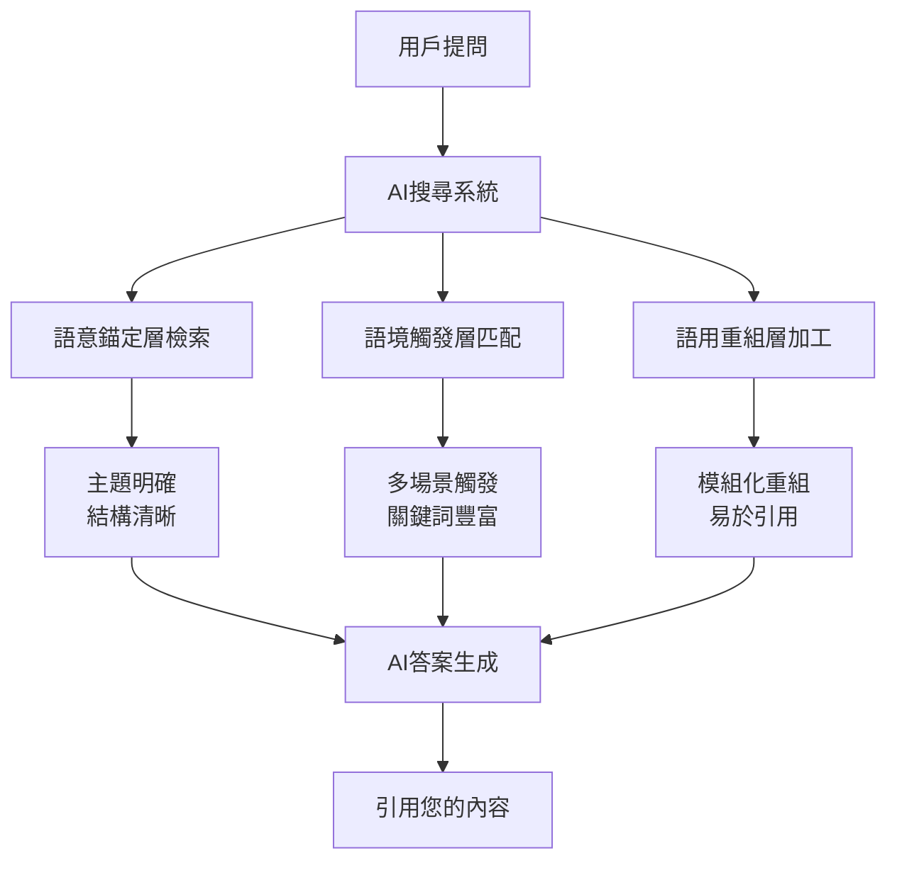

# GEO（生成式引擎優化）完整指南：AI搜尋時代內容策略總覽

<section class="summary">
在AI搜尋興起的時代，GEO（生成式引擎優化）成為讓內容被ChatGPT、Claude、Perplexity等AI「看見、理解並引用」的關鍵策略。本完整指南涵蓋從基礎理論到進階實作的全方位內容矩陣，包含語意可見性三層架構、五大引用潛力指標、Semantic Mesh佈局實作、多模態轉譯策略、SEO×GEO雙軌整合等核心主題，助您在AI驅動的搜尋生態中建立內容競爭優勢，實現從零散引用到系統性被引用的戰略躍升。
</section>

> 🎯 **專案使命**：讓每一段精心創作的內容都能被AI看見、理解並引用，在AI驅動的未來中發揮更大的影響力。
> 
> 👨‍💻 **作者**：[廖天佑 Bless Liao](about.md) | 📧 (https://bless25min.github.io/AIOGEO-Knowledge/) | 🐙 [@bless25min](https://github.com/bless25min)

---

## 🌍 AI搜尋時代的到來

### 搜尋行為的根本性轉變

我們正處於搜尋史上最重要的轉折點。傳統「搜尋→點擊→瀏覽」的模式正被「提問→AI直接回答→（選擇性）查看來源」所取代。這不僅是技術進步，更是用戶行為和期待的根本改變。

**市場數據顯示**：
- **AI對話查詢年增長率**：158%
- **18-34歲用戶**：71.5%已使用AI工具輔助搜尋
- **企業決策者**：67%在工作中使用AI搜尋工具
- **傳統搜尋影響**：點擊率因AI摘要下滑約30%，但搜尋曝光上升50%

### 為什麼需要GEO？

**GEO（Generative Engine Optimization）**不是SEO的替代品，而是AI時代內容策略的必要升級。當AI成為資訊的主要分發渠道，內容的價值不再取決於搜尋排名，而是取決於**被AI理解、信任並引用的能力**。

**核心價值主張**：
1. **🎯 精準觸達**：直接出現在AI回答中，無需競爭排名位置
2. **🏆 權威建立**：成為AI優先引用的權威來源
3. **🌐 跨平台曝光**：同時在ChatGPT、Claude、Perplexity等平台獲得引用
4. **📈 長期價值**：一次優化，持續被多個AI系統引用

---

## 🎯 GEO核心理論框架

### 三層語意可見性架構

GEO的核心是建立**三層語意可見性**，確保內容對AI系統完全透明可讀：

#### 第一層：語意錨定（Semantic Anchoring）
**目標**：讓AI清楚識別內容主題和重點
- 開門見山的標題和摘要
- 清晰的H1/H2/H3標題階層
- 明確的概念定義和解釋

#### 第二層：語境觸發（Context Triggering）
**目標**：涵蓋多種相關查詢場景
- 同義詞和變體表達
- 不同提問角度的覆蓋
- 長尾關鍵詞的自然融入

#### 第三層：語用重組（Pragmatic Recomposition）
**目標**：便於AI拆解和重組引用
- 段落獨立性和完整性
- FAQ問答模組化設計
- 清單和步驟的結構化呈現

### 五大引用潛力指標

**量化評估內容的AI友好度**：

| 指標名稱 | 目標分數 | 評估重點 | 優化策略 |
|---------|---------|---------|---------|
| **AIO語義集中度** | >0.75 | 主題聚焦，意圖對齊 | 拆分長文，單一主題 |
| **GEO引用潛力** | >0.70 | 權威性，可信度 | 增加數據引用，專家觀點 |
| **結構化指標** | >0.80 | 層級清晰，格式標準 | H標籤，FAQ，Schema標記 |
| **模組化引用潛力** | >0.65 | 片段獨立，易於重組 | 段落自足，問答對設計 |
| **多模態轉譯潛力** | >0.60 | 跨媒體適配性 | 圖表化，影音腳本 |

---

## 🗺️ 學習路徑導航

### 📚 基礎理論系列（必讀基礎）

#### [1. GEO核心概念與原理](posts/geo-fundamentals.md) ⏱️ 15分鐘
**學習重點**：理解GEO與SEO的本質差異，掌握AI搜尋引擎的評估邏輯
- GEO定義與發展背景
- AI搜尋引擎運作原理
- 傳統SEO vs GEO對比分析
- AI內容評估標準解析

#### [2. Answer Layer語段設計實戰](posts/answer-layer-design.md) ⏱️ 12分鐘
**學習重點**：設計AI優先選擇的回答層內容結構
- AI回答層運作機制
- 高引用價值語段特徵
- 段落獨立性設計
- FAQ模組最佳實踐

### 🎯 結構優化系列（實戰重點）

#### [3. Semantic Mesh佈局完整實作](posts/semantic-mesh.md) ⏱️ 20分鐘
**學習重點**：建立主幹頁→子頁→微型頁的語意矩陣內容網
- 三層頁面架構設計
- 內部連結網絡建立
- 語意集群效應創造
- 主題權威度累積策略

#### [4. 多模態轉譯與跨平台引用](posts/multimodal-optimization.md) ⏱️ 15分鐘
**學習重點**：擴大AI引用入口，建立多媒體內容矩陣
- 圖文並茂的懶人包製作
- 影音內容腳本化
- PDF白皮書資源建立
- 社群圖卡設計策略

### 🚀 進階策略系列（深度優化）

#### [5. SEO×GEO雙軌整合策略](posts/seo-geo-integration.md) ⏱️ 18分鐘
**學習重點**：平衡傳統搜尋排名與AI引用的雙重需求
- 雙軌優化策略框架
- 內容結構整合設計
- Schema技術實施
- 效果測量與迭代

#### [6. AI引用追蹤與成效評估](posts/geo-measurement.md) ⏱️ 10分鐘
**學習重點**：建立量化追蹤體系，持續優化引用表現
- AI引用監控指標設計
- AIOGEO SearchAware Optimizer工具應用
- 競爭對手引用分析
- 迭代優化流程建立

---

## 🎯 不同程度學習建議

### 🔰 初學者路徑（第一次接觸GEO）
**推薦順序**：
1. 先讀 [GEO核心概念](posts/geo-fundamentals.md) 建立基礎認知
2. 學習 [Answer Layer設計](posts/answer-layer-design.md) 理解核心原理  
3. 實作 [SEO×GEO整合](posts/seo-geo-integration.md) 獲得實戰經驗
4. 應用 [成效評估](posts/geo-measurement.md) 完成技術基礎

**時間投入**：每週2-3小時，4週完成基礎建設

### ⚡ 進階實踐者路徑（有SEO基礎）
**推薦順序**：
1. 快速瀏覽基礎理論，重點關注差異對比
2. 深入學習 [Semantic Mesh實作](posts/semantic-mesh.md)
3. 掌握 [多模態內容](posts/multimodal-optimization.md) 競爭優勢
4. 建立完整的追蹤評估體系

**時間投入**：每週4-5小時，6週達到專業水準

### 🏆 專家級應用（企業團隊）
**推薦順序**：
1. 全面學習所有模組，建立完整知識體系
2. 重點強化成效評估和追蹤能力
3. 開發內部工具和流程，規模化實施
4. 建立行業最佳實踐，成為GEO領域專家

**時間投入**：每週6-8小時，8-12週建立企業級能力

---

## 📊 實施效果預期

### 短期效益（1-3個月）
- **AI引用率提升60%+**：從零散引用到穩定被引用
- **品牌專業度建立**：在相關領域成為權威參考
- **跨平台可見性**：在多個AI工具中獲得引用

### 中期效益（3-6個月）
- **主題權威地位**：在特定領域成為AI首選來源
- **內容影響力放大**：引用帶來的間接流量和認知
- **競爭優勢建立**：領先競爭對手的技術門檻

### 長期價值（6-12個月）
- **AI時代護城河**：建立難以複製的內容優勢
- **行業標準制定者**：引領GEO最佳實踐發展
- **可持續競爭力**：在AI搜尋生態中的穩定地位

---

## 🛠️ 核心工具與資源

### 📊 分析評估工具
- **AIOGEO SearchAware Optimizer**：內容AI引用潛力分析
- **Schema Markup Validator**：結構化資料驗證
- **AI Citation Tracker**：跨平台引用監控

### 📚 參考資源庫
- **GEO最佳實踐案例集**：真實成功案例分析
- **Schema標記模板庫**：即用型結構化資料模板
- **FAQ設計靈感庫**：高引用率問答範例

### 🎨 內容製作工具
- **Semantic Mesh架構模板**：三層頁面設計框架
- **圖文懶人包設計工具**：社群內容製作
- **PDF白皮書模板**：專業資源文件範本

---

## 🚀 立即開始行動

### 本週可以完成的三個步驟

#### 1. 📊 內容現狀評估
使用[五大引用潛力指標](posts/geo-measurement.md)評估您現有的3-5篇重點內容：
- [ ] 計算AIO語義集中度得分
- [ ] 分析結構化程度和模組化水準
- [ ] 識別需要優化的具體環節

#### 2. 🎯 選定試點項目
挑選一個主題進行Semantic Mesh改造：
- [ ] 確定主幹頁主題和範圍
- [ ] 規劃3-5個子主題頁方向
- [ ] 列出10個潛在微型頁問題

#### 3. 🔧 技術基礎建設
為網站添加基本的GEO技術支援：
- [ ] 在重點頁面加入Article Schema標記
- [ ] 建立FAQ模組的標準格式
- [ ] 設置內部連結的最佳實踐

### 下一步深度學習

準備好深入學習了嗎？選擇最符合您當前需求的路徑：

- 🔰 **新手入門**：從[GEO基礎原理](posts/geo-fundamentals.md)開始建立扎實基礎
- ⚡ **實戰優化**：直接學習[Semantic Mesh實作](posts/semantic-mesh.md)獲得立竿見影的效果  
- 🏆 **技術進階**：掌握[SEO×GEO整合](posts/seo-geo-integration.md)實現雙軌優化
- 📊 **效果追蹤**：建立[AI引用監控](posts/geo-measurement.md)體系量化成果

---

## 💡 特別提醒

### 💎 成功的關鍵原則
1. **質量優先**：AI偏好準確、權威、有價值的內容
2. **結構清晰**：良好的組織結構是AI理解的基礎
3. **持續迭代**：GEO需要根據AI引用效果不斷優化
4. **耐心堅持**：建立AI引用需要時間積累和算法學習

### ⚠️ 常見誤區避免
- **不要過度優化**：自然的語言表達比刻意的關鍵字堆砌更有效
- **不要忽視基礎**：GEO建立在良好的內容品質基礎上
- **不要急於求成**：AI引用建立需要3-6個月的持續努力
- **不要單一依賴**：GEO應該與傳統SEO形成互補，而非替代

---

## 🤝 社群與支援

### 💬 加入討論
- **GitHub Discussions**：[參與技術討論](https://github.com/bless25min/AIOGEO-Knowledge/discussions)
- **問題回報**：[提交Issue](https://github.com/bless25min/AIOGEO-Knowledge/issues)
- **功能建議**：[建議新功能](https://github.com/bless25min/AIOGEO-Knowledge/discussions/categories/ideas)

### 📧 聯絡作者
- **專業諮詢**：bless.liao@aiogeo.com
- **LinkedIn**：[linkedin.com/in/bless-liao](https://linkedin.com/in/bless-liao)
- **Twitter**：[@BlessLiao](https://twitter.com/BlessLiao)

### 🌟 支持專案
如果這個知識庫對您有幫助，請考慮：
- ⭐ [給專案一個Star](https://github.com/bless25min/AIOGEO-Knowledge)
- 🔄 分享給需要的朋友同事
- 💬 在社群媒體提及 `#AIOGEO`
- 📝 [貢獻您的經驗和案例](contributing.md)

---

**🎯 記住：GEO不僅是技術策略，更是思維方式的轉變。從「為搜尋引擎寫作」到「為AI理解而創作」，從「追求點擊」到「提供價值」。掌握GEO，就是掌握AI時代內容影響力的密碼。**

**現在就開始您的GEO之旅，讓每一段文字都能在AI的語意循環中發光發熱！**

---

**由 [廖天佑 Bless](https://github.com/bless25min) 用心打造 ❤️**

