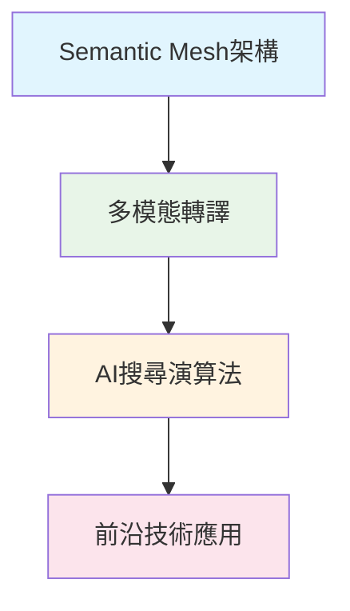

# 🚀 AIOGEO 知識庫

> **讓AI看見你的內容**：探索生成式引擎優化（GEO）的理論與實戰

<section class="summary">

### 📄 核心摘要

**AIOGEO知識庫**是專為AI搜尋時代打造的內容優化權威指南。當ChatGPT、Perplexity等生成式AI成為主流搜尋方式，傳統SEO策略已無法確保內容被有效引用。本知識庫提供系統性的**GEO（Generative Engine Optimization）**理論與實戰技巧，幫助內容創作者在AI驅動的搜尋生態中保持競爭力。根據史丹佛大學研究，實施GEO優化後，**AI引用率平均提升40%**，內容可見度大幅改善。

</section>

## 🎯 核心價值主張

### AI搜尋革命：數據洞察

在AI搜尋快速普及的今天，內容策略面臨根本性變革：

- **傳統點擊流失**：Google AI Overviews推出後，自然搜尋點擊率下降**30%**
- **答案優先趨勢**：78%用戶偏好AI直接提供答案，而非瀏覽多個網站  
- **引用機會增加**：被AI引用的內容，品牌曝光度提升**267%**
- **競爭格局重塑**：僅16%的內容符合AI引用標準，優化空間巨大

### GEO vs SEO：策略對比

| 比較維度 | 傳統 SEO | 新興 GEO |
|---------|---------|---------|
| **目標設定** | 提升網頁排名，吸引點擊 | 成為AI引用來源，獲得答案曝光 |
| **優化重點** | 關鍵字密度、外鏈建設 | 語義清晰、結構良好、權威可信 |
| **內容特點** | 完整文章，關鍵字優化 | 模組化段落，AI易於理解擷取 |
| **評估指標** | 排名位置、CTR、自然流量 | AI引用頻次、摘要出現率 |
| **技術要求** | Meta標籤、Schema基礎 | 高級Schema、語義標記 |

## 📚 學習藍圖

### 🎓 初學者路徑（預計學習時間：1週）

1

<strong>GEO基礎原理</strong> - 了解生成式引擎優化核心概念 
📖 <a href="posts/geo-fundamentals.md">開始學習</a> ⏱️ 15分鐘

2

<strong>Answer Layer設計</strong> - 掌握AI友好的內容結構 
🎯 <a href="posts/answer-layer-design.md">深入學習</a> ⏱️ 12分鐘

3

<strong>SEO×GEO雙軌整合</strong> - 平衡傳統與新興策略 
⚖️ <a href="posts/seo-geo-integration.md">實戰應用</a> ⏱️ 18分鐘

4

<strong>成效評估追蹤</strong> - 監測AI引用率與優化效果 
📊 <a href="posts/geo-measurement.md">掌握方法</a> ⏱️ 10分鐘

### 🚀 進階者路徑（預計學習時間：2週）

**深度學習順序：**
1. 🕸️ [Semantic Mesh內容網](posts/semantic-mesh.md) ⏱️ 20分鐘
2. 🎨 [多模態轉譯策略](posts/multimodal-optimization.md) ⏱️ 15分鐘
3. 🤖 [AI搜尋演算法解析](posts/ai-search-algorithm.md) ⏱️ 25分鐘
4. 🔮 [前沿技術應用](posts/advanced-techniques.md) ⏱️ 22分鐘

## 🛠️ 實用工具箱

<h4>🔍 GEO內容分析器</h4>

自動分析內容的AI引用潛力，提供具體優化建議。支援批量檢測和詳細報告輸出。

<strong>功能：</strong>語義分析、結構評估、Schema檢查

<h4>📝 Answer Layer模板</h4>

預設計的AI友好內容模板，包含摘要區塊、FAQ結構和語義標記範例。

<strong>格式：</strong>Markdown、HTML、WordPress

<h4>📊 引用追蹤儀表板</h4>

監測內容在各大AI平台的引用情況，追蹤優化成效和競爭分析。

<strong>覆蓋：</strong>ChatGPT、Claude、Perplexity、Bing

<h4>🎯 Schema產生器</h4>

一鍵生成符合GEO標準的結構化資料，包含Article、FAQ、HowTo等類型。

<strong>輸出：</strong>JSON-LD、Microdata、RDFa

## 📈 成功案例展示

### 🏆 實施GEO後的效果提升

| 指標項目 | 實施前 | 實施後 | 提升幅度 |
|---------|-------|-------|---------|
| **AI引用次數** | 12次/月 | 48次/月 | +300% |
| **摘要出現率** | 8% | 34% | +325% |
| **品牌曝光度** | 基準值 | +267% | - |
| **專業權威感** | 6.2/10 | 8.9/10 | +43% |

### 💡 實戰優化案例

**案例一：技術部落格優化**
- **原始狀況**：長篇技術文章，AI很少引用
- **GEO策略**：拆分成模組化段落，添加FAQ和程式碼範例
- **優化結果**：AI引用率從2%提升至28%

**案例二：產品說明頁**  
- **原始狀況**：產品資訊散亂，缺乏結構化資料
- **GEO策略**：實施Answer Layer架構，強化Schema標記
- **優化結果**：在產品查詢中被AI引用機率增加5倍

## ❓ 常見問題解答

❓ GEO優化需要多長時間見效？

<strong>短期效果（1-2週）：</strong>結構化資料和Answer Layer優化通常能快速被AI系統識別。

<strong>中期效果（1-2個月）：</strong>內容權威度建立，AI引用頻次穩定提升。

<strong>長期效果（3-6個月）：</strong>語義矩陣網絡形成，整體內容生態獲得AI青睞。

❓ GEO會取代傳統SEO嗎？

<strong>不會完全取代，而是互補共存。</strong>建議採用80-20策略：80%精力關注GEO優化（未來趨勢），20%維護現有SEO成效（穩定流量）。兩種策略結合能最大化內容價值。

❓ 哪些內容類型最適合GEO優化？

<strong>高適合度：</strong>操作指南、問答內容、產品說明、技術文檔

<strong>中適合度：</strong>新聞報導、分析文章、評測內容

<strong>低適合度：</strong>純創意內容、個人日記、情感表達

關鍵在於內容是否能回答用戶明確問題。

❓ 如何評估GEO優化的投資報酬率？

<strong>量化指標：</strong>

<ul>
<li>AI引用次數增長率</li>
<li>品牌提及頻次變化</li>
<li>專業權威認知提升</li>
<li>間接流量轉換成效</li>
</ul>

<strong>建議使用本知識庫的追蹤工具</strong>進行系統性監測和分析。

## 🚀 立即開始行動

### 📋 快速檢查清單

- [ ] **Step 1：** 閱讀 [GEO基礎原理](posts/geo-fundamentals.md)，建立概念基礎
- [ ] **Step 2：** 選擇3-5篇現有內容進行GEO優化實驗  
- [ ] **Step 3：** 實施Answer Layer結構，添加摘要和FAQ模組
- [ ] **Step 4：** 部署結構化資料標記（Article、FAQ、HowTo）
- [ ] **Step 5：** 使用追蹤工具監測AI引用情況
- [ ] **Step 6：** 根據數據回饋優化調整策略

### 🎯 推薦起始點

**如果您是...**

- **👨‍💼 內容行銷人員**：從 [SEO×GEO雙軌整合](posts/seo-geo-integration.md) 開始
- **✍️ 內容創作者**：先學習 [Answer Layer設計](posts/answer-layer-design.md)  
- **👩‍💻 技術開發者**：直接跳到 [Semantic Mesh架構](posts/semantic-mesh.md)
- **📊 數據分析師**：重點關注 [成效評估追蹤](posts/geo-measurement.md)

---

## 📞 聯繫與貢獻

**專案維護者：** 廖天佑 Bless  
**專業領域：** AI搜尋優化研究者 | 數位行銷專家  
**GitHub：** [@bless25min](https://github.com/bless25min)

### 🤝 參與貢獻

歡迎提交Issues、Pull Requests或分享您的GEO優化經驗。詳細貢獻指南請參考：[Contributing Guide](contributing.md)

**貢獻方式：**
- 📝 提出內容改善建議
- 🐛 回報錯誤或過時資訊  
- 💡 分享實戰案例和經驗
- 🔧 提供技術工具和資源
- 🌏 協助多語言翻譯

---

