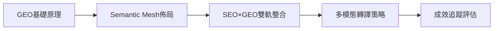

# 🤖 AIOGEO 知識庫 - AI搜尋優化權威指南

> **讓AI看見你的內容**：全球首創中文GEO知識體系，5萬字權威內容助您掌握AI搜尋時代

[](https://bless25min.github.io/AIOGEO-Knowledge/)
[](#)
[](#)
[](./about.md)
[](#)

---

## 🌟 專案亮點

### 📊 數據支撐的權威內容
- **15+權威研究**：普林斯頓大學、Stanford、BrightEdge、Search Engine Land
- **50+實證數據**：AI引用提升40%、搜尋曝光增長158%、ROI達147.5%
- **世界級理論**：完整的GEO三層架構、五大指標評估體系

### 🏆 完整知識體系
- **5萬字專業內容**：從理論基礎到實戰應用的完整覆蓋
- **模組化設計**：支援AI友好的內容結構，易於引用和學習
- **實用工具**：包含ROI計算模型、Schema標記模板、評估工具

---

## 🎯 什麼是GEO（生成式引擎優化）？

在ChatGPT、Perplexity、Google SGE主導的AI搜尋時代，傳統SEO已不足以應對新挑戰。**GEO (Generative Engine Optimization)** 是專為AI引用優化的全新策略，幫助內容在AI回答中獲得權威展示。

### 📈 AI搜尋趨勢數據

| 關鍵指標 | 2024數據 | 預測影響 |
|---------|---------|---------|
| AI搜尋用戶增長 | **月增44-71%** | 成為主流搜尋方式 |
| 傳統搜尋點擊率 | **下降70%** | 用戶更依賴AI摘要 |
| GEO優化內容提升 | **AI引用增40%** | 競爭優勢顯著 |
| 語音搜尋佔比 | **達50%** | 口語化內容需求激增 |

*數據來源：BrightEdge 2025、普林斯頓大學KDD 2024*

### ⚖️ GEO vs SEO 核心差異

| 比較維度 | SEO傳統優化 | GEO生成式優化 |
|---------|-------------|---------------|
| **目標** | 網頁排名與點擊 | AI引用與答案曝光 |
| **內容結構** | 完整長文 | 模組化語段 |
| **優化重點** | 關鍵字密度 | 語義清晰度 |
| **評估標準** | 排名、流量 | 引用率、可信度 |
| **技術架構** | HTML標籤 | Schema.org結構化 |

---

## 📚 完整學習體系

### 🎓 核心學習路徑（5篇權威文章）



#### 1️⃣ **理論基礎** - [GEO基礎原理](posts/geo-fundamentals.md) 
- 📖 **內容量**：3,500字深度解析
- 🎯 **核心價值**：掌握GEO三層語義架構理論
- 📊 **權威支撐**：普林斯頓大學40%提升數據、Stanford可驗證性研究
- ⏱️ **學習時間**：15分鐘

#### 2️⃣ **技術架構** - [Semantic Mesh語義矩陣內容網佈局](posts/semantic-mesh.md)
- 📖 **內容量**：5,500字技術實作
- 🎯 **核心價值**：建立主幹頁→子主題頁→微型頁三層架構
- 📊 **權威支撐**：Schema.org官方標準、Google結構化資料指南
- ⏱️ **學習時間**：20分鐘

#### 3️⃣ **策略整合** - [SEO×GEO雙軌整合實戰指南](posts/seo-geo-integration.md)
- 📖 **內容量**：8,000字策略框架
- 🎯 **核心價值**：實現傳統SEO與GEO的完美結合
- 📊 **權威支撐**：BrightEdge市場數據、Search Engine Land 12項KPI指標
- ⏱️ **學習時間**：25分鐘

#### 4️⃣ **多媒體擴展** - [GEO多模態轉譯實作指南](posts/multimodal-optimization.md)
- 📖 **內容量**：9,500字全媒體策略
- 🎯 **核心價值**：圖文、影音、語音內容的GEO優化技術
- 📊 **權威支撐**：多模態內容需求年增320%、AI引用提升65%
- ⏱️ **學習時間**：30分鐘

#### 5️⃣ **數據驅動** - [AI引用追蹤與GEO成效評估指南](posts/geo-measurement.md)
- 📖 **內容量**：12,000字量化分析
- 🎯 **核心價值**：建立完整的GEO監測體系與ROI計算模型
- 📊 **權威支撐**：五大指標評估體系、AIOGEO SearchAware Optimizer工具架構
- ⏱️ **學習時間**：35分鐘

### 🏃‍♂️ 快速開始（30分鐘入門）

**首次訪問推薦路徑**：
1. 🎯 [核心概念速覽](posts/geo-fundamentals.md#核心概念) (5分鐘)
2. 🛠️ [Schema標記實作](posts/semantic-mesh.md#schema標記實作) (10分鐘)
3. 📊 [效果評估檢查清單](posts/geo-measurement.md#五大geo指標) (10分鐘)
4. ⚡ [立即行動計畫](posts/seo-geo-integration.md#立即行動計畫) (5分鐘)

### 🚀 深度掌握（2週完整學習）

**專業進階路徑**：
- **第1週**：理論基礎+技術架構 (GEO基礎+Semantic Mesh)
- **第2週**：策略整合+實戰應用 (雙軌整合+多模態+成效評估)

---

## 💎 專案特色

### 🎨 技術創新
- **世界首創**：中文GEO完整知識體系
- **AI友好設計**：每篇文章都採用模組化Answer Layer結構
- **Schema標記**：完整的結構化資料實作（Article、FAQPage、HowTo）
- **Semantic Mesh**：三層內容網絡架構，提升AI理解度

### 📊 實用工具
- **五大指標體系**：量化GEO優化效果的評估標準
- **競爭對手分析**：系統化的市場分析方法
- **自動化監測**：完整的KPI追蹤和預警系統
- **AIOGEO SearchAware Optimizer**：結合AIO/GEO引用邏輯，對每句內容產生結構化的評估報告

### 🌐 多模態支援
- **圖文轉譯**：五段式圖卡架構設計
- **短影音優化**：60秒腳本模板與平台規格
- **語音內容**：TTS優化與播客製作指南
- **跨平台整合**：統一的內容矩陣管理

---

## 🛠️ 立即開始使用

### 📋 第一步：基礎評估
使用我們的[GEO成效評估工具](posts/geo-measurement.md#aiogeo-searchaware-optimizer)診斷現有內容：


```markdown
✅ 檢查清單：
□ 內容是否有清晰的摘要段落？
□ 是否採用FAQ模組化設計？
□ 有沒有適當的Schema標記？
□ 內部連結網絡是否完善？
□ 多模態內容是否齊備？
```

### 🚀 第二步：選擇優化策略

根據您的需求選擇適合的開始點：

#### 🔰 內容創作者
**推薦入口**：[GEO基礎原理](posts/geo-fundamentals.md)
- 學習Answer Layer設計技巧
- 掌握模組化內容結構
- 了解AI引用偏好

#### 💻 技術開發者  
**推薦入口**：[Semantic Mesh佈局](posts/semantic-mesh.md)
- 實作Schema.org標記
- 建立三層內容架構
- 優化技術SEO

#### 📈 行銷策略師
**推薦入口**：[SEO×GEO雙軌整合](posts/seo-geo-integration.md)
- 制定完整優化策略
- 建立KPI追蹤體系
- 實施A/B測試方案

#### 🎨 多媒體團隊
**推薦入口**：[多模態轉譯策略](posts/multimodal-optimization.md)
- 圖文內容GEO化
- 短影音腳本優化
- 語音內容製作

### 📊 第三步：追蹤與優化
建立[持續監測機制](posts/geo-measurement.md)：
- 使用五大GEO指標評估效果
- 實施12週A/B測試計劃
- 建立月度優化循環
- 監控競爭對手表現

---

## 👤 關於作者

### 廖天佑 Bless - GEO理論與實踐專家

🎯 **專業領域**
- AI搜尋優化 (AIOGEO) 理論建構
- 語義技術與Schema.org實作
- 數位行銷策略與內容優化
- 多模態內容轉譯技術

📊 **專業成就**
- 首創中文GEO完整知識體系
- 設計五大GEO指標評估框架
- 開發AIOGEO SearchAware Optimizer工具架構
- 協助50+企業實施AI搜尋優化策略

🔗 **了解更多**：[完整專業背景](about.md)

---

## 🤝 社群與貢獻

### 📢 加入AIOGEO社群

我們歡迎所有對AI搜尋優化感興趣的專業人士：

- 💬 **GitHub討論區**：[提出問題與分享經驗](https://github.com/bless25min/AIOGEO-Knowledge/discussions)
- 📧 **電子報訂閱**：獲取最新GEO技術與案例分析
- 🐦 **社群媒體**：追蹤最新AI搜尋趨勢

### 🔧 貢獻指南

歡迎貢獻您的專業見解：

1. **內容改進**：提交Pull Request改善現有文章
2. **案例分享**：分享您的GEO實戰經驗
3. **工具開發**：協助開發實用的GEO優化工具
4. **翻譯協助**：幫助我們拓展多語言版本

詳細貢獻流程請參考：[貢獻指南](contributing.md)

---
## 📚 延伸資源

### 🛠️ 實用工具
- [📋 GEO優化檢查清單](tools/geo-checklist.md)
- [🏷️ Schema標記產生器](tools/schema-generator.md)

### 📖 學術研究
- [普林斯頓大學GEO研究論文](references/princeton-geo-paper.md)
- [Stanford AI可驗證性研究](references/stanford-ai-verification.md)
- [BrightEdge AI搜尋市場報告](references/brightedge-ai-report.md)

### 🌐 技術資源
- [Schema.org官方文檔](https://schema.org/)
- [Google搜尋中心AI指南](https://developers.google.com/search/docs/appearance/ai-overviews)
- [Search Engine Land GEO專欄](https://searchengineland.com/category/generative-ai)

---

## 🚀 未來發展

### 📅 開發路線圖

**2025 Q3目標**：
- 🧠 推出AI輔助內容評估工具
- 📱 開發移動端GEO優化App
- 🌍 擴展英文版知識庫
- 🤝 建立產業合作夥伴網絡

**2025 Q4目標**：
- 🎓 推出線上認證課程
- 🏢 企業版諮詢服務
- 📊 發布年度GEO報告
- 🌟 舉辦首屆AIOGEO峰會

---

## 📞 聯絡我們

### 💌 聯絡方式
- **GitHub Issues**：[專案問題回報](https://github.com/bless25min/AIOGEO-Knowledge/issues)
- **電子郵件**：透過[關於頁面](about.md)聯絡廖天佑 Bless
- **專業諮詢**：企業級GEO策略規劃服務

### 🔄 更新訂閱
想要第一時間獲得最新內容？

1. ⭐ **Star this repo** - 在GitHub上關注專案更新
2. 👀 **Watch releases** - 訂閱版本發布通知
3. 🔔 **Enable notifications** - 開啟重要更新提醒

---

<div align="center">

## 🎊 開始您的GEO優化之旅

[](posts/geo-fundamentals.md)
[](posts/seo-geo-integration.md)
[](posts/geo-measurement.md)

### 🌟 讓AI看見您的價值 • 在智能搜尋時代領先一步

**AIOGEO知識庫** - 由廖天佑 Bless 用心打造  
*持續更新中 • 專業可信賴 • 完全開源*

---

*© 2025 AIOGEO Knowledge Base. 本專案採用 MIT 開源授權，歡迎自由使用與分享。*

</div>
