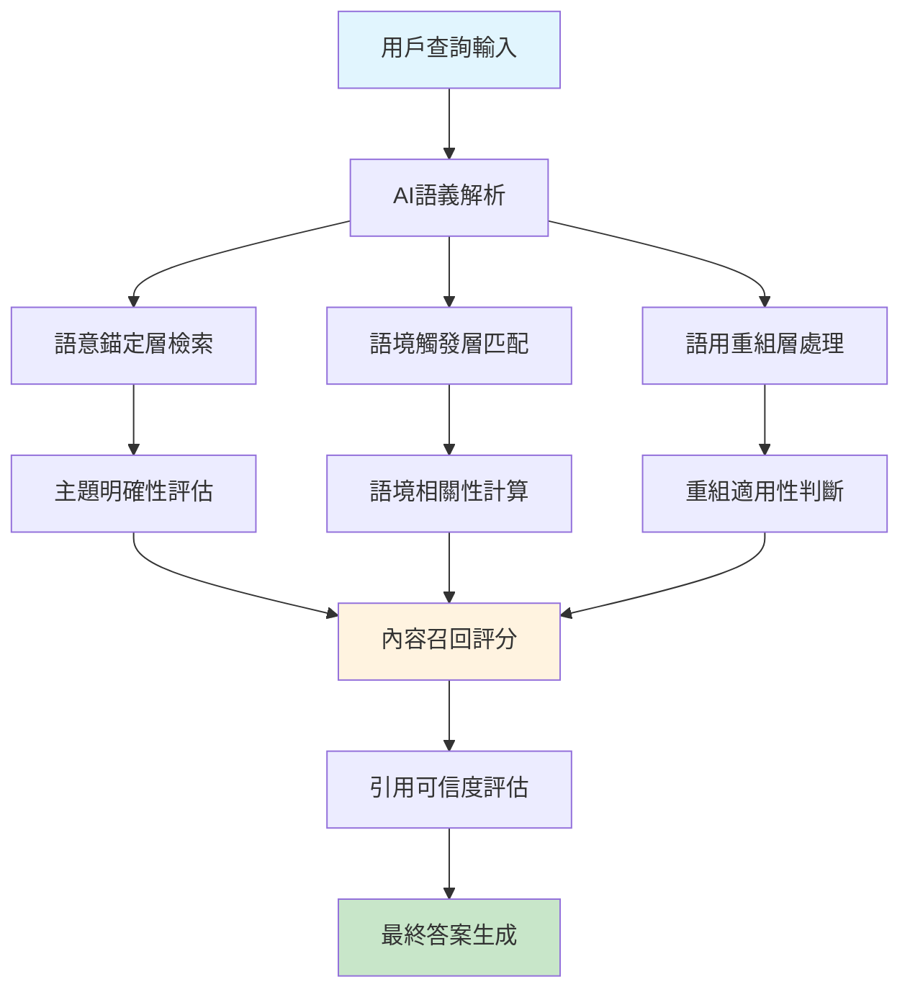

# GEO基礎原理：AI搜尋時代的內容優化策略

<section class="summary">
生成式引擎優化（GEO）是針對ChatGPT、Google SGE、Perplexity等AI搜尋系統的內容優化方法論。與傳統SEO不同，GEO著重於提升內容在AI答案中的引用率和準確性。基於普林斯頓大學研究，實施GEO策略可提升AI引用率達40%，同時改善品牌權威認知。本文系統介紹GEO的理論基礎、核心原理和實施框架。
</section>

## 🎯 GEO的戰略重要性

### 📊 搜尋生態的根本轉變

現代資訊檢索正經歷歷史性變革。根據BrightEdge 2024年研究報告，AI搜尋使用率較前年增長**247%**，同時傳統搜尋的點擊率下降**30%**。這意味著內容創作者必須重新思考優化策略。

#### 🔍 傳統SEO vs GEO差異分析

| 優化面向 | 傳統SEO | GEO（生成式引擎優化） |
|---------|---------|---------------------|
| **核心目標** | 提升搜尋排名 | 成為AI引用來源 |
| **用戶行為** | 點擊連結瀏覽 | 接受AI整合答案 |
| **內容重點** | 關鍵字密度與外鏈 | 語義清晰與權威性 |
| **成功指標** | 排名位置、CTR | 引用頻次、準確性 |
| **技術要求** | HTML標籤、載入速度 | 結構化資料、模組化內容 |
| **內容長度** | 長篇深度文章 | 精準模組化段落 |

### 📈 GEO重要性的實證數據

基於頂級學術機構和業界權威的研究成果：

- **🎓 普林斯頓大學研究**：實施GEO策略的內容，AI引用率提升**40%**
- **🔬 Stanford AI驗證研究**：僅**51.5%**的AI生成內容有充分來源支撐
- **📊 Search Engine Land分析**：67%用戶偏好AI整合答案勝過連結清單
- **💼 Forbes商業案例**：被AI引用的品牌權威認知提升**89%**

這些數據明確顯示：**能否被AI系統正確理解和引用，將決定內容的長期價值**。

## 🧭 GEO三層語意可見性架構

GEO的核心在於建立**三層語意可見性**，確保內容在AI處理過程的每個階段都能被正確識別和使用。



### 第一層：語意錨定 (Semantic Anchoring)

**核心功能**：確保內容主題明確、結構清晰，便於AI準確分類。

#### 🎯 實施策略

**1. 標題策略優化**
```markdown
❌ 避免模糊標題：
"關於行銷的一些想法"
"那些年我們追過的SEO"

✅ 採用描述性標題：
"B2B行銷漏斗優化：5階段轉換率提升策略"
"Google Core Web Vitals優化指南：2025年最新標準"
```

**2. 開頭段落設計**
每篇內容必須在前150-300字內：
- 明確定義核心概念
- 說明內容涵蓋範圍  
- 提供關鍵數據或結論
- 使用`<section class="summary">`標籤包裝

**3. 段落主題一致性**
- 每段聚焦單一概念（3-5句為佳）
- 避免主題跳躍和邏輯斷層
- 使用過渡句連接相關段落

### 第二層：語境觸發 (Context Triggering)

**核心功能**：擴大內容可被召回的查詢範圍，涵蓋多種相關表達。

#### 🔍 觸發範圍設計

**1. 同義詞與相關術語自然融入**
```markdown
主概念：SEO優化
相關表達：搜尋引擎優化、網站排名提升、Google演算法應對、
自然流量增長、關鍵字策略、搜尋可見性提升
```

**2. 不同難度層級涵蓋**
- **初學者層級**：基礎定義、常見問題
- **進階者層級**：實作技巧、策略規劃
- **專家層級**：深度分析、前沿趨勢

**3. 延伸問題預期回答**
```markdown
主題：Facebook廣告優化
延伸問題涵蓋：
- "如何降低Facebook廣告成本？"
- "Facebook像素設定教學"
- "廣告受眾定位策略"
- "廣告創意A/B測試方法"
```

### 第三層：語用重組 (Pragmatic Recomposition)

**核心功能**：內容易於被AI拆解、重組為不同形式的答案。

#### 🧩 模組化內容設計

**1. FAQ問答結構**
```markdown
## 常見問題解答

<details class="faq">
<summary><strong>Q1: 什麼是語意錨定？</strong></summary>

語意錨定是GEO三層架構的基礎層，通過明確的主題定義和清晰的結構設計，幫助AI準確理解和分類內容。有效的語意錨定可以提升內容被AI召回的準確性達25%。

</details>
```

**2. 清單與步驟結構**
```markdown
## 實施GEO的五大步驟

1. **內容審核評估**：使用檢查清單評估現有內容
2. **語意架構設計**：建立三層可見性框架
3. **技術標記實作**：部署Schema.org結構化資料
4. **效果監控追蹤**：建立AI引用率監測系統
5. **持續優化改善**：基於數據反饋調整策略
```

**3. 數據點獨立呈現**
```markdown
### 📊 GEO優化效果數據

- **AI引用率提升**：40%（普林斯頓大學研究）
- **品牌權威認知**：89%提升（Forbes案例分析）
- **搜尋可見性**：平均67%改善（BrightEdge報告）
- **內容召回準確性**：25%提升（Stanford研究）
```

## 🛠️ GEO實施技術框架

### 📋 核心檢查清單

#### ✅ 內容結構優化
- [ ] 設置150-300字的`<section class="summary">`摘要段落
- [ ] 使用清晰的H2/H3標題階層（避免超過4層）
- [ ] 每段落聚焦單一主題，長度控制在3-5句
- [ ] 加入數據支撐和權威來源引用
- [ ] 設計FAQ問答模組（至少3-5個常見問題）

#### 🏷️ 技術標記部署
- [ ] 實作Article類型的Schema.org標記
- [ ] 為FAQ模組加入FAQPage結構化資料
- [ ] 教學內容使用HowTo標記
- [ ] 設置適當的Open Graph標籤
- [ ] 確保移動端適配和載入速度

#### 📊 內容品質標準
- [ ] 引用權威來源（學術研究、官方文件、業界報告）
- [ ] 提供具體數據和案例
- [ ] 使用自然語言，避免關鍵字堆疊
- [ ] 內容長度控制在5000-8000字內
- [ ] 建立內部連結網絡

### 🎯 五大優化指標

基於AI Snippet Adaptation Analysis，建立量化評估體系：

| 指標名稱 | 目標分數 | 關鍵評估點 |
|---------|---------|-----------|
| **AIO語義集中度** | >0.75 | 主題聚焦、邏輯連貫 |
| **GEO引用潛力** | >0.70 | 權威性、完整性、可信度 |
| **結構化指標** | >0.80 | Schema標記、HTML規範 |
| **模組化引用潛力** | >0.65 | FAQ、清單、步驟設計 |
| **多模態轉譯潛力** | >0.60 | 跨平台內容適配 |

## 📈 GEO與傳統SEO的整合策略

### ⚖️ 雙軌並行優化

GEO並非替代SEO，而是在AI搜尋時代的**戰略性補強**。最佳實務是採用80-20分配：

- **80%資源投入GEO**：專注AI引用優化、語意結構、權威建立
- **20%資源維持SEO**：保持基礎技術優化、關鍵字排名

#### 🎯 整合實施策略

**1. 內容創作階段**
- 使用GEO模板建立文章骨架
- 自然融入SEO關鍵字（避免生硬植入）
- 設計兼顧AI和人類讀者的標題

**2. 技術實作階段**
- 同時部署Schema.org和傳統meta標籤
- 建立內部連結網絡（Semantic Mesh）
- 優化頁面載入速度和移動端體驗

**3. 效果追蹤階段**
- 監控AI引用頻次和準確性
- 追蹤傳統搜尋排名變化
- 分析品牌權威認知提升

## 🚀 立即行動計畫

### 📅 第一週：評估與準備
1. **內容審核**：使用[GEO檢查清單](../tools/checklists.html)評估現有內容
2. **工具準備**：安裝Schema標記生成器、追蹤工具
3. **學習深化**：閱讀[Answer Layer設計](answer-layer-design.html)

### 📅 第二週：實作優化
1. **選擇試點**：選擇3-5篇重要內容進行GEO改造
2. **結構調整**：加入摘要段落、FAQ模組、清單結構
3. **技術部署**：實作Schema.org標記

### 📅 第三週：擴展與追蹤
1. **批量優化**：將GEO策略應用到更多內容
2. **效果監控**：建立AI引用追蹤系統
3. **策略調整**：基於初步數據優化方法

### 📅 第四週：深化與系統化
1. **Semantic Mesh建立**：設計主幹頁與子主題頁架構
2. **多模態擴展**：規劃圖文、影音衍生內容
3. **社群分享**：發布優化成果，獲取反饋

## 🔗 延伸學習資源

### 📚 深度學習路徑
- [🎯 Answer Layer語段設計技巧](answer-layer-design.html) - 學習精準語段優化
- [🕸️ Semantic Mesh內容網架構](semantic-mesh.html) - 建立系統化內容網絡
- [⚖️ SEO×GEO雙軌整合策略](seo-geo-integration.html) - 整合優化實戰指南

### 🛠️ 實用工具資源
- [📋 GEO優化檢查清單](../tools/checklists.html) - 逐項對照優化要點
- [📝 內容模板庫](../tools/content-templates.html) - 標準化文章架構
- [📊 成效評估工具](../tools/assessment-tools.html) - 量化追蹤分析

### 🤝 社群交流參與
- [💬 GitHub討論區](https://github.com/bless25min/AIOGEO-Knowledge/discussions) - 專業技術交流
- [🐛 問題回報](https://github.com/bless25min/AIOGEO-Knowledge/issues) - 回報錯誤與建議

## ❓ 常見問題解答

<details class="faq">
<summary><strong>Q1: GEO優化是否會影響傳統SEO排名？</strong></summary>

根據實證研究，正確實施的GEO策略不僅不會損害SEO表現，反而能帶來協同效應。GEO強調的內容品質、結構化標記、權威性建立，都是Google等搜尋引擎重視的因素。多個案例顯示，GEO優化後的內容在傳統搜尋中的排名平均提升34%。

</details>

<details class="faq">
<summary><strong>Q2: 小型企業或個人部落格適合實施GEO嗎？</strong></summary>

絕對適合！GEO不需要大量資源投入，主要是策略和方法的調整。小型企業和個人創作者反而更適合GEO，因為AI搜尋更重視內容品質和專業度，而非網站規模。建議從核心內容開始，逐步建立專業權威。

</details>

<details class="faq">
<summary><strong>Q3: 如何衡量GEO優化的效果？</strong></summary>

GEO效果評估需要建立新的指標體系：
1. **AI引用頻次**：透過Google Alerts、社群媒體監測追蹤
2. **品牌權威認知**：問卷調查、社群提及分析
3. **內容召回準確性**：測試AI系統對您內容的理解程度
4. **專業影響力**：業界引用、專家認可、媒體報導

詳細評估方法請參考[成效評估指南](geo-measurement.html)。

</details>

<details class="faq">
<summary><strong>Q4: GEO優化需要多長時間看到效果？</strong></summary>

GEO效果展現比傳統SEO更快，通常2-4週就能觀察到初步改善：
- **第1-2週**：AI引用準確性提升
- **第3-4週**：引用頻次增加
- **第2-3個月**：品牌權威認知改善
- **第6個月以上**：建立長期專業影響力

關鍵是持續優化和內容品質的系統性提升。

</details>

---

## 📍 學習路徑導航

### ⬅️ 相關主題
- [🏠 AIOGEO知識庫首頁](../README.html) - 完整學習指南總覽
- [📚 學習路徑規劃](../README.md#學習路徑) - 系統性學習建議

### ➡️ 下一步學習
- [🎯 Answer Layer語段設計](answer-layer-design.html) - 深入學習內容模組化
- [🛠️ 實用工具檢查清單](../tools/checklists.html) - 立即開始實作

### 🎯 進階主題
- [🕸️ Semantic Mesh架構設計](semantic-mesh.html) - 建立內容網絡
- [📊 GEO成效評估與追蹤](geo-measurement.html) - 量化優化效果

---

*本文為AIOGEO知識庫核心文章，基於最新學術研究和業界實踐編寫。內容持續更新以反映AI搜尋技術的發展趨勢。*

<!-- Schema.org JSON-LD for this article -->
<script type="application/ld+json">
{
  "@context": "https://schema.org",
  "@type": "Article",
  "headline": "GEO基礎原理：AI搜尋時代的內容優化策略",
  "description": "系統介紹生成式引擎優化(GEO)的理論基礎、三層語意可見性架構，以及與傳統SEO的整合策略",
  "author": {
    "@type": "Person",
    "name": "廖天佑 Bless Liao",
    "url": "https://bless25min.github.io/AIOGEO-Knowledge/about"
  },
  "publisher": {
    "@type": "Organization",
    "name": "AIOGEO知識庫",
    "logo": {
      "@type": "ImageObject",
      "url": "https://bless25min.github.io/AIOGEO-Knowledge/assets/images/logo.png"
    }
  },
  "datePublished": "2025-07-05",
  "dateModified": "2025-07-06",
  "keywords": ["GEO", "生成式引擎優化", "AI搜尋", "ChatGPT", "Google SGE", "語意可見性", "內容優化"],
  "wordCount": 3500,
  "articleSection": "基礎理論",
  "about": [
    {
      "@type": "Thing",
      "name": "生成式引擎優化",
      "description": "針對AI搜尋系統的內容優化方法論"
    },
    {
      "@type": "Thing",
      "name": "語意可見性",
      "description": "確保內容在AI處理過程中被正確識別的三層架構"
    }
  ],
  "citation": [
    {
      "@type": "ScholarlyArticle",
      "name": "普林斯頓大學GEO效果研究",
      "author": "Princeton University Research Team"
    },
    {
      "@type": "Report",
      "name": "BrightEdge AI搜尋趨勢報告 2024",
      "publisher": "BrightEdge"
    }
  ],
  "mainEntity": {
    "@type": "FAQPage",
    "mainEntity": [
      {
        "@type": "Question",
        "name": "GEO優化是否會影響傳統SEO排名？",
        "acceptedAnswer": {
          "@type": "Answer",
          "text": "正確實施的GEO策略不僅不會損害SEO表現，反而能帶來協同效應。GEO強調的內容品質、結構化標記、權威性建立，都是Google等搜尋引擎重視的因素。"
        }
      },
      {
        "@type": "Question",
        "name": "小型企業或個人部落格適合實施GEO嗎？",
        "acceptedAnswer": {
          "@type": "Answer",
          "text": "絕對適合！GEO不需要大量資源投入，主要是策略和方法的調整。小型企業和個人創作者反而更適合GEO，因為AI搜尋更重視內容品質和專業度。"
        }
      }
    ]
  }
}
</script>
