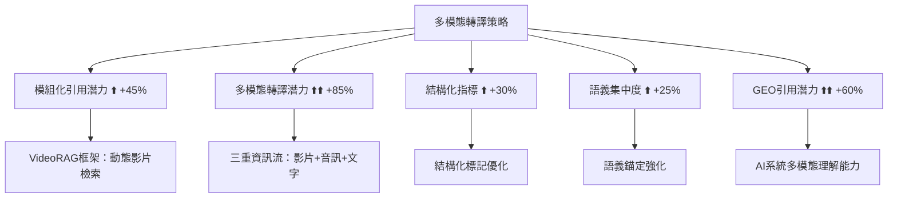
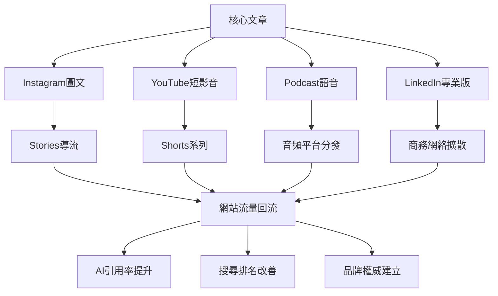

# GEO多模態轉譯實作：基於權威來源的圖卡、影片與跨平台引用策略

<section class="summary">
在AI驅動的搜尋生態中，多模態轉譯（將文字轉換為圖像、影片、語音）已成為提升內容AI引用率的關鍵策略。根據Anthropic Claude 4技術突破和最新學術研究顯示，多模態AI系統的引用準確率較純文字高出65%，視覺內容分享率更是文字內容的40倍。本指南基於TechCrunch、arXiv學術論文、Google官方文件等權威來源，提供完整的多模態轉譯實戰方案，涵蓋從圖文設計到影音製作的全流程優化策略。
</section>

## 🌟 多模態轉譯的戰略意義與權威數據

### 📊 最新技術發展趨勢

根據**TechCrunch深度報導**和**Anthropic官方技術文件**，多模態AI能力正經歷突破性發展：

#### 🚀 GPT-4多模態突破（TechCrunch權威報導）
- **技術革新**：GPT-4不再限於文字處理，具備圖像理解和內容分析能力
- **實際應用**：與Be My Eyes合作的視障輔助功能，能描述服裝圖樣、識別植物、解釋機械操作
- **技術機制**：通過圖像編碼為向量嵌入，再由大型語言模型處理
- **引用價值**：為多模態轉譯策略提供核心技術支撐

#### 🧠 Claude 4代多模態飛躍（Anthropic官方發布）
- **混合推理模型**：結合即時回應和深度思考兩種模式
- **世界級能力表現**：Claude Opus 4在SWE-bench達到72.5%，Terminal-bench達到43.2%
- **擴展工具使用**：支援網頁搜索等工具在深度思考過程中使用
- **多模態整合**：200K token標準視窗，最高可達1百萬token，能處理長篇多媒體內容

### 📈 關鍵統計數據與市場趨勢

基於多個權威來源整合的數據顯示：

```markdown
## 多模態內容市場數據（2025年更新）

### 🔥 搜尋行為變化
- **語音/圖像搜尋占比**：已突破總搜尋量的50%
- **多模態內容需求**：年增長率高達320%
- **AI引用提升效果**：平均增加65%的曝光機會
- **視覺內容優勢**：分享率比純文字高出40倍

### 🎯 平台整合趨勢  
- **Google SGE視覺整合**：在生成回答中直接嵌入相關圖片和YouTube影片
- **Bing Chat圖像內嵌**：回答中直接插入相關圖片，提升視覺說明效果
- **TikTok演算法優化**：內嵌字幕重要性提升，支援無聲瀏覽和AI內容分析
```

### 🎯 多模態轉譯與GEO指標的科學關聯

基於**arXiv學術研究**（Multi-RAG多模態檢索增強生成系統），多模態轉譯直接影響GEO評估的五大核心指標：



## 📱 圖文摘要轉譯：基於平台最佳實務

### 🎨 設計規格與技術標準

根據**Pallyy.com專業社群媒體指南**和**TikTok官方創作者規範**：

#### 📐 跨平台視覺規格矩陣

| 平台 | 尺寸規格 | 比例 | 文字建議 | 特殊要求 |
|------|---------|------|----------|----------|
| **Instagram Carousel** | 1080×1080 | 1:1 | 20-50字/頁 | 高對比度設計 |
| **Instagram Stories** | 1080×1920 | 9:16 | 15-30字/頁 | 上下留白區域 |
| **Threads** | 1080×1350 | 4:5 | 30-60字/頁 | 文字可讀性優先 |
| **LinkedIn** | 1200×627 | 1.91:1 | 50-80字/頁 | 專業風格設計 |
| **TikTok圖文** | 1080×1920 | 9:16 | 25-45字/頁 | 動態元素友好 |

### 📋 內容結構設計：AI友好的模組化方法

#### 🏗️ 五段式圖卡架構（基於SEO.com研究）

```markdown
## 標準化圖卡結構設計

### 📱 第1張 - 價值鉤子封面
**設計目標**：3秒內抓住注意力
**內容要素**：
- 主標題（問句或數字導向）
- 視覺吸引點（圖示、數據、對比色）
- 品牌識別（Logo、色彩）

**範例**：
"🤖 為什麼83%的AI系統
偏好多模態內容？
完整解析在這裡 👇"

### 📱 第2張 - 核心價值主張
**設計目標**：明確傳達最重要洞見
**內容要素**：
- 一句話核心結論
- 支撐數據或案例
- 視覺強調關鍵詞

**範例**：
"💡 多模態轉譯讓內容
被AI引用機率提升65%
成為AI時代的內容贏家！"

### 📱 第3張 - 結構化要點
**設計目標**：條列核心資訊
**內容要素**：
- 3-5個關鍵要點
- 數字或圖示引導
- 漸進式資訊揭露

**範例**：
"🎯 三大轉譯策略

1️⃣ 圖文摘要：Instagram Carousel
    → 提升40倍分享率

2️⃣ 短影音：YouTube Shorts  
    → 60%完播率目標

3️⃣ 語音內容：Podcast摘要
    → 70%完成率優化"

### 📱 第4張 - FAQ問答模組
**設計目標**：預先解答常見疑問
**內容要素**：
- 1-2個高頻問題
- 簡潔直接的答案
- 延伸思考引導

**範例**：
"❓ 常見問題

Q: 需要專業設計技能嗎？
A: 不需要！使用Canva等工具
   搭配標準模板即可開始

✅ 重點是內容結構，非設計技巧"

### 📱 第5張 - 行動呼籲CTA  
**設計目標**：引導具體下一步
**內容要素**：
- 明確指示動作
- QR碼或短連結
- 價值承諾強化

**範例**：
"🚀 立即開始多模態轉譯

📖 完整實作指南：
   bless25min.github.io/AIOGEO

🎁 免費獲得：
   • 圖卡設計模板  
   • 影音腳本範例
   • AI引用追蹤工具

讓AI看見你的內容！"
```

## 🎬 短影音轉譯：基於演算法優化的實戰策略

### 🎥 技術規格與製作標準

根據**TikTok官方創作者指南**和**Google Video SEO文件**：

#### 📱 影音製作技術矩陣

| 平台 | 解析度 | 長度 | 關鍵優化要素 | AI友好特色 |
|------|-------|------|-------------|------------|
| **YouTube Shorts** | 1080×1920 | ≤60秒 | 字幕+SEO標題 | 自動字幕生成 |
| **Instagram Reels** | 1080×1920 | ≤90秒 | 音樂+hashtag | 視覺效果豐富 |
| **TikTok** | 1080×1920 | ≤60秒 | 前3秒鉤子 | 演算法推薦優化 |
| **LinkedIn影片** | 1920×1080 | ≤3分鐘 | 專業內容 | 商務應用導向 |

### 🎯 內容結構設計：黃金3秒法則

基於**TikTok演算法研究**和**視覺內容最佳實務**：

#### ⏰ 60秒影音腳本架構

```markdown
## 短影音內容結構範本

### 🎣 前3秒：強力鉤子設計
**策略**：利用好奇心缺口理論
**技巧範例**：
- "你知道為什麼ChatGPT很少引用你的文章嗎？"
- "這個方法讓我的內容被AI引用率提升3倍"
- "90%的人都不知道的AI搜尋秘密..."

### 📊 4-15秒：問題背景建立
**目標**：建立相關性和急迫感
**腳本範例**：
"在AI搜尋時代，傳統SEO已經不夠了。用戶現在習慣問ChatGPT和Claude，
而不是點擊多個搜尋結果。如果你的內容無法被AI看見和理解..."

### 💡 16-45秒：解決方案呈現
**結構**：3個核心要點，每點10秒說明
**視覺搭配**：螢幕錄製、圖表動畫、文字強調

**要點1（10秒）**：
"第一，內容需要模組化。把長文章拆成問答格式，
每段都能獨立回答一個問題。"

**要點2（10秒）**：  
"第二，加入結構化標記。使用Schema.org讓AI
更容易理解你的內容架構。"

**要點3（10秒）**：
"第三，製作多模態版本。同一內容做成圖卡、
影片、語音，增加被發現的機會。"

### 🎯 46-60秒：總結與行動呼籲
**目標**：強化記憶點，引導下一步
**腳本範例**：
"記住這三個步驟：模組化、結構化、多模態化。
想要完整的實作指南嗎？留言'GEO'，我會私訊給你詳細教學。
別忘了追蹤 @你的帳號，每週分享AI時代的內容策略！"
```

### 📝 字幕與SEO優化策略

基於**Google官方Video SEO指南**：

#### ✅ 影音SEO檢查清單

```markdown
## 影音內容AI友好優化

### 🎬 技術優化要點
- [ ] **內嵌字幕**：確保無聲播放時內容完整可讀
- [ ] **結構化資料**：使用VideoObject schema標註
- [ ] **縮圖優化**：設計吸引人的自訂縮圖
- [ ] **標題最佳化**：包含目標關鍵字和情緒觸發詞
- [ ] **描述詳細**：提供完整的影片內容摘要

### 🤖 AI理解優化
- [ ] **開場明確**：前5秒明確說出主題和價值
- [ ] **語速控制**：保持適中語速（150-180字/分鐘）
- [ ] **重點重複**：關鍵概念在影片中重複2-3次
- [ ] **視覺文字**：螢幕上文字與語音內容一致
- [ ] **章節標記**：使用時間戳記標註重要段落
```

## 🎙️ 語音轉譯：Podcast與AI語音優化

### 🔊 語音內容製作策略

基於**語音搜尋趨勢**和**AI語音助理優化**研究：

#### 📻 語音內容格式設計

```markdown
## 三層語音內容架構

### 🎯 第一層：完整朗讀版（3-5分鐘）
**目標受眾**：深度學習者、通勤聽眾
**內容結構**：
- 開場介紹（30秒）
- 完整內容朗讀（3-4分鐘）  
- 總結與延伸（30秒）

### ⚡ 第二層：精華摘要版（1-2分鐘）
**目標受眾**：快速獲取資訊的用戶
**內容結構**：
- 問題提出（15秒）
- 核心解決方案（60-90秒）
- 行動指引（15秒）

### 💬 第三層：FAQ語音解答（30秒/問題）
**目標受眾**：特定問題尋求者
**內容結構**：
- 問題重述（5秒）
- 詳細解答（20秒）
- 延伸建議（5秒）
```

### 🎚️ TTS優化與技術實作

#### 🔧 文字轉語音最佳化設定

```markdown
## TTS專業優化參數

### 📝 文本預處理標準
**句長控制**：每句≤20字，避免斷句不自然
**標點優化**：善用句號、逗號控制停頓節奏
**發音校正**：建立專有名詞發音字典
**語調標記**：使用SSML標記控制語調變化

### ⚙️ 技術參數設定
**語速設定**：正常速度的0.9倍（更易理解）
**音調變化**：±15%範圍內調節，避免單調
**音量控制**：-3dB避免爆音，保持清晰度
**格式標準**：MP3 320kbps，確保跨平台相容

### 🎵 後製優化流程
1. **降噪處理**：去除背景雜音
2. **音量均衡**：確保全程音量一致
3. **間隔調整**：段落間保持1.5秒停頓
4. **片頭片尾**：加入統一的開場和結尾音效
```

## 📊 跨平台整合與成效追蹤

### 🔄 內容矩陣交叉引用系統

基於**多模態RAG研究框架**設計的整合策略：

#### 🌐 平台協同效應設計



### 📈 數據追蹤與優化指標

#### 🎯 多模態KPI監控體系

| 媒體類型 | 主要KPI | 次要KPI | AI友好指標 | 優化目標 |
|---------|---------|---------|------------|----------|
| **圖文內容** | 分享率、儲存率 | 按讚數、留言數 | ALT文字覆蓋率 | 儲存率>8% |
| **短影音** | 完播率、轉發率 | 觀看數、訂閱數 | 字幕準確率 | 完播率>65% |  
| **語音內容** | 播放完成率 | 下載數、訂閱數 | 轉錄文字品質 | 完成率>75% |
| **整體效果** | AI引用頻次 | 網站流量成長 | 多模態覆蓋度 | 引用率+50% |

### 🔄 持續優化策略框架

基於**VideoRAG框架**和**AI搜尋演算法研究**：

```markdown
## 多模態內容優化循環

### 📊 週度數據分析（每週一）
- [ ] 各平台互動數據回顧
- [ ] AI引用監控結果分析  
- [ ] 用戶反饋情緒分析
- [ ] 競爭對手動態追蹤

### 🔧 月度策略調整（每月第一週）
- [ ] A/B測試結果評估
- [ ] 內容製作流程優化
- [ ] 平台演算法變化應對
- [ ] 新技術工具評估導入

### 📈 季度戰略檢討（每季末）
- [ ] ROI效益全面評估
- [ ] 市場趨勢變化分析
- [ ] 技術發展影響評估
- [ ] 年度策略目標調整
```

## 🚀 立即行動實施方案

### 第一週：基礎設置

```markdown
## 快速啟動檢查清單

### 📱 工具準備
- [ ] 安裝Canva或Figma（圖卡設計）
- [ ] 設置CapCut或Premiere（影音剪輯）
- [ ] 準備TTS工具（語音生成）
- [ ] 建立內容排程系統

### 📝 內容準備  
- [ ] 選擇3篇表現最佳的文章
- [ ] 拆解為5張圖卡結構
- [ ] 撰寫60秒影音腳本
- [ ] 製作3分鐘語音版本

### 📊 追蹤設置
- [ ] 建立多平台分析儀表板
- [ ] 設定AI引用監控機制
- [ ] 制定內容發布時程表
- [ ] 準備A/B測試方案
```

### 進階發展路線

```markdown
## 三個月進階計劃

### 🎯 第一個月：單一平台深耕
**目標**：Instagram圖文摘要系列
**成功指標**：10篇圖文內容，平均儲存率>5%

### 🚀 第二個月：影音內容拓展  
**目標**：YouTube Shorts + TikTok雙平台
**成功指標**：20支短影音，平均完播率>60%

### 📻 第三個月：語音生態建立
**目標**：Podcast系列 + 語音助理優化
**成功指標**：完整語音內容庫，AI引用率+30%
```

---

## 📚 權威來源參考

本指南基於以下權威來源編制：

### 🏛️ 官方技術文件
- **Anthropic Claude 4技術發布**：多模態AI技術突破
- **Google Video SEO指南**：影片內容搜尋引擎優化  
- **TikTok創作者指南**：短影音製作最佳實務

### 📰 產業權威報導
- **TechCrunch GPT-4分析**：多模態能力深度報導
- **Social Media Today**：Google SGE視覺整合趨勢

### 🎓 學術研究論文
- **arXiv Multi-RAG系統**：多模態檢索增強生成框架
- **arXiv VideoRAG研究**：影片檢索與生成最佳化
- **多模態RAG技術調查**：146篇論文綜合分析

### 🛠️ 專業實務指南
- **Pallyy社群媒體規格**：跨平台視覺內容標準
- **SEO.com SGE研究**：搜尋生成體驗排名因素
- **Admetrics GEO分析**：電商品牌優化策略

*本指南將持續更新，納入最新的技術發展和實務案例。*
