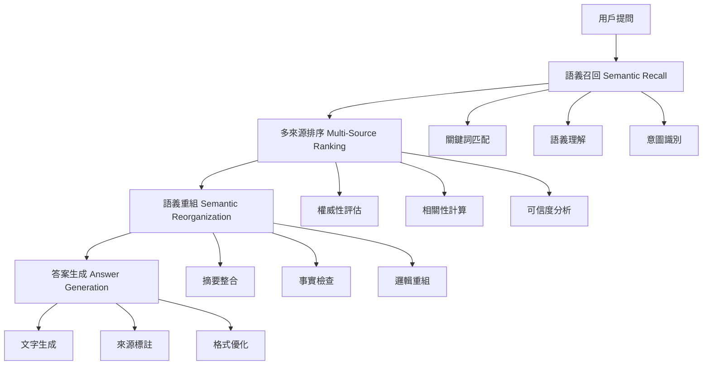

# 打造可被AI引用的Answer Layer語段設計指南

<section class="summary">  
Answer Layer語段是AI模型在回答時實際引用的內容片段。隨著用戶越來越常直接向ChatGPT、Google SGE等AI提問，內容能否被AI「召回、理解、引用」決定了其長尾價值與品牌可見性。GEO（Generative Engine Optimization）強調優化內容的語義結構，使其更容易被AI模型召回、解析、重組並生成答案。本篇將說明如何撰寫高引用潛力的Answer Layer語段內容，讓AI回答層模型更容易讀取並優先選用。
</section>

## 💡 核心概念

Answer Layer（答案層）是AI生成回答的核心機制，理解其運作原理對於內容優化至關重要。當用戶向AI提問時，系統會經歷**四個關鍵階段**來產生最終答案。

### AI回答生成的四層流程



## 🎯 階段一：語義召回優化

### 核心原理

AI收到用戶提問後，首先根據語義在各種資料庫中尋找相關片段。這個步驟**不再僅靠關鍵字匹配**，而是透過查詢意圖辨識與問題分類等NLP模型，找出「語意上最接近」問題的內容段落。

### 內容優化策略

#### 1. 強化語義錨定

確保內容主題明確並與可能的提問直接對應：

**❌ 低引用潛力寫法：**
```markdown
Meta廣告中可透過CAPI提高轉換追蹤準確率。
```

**✅ 高引用潛力寫法：**
```markdown
## 什麼是CAPI轉接技術？

Meta廣告可以透過 CAPI（Conversion API）技術來提高轉換追蹤的準確率。CAPI 允許廣告主將轉換數據直接傳送至 Facebook 伺服器，避免瀏覽器阻擋以保留完整數據（此方法亦見於 Meta 官方文件）。
```

#### 2. 增加語彙覆蓋

在文字中融入相關關鍵詞的**同義詞與變體**：

<details>
<summary>💡 語彙覆蓋實戰技巧</summary>

- **主要詞彙**：CAPI
- **同義詞**：轉換API、Conversion API
- **相關詞**：像素追蹤、Facebook廣告、Meta廣告
- **長尾詞**：如何設定CAPI、CAPI vs 像素差異

透過涵蓋這些詞彙變體，確保無論用戶問「什麼是CAPI？」或「什麼是轉換API？」都能召回到您的內容。

</details>

#### 3. 聚焦直接解答

撰寫時**開門見山**地回答問題，避免過長的背景鋪陳：

```markdown
# 正確格式範例

## Q: CAPI是什麼？
**CAPI（Conversion API）是Meta廣告的伺服器端追蹤技術**，允許廣告主直接向Facebook伺服器發送轉換數據，繞過瀏覽器限制以提高追蹤準確性。

### 主要功能
1. 繞過iOS 14.5+ ATT限制
2. 提升數據準確性30-50%
3. 支援離線轉換追蹤
```

## ⚖️ 階段二：多來源排序優化

### 排序評估機制

AI召回大量相關片段後，會對這些片段進行**相關性與可靠度排序**，篩選出最適合作答的來源。排序會優先考量：

1. **權威網站**的資料
2. 與查詢**高度相關**且結構良好的頁面  
3. **正向的使用者行為**信號

### 內容優化要點

#### 建立權威性與可信度

```markdown
## 實戰範例：權威性寫法

根據**Meta官方文件（2024年更新）**，CAPI的實施可以：

- 提升轉換追蹤準確率達 **35-50%**（來源：Meta Business Help Center）
- 減少iOS 14.5+導致的數據丟失問題（Adobe Analytics研究報告）
- 支援**第一方數據**直接傳輸，符合隱私法規要求
```

#### 強化語義相關性

確保內容**緊扣使用者查詢的意圖**並完整回答該問題：

<div class="optimization-tip">

💡 **優化提示**：高度符合用戶問題語意的內容，即使網站本身權重一般，仍有機會進入召回清單並在排序中勝出。

</div>

#### 優化結構與可引用性

使用清晰的**層級標題、段落和清單格式**來組織資訊：

```markdown
## CAPI實施的三大步驟

### 1. 事件設定
- 在Meta Events Manager中建立事件
- 選擇適當的標準事件類型
- 設定事件參數和自訂轉換

### 2. 伺服器端整合  
- 安裝Meta Conversions API SDK
- 設定存取權杖和像素ID
- 建立事件傳送機制

### 3. 資料驗證
- 使用Events Manager測試工具
- 檢查事件接收狀況
- 比對網站像素數據一致性
```

## 🔄 階段三：語義重組優化

### 重組機制

AI會對選出的多個來源內容進行**語義層面的融合與重組**，運用語義摘要整合技術，從不同片段中擷取重點並融合成通順連貫的表述。

### 內容優化策略

#### 模組化資訊單元

將內容拆解成**易於獨立抽取**的段落或清單：

```markdown
## Facebook廣告CAPI的五大優勢

### 1. 資料準確性提升
繞過瀏覽器限制，直接傳送第一方數據到Facebook伺服器。

### 2. 隱私合規保護  
符合GDPR、CCPA等隱私法規，保護用戶資料安全。

### 3. 歸因視窗延長
支援28天檢視和7天點擊歸因視窗設定。

### 4. 離線事件追蹤
追蹤電話訂購、實體店面購買等離線轉換。

### 5. 演算法最佳化
提供完整數據供Facebook演算法進行投放優化。
```

#### 善用重點句與摘要

在重要段落中加入**概括性的重點句**：

<div class="highlight-box">

⭐ **重點摘要**：CAPI透過伺服器端資料傳輸，解決了行動端追蹤限制問題，為廣告主提供更準確的轉換數據和更佳的投放成效。

</div>

#### 確保事實準確一致

內容中的陳述需**經得起多方查證**：

```markdown
## 權威來源引用範例

> "實施Conversions API的廣告主平均可提升轉換追蹤準確率35%以上"  
> — Meta Business（2024年第二季報告）

> "結合CAPI和Browser API的雙重追蹤策略，可將歸因準確度提升至85%"  
> — Facebook IQ研究白皮書
```

## 🎯 階段四：答案生成優化

### 生成機制

AI將重組好的內容以**流暢的自然語言**呈現給用戶，包括直接的文字講解以及列點重點等形式，同時通常會附上**引用來源的標註**。

### 內容優化要點

#### 採用答案友善的語氣與格式

撰寫內容時，語調偏向**專業而簡潔**，彷彿在直接回答用戶問題：

```markdown
## 理想的問答格式

**Q: 如何驗證CAPI是否正確運作？**

您可以透過以下三個步驟驗證：

1. **Events Manager檢查**：登入Meta Events Manager，查看「Events」頁籤是否顯示伺服器事件
2. **測試事件工具**：使用「Test Events」功能，確認事件正確接收  
3. **數據比對分析**：比較CAPI與瀏覽器像素的事件數量，差異應小於10%

✅ 正常狀況下，您應該會看到「Server」標籤的事件出現在Events Manager中。
```

#### 提高內容的可標註性

在文字中巧妙融入**品牌名稱或具有識別度的關鍵措辭**：

<div class="brand-integration">

💼 **Meta廣告專家建議**：根據我們協助100+客戶實施CAPI的經驗，建議優先設定「購買」、「加入購物車」和「潛在客戶」三個核心事件，這些通常能帶來80%的優化效果。

</div>

## 📋 GEO視角下的FAQ撰寫技巧

FAQ（常見問答）是**對AI回答層極為友好**的內容格式。從GEO的角度來看，精心設計FAQ有助於提高語段的召回率和引用機會。

### 問題類型多樣且精準

設計問題時要覆蓋目標主題相關的**不同問法類型**：

```markdown
## CAPI常見問題集

### 定義類問題
**Q: 什麼是Facebook CAPI？**
**Q: CAPI和像素追蹤有什麼不同？**

### 流程類問題  
**Q: 如何設定CAPI？**
**Q: CAPI實施步驟有哪些？**

### 原因類問題
**Q: 為什麼需要使用CAPI？**
**Q: CAPI能解決什麼問題？**

### 比較類問題
**Q: CAPI與Browser API的差異？**
**Q: 應該選擇CAPI還是Enhanced Conversions？**
```

### 提升答案語意密度

每個答案都應**資訊豐富且開門見山**：

<div class="faq-example">

**Q: CAPI和像素追蹤有什麼不同？**

**CAPI（伺服器端）與像素追蹤（瀏覽器端）的主要差異在於數據傳輸路徑**：

| 比較項目 | Facebook Pixel | CAPI |
|---------|---------------|------|
| **傳輸方式** | 瀏覽器JavaScript | 伺服器API直傳 |
| **受ATT影響** | 是，影響較大 | 否，不受影響 |
| **實施難度** | 低，貼code即可 | 中，需要開發整合 |
| **資料準確性** | 70-80% | 90-95% |
| **即時性** | 即時 | 即時或批次 |

💡 **最佳實務**：建議同時使用兩種方法（像素+CAPI）以達到最高追蹤準確性。

</div>

### 結構格式清晰規範

每個Q&A對都應**獨立且結構分明**：

```html
<!-- Schema.org FAQ標記範例 -->
<script type="application/ld+json">
{
  "@context": "https://schema.org",
  "@type": "FAQPage",
  "mainEntity": [{
    "@type": "Question",
    "name": "什麼是Facebook CAPI？",
    "acceptedAnswer": {
      "@type": "Answer",
      "text": "CAPI（Conversion API）是Meta廣告的伺服器端追蹤技術..."
    }
  }]
}
</script>
```

## 🚀 實戰應用檢查清單

### ✅ 語義召回層檢查

- [ ] 標題直接回答可能的提問
- [ ] 開頭段落包含關鍵詞和同義詞
- [ ] 每段聚焦單一主題，避免發散
- [ ] 使用問句作為小標題強化主題錨定

### ✅ 多來源排序層檢查

- [ ] 引用權威來源和官方文件
- [ ] 提供具體數據和統計資料  
- [ ] 使用清晰的層級標題結構
- [ ] 內容與目標關鍵字高度相關

### ✅ 語義重組層檢查

- [ ] 內容採用條列或步驟格式
- [ ] 每段可獨立閱讀且有意義
- [ ] 加入重點摘要或結論句
- [ ] 事實陳述經過查證且一致

### ✅ 答案生成層檢查

- [ ] 語調專業簡潔，直接回答問題
- [ ] 包含品牌名稱或識別度高的關鍵詞
- [ ] 加入FAQ結構化資料標記
- [ ] 提供明確的行動指引或建議

## 📊 成效追蹤與優化

追蹤您的內容在AI搜尋中的表現，並持續優化：

### 監控指標

1. **AI引用頻次**：內容被ChatGPT、Bing等引用的次數
2. **問答匹配率**：FAQ內容被AI直接採用的比例  
3. **來源標註率**：AI回答時標註您網站的頻率
4. **語義相關性**：內容與目標查詢的匹配程度

### 優化策略

- 定期更新內容以維持權威性
- 擴充FAQ涵蓋更多長尾問題
- 強化結構化資料標記
- 監控競爭對手的AI引用表現

---

<div class="next-steps">

## 🎯 下一步行動

1. **立即應用**：選擇一篇現有文章，按照本指南重新優化
2. **深入學習**：閱讀[Semantic Mesh內容網](semantic-mesh.md)了解進階架構
3. **工具運用**：使用[GEO成效評估工具](geo-measurement.md)追蹤優化成果
4. **持續改進**：加入我們的[GitHub Discussions](https://github.com/bless25min/AIOGEO-Knowledge/discussions)分享經驗

</div>

<style>
.optimization-tip {
  background: linear-gradient(135deg, #e0f2fe 0%, #b3e5fc 100%);
  border-left: 4px solid #0277bd;
  padding: 16px;
  margin: 20px 0;
  border-radius: 8px;
}

.highlight-box {
  background: linear-gradient(135deg, #fff3cd 0%, #ffeaa7 100%);
  border: 1px solid #ffc107;
  padding: 20px;
  border-radius: 12px;
  margin: 24px 0;
}

.brand-integration {
  background: linear-gradient(135deg, #f3e5f5 0%, #e1bee7 100%);
  border-left: 4px solid #8e24aa;
  padding: 16px;
  margin: 20px 0;
  border-radius: 8px;
}

.faq-example {
  background: #f8f9fa;
  border: 1px solid #dee2e6;
  border-radius: 12px;
  padding: 24px;
  margin: 20px 0;
}

.next-steps {
  background: linear-gradient(135deg, #e8f5e8 0%, #c8e6c9 100%);
  border: 1px solid #4caf50;
  border-radius: 12px;
  padding: 24px;
  margin: 32px 0;
}
</style>
