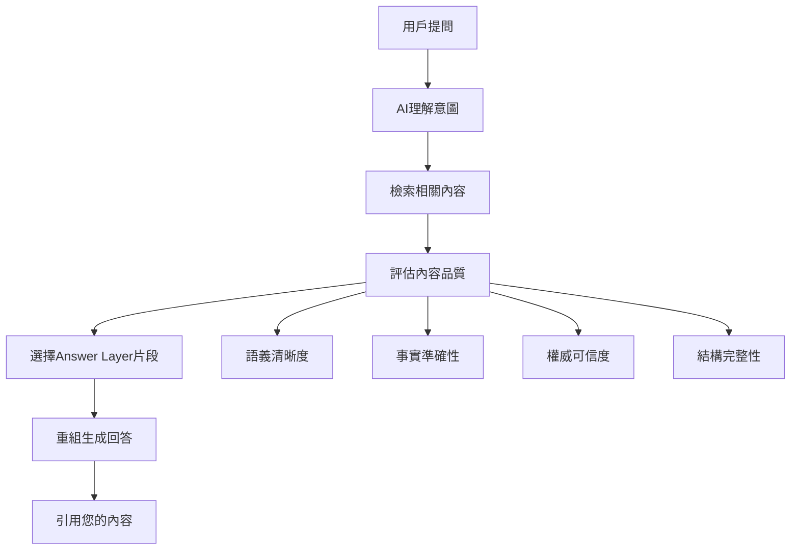

# Answer Layer語段設計實戰：讓AI優先引用你的內容的五大技巧

<section class="summary">
Answer Layer（回答層）是AI搜尋系統實際引用的內容片段集合。本指南深入解析如何設計具有高引用潛力的語段，包含段落獨立性設計、FAQ模組最佳實踐、語義清晰度優化等核心技巧。掌握Answer Layer設計原理，能讓您的內容在ChatGPT、Claude、Perplexity等AI平台中獲得更高的引用率和準確的呈現效果，成為AI優先選擇的權威來源。
</section>

> 📖 **本文屬於**：[《GEO（生成式引擎優化）完整指南》](../README.md) > 基礎理論系列
> 
> 🎯 **學習目標**：掌握AI友好的內容結構設計，提升內容被準確引用的機率

---

## 🎯 什麼是Answer Layer？

### 核心概念定義

**Answer Layer（回答層）**是指AI模型在生成回答時實際引用的內容片段集合。當用戶向ChatGPT或Claude提問時，AI系統會從龐大的知識庫中檢索相關內容，然後將這些內容重組成連貫的回答。您的內容能否進入這個「回答層」，直接決定了品牌曝光和專業權威的建立。

### AI引用機制解析



**關鍵洞察**：AI在選擇Answer Layer內容時，優先考慮**語義獨立、結構清晰、事實準確**的片段。這意味著內容需要能夠脫離原文脈絡仍然完整可讀。

---

## 🏗️ 段落獨立性設計原理

### 為什麼段落獨立性如此重要？

AI系統通常會將長文拆解成多個語義單元進行分析，每個段落都可能成為獨立的引用候選。如果段落過度依賴上下文，AI就難以準確理解和引用其含義。

### 段落獨立性設計的五大原則

#### 1. 開門見山原則
**❌ 錯誤範例**：
```markdown
此外，這個方法還有另一個好處。它可以大幅提升效果。
很多專家都推薦使用。建議大家試試看。
```

**✅ 正確範例**：
```markdown
Facebook CAPI（Conversion API）能夠繞過iOS追蹤限制，
直接向Facebook伺服器傳送轉換數據。相較於傳統像素追蹤，
CAPI可提升轉換數據準確率30-50%，是Meta廣告投放的
關鍵優化技術。
```

#### 2. 概念完整性原則
每個段落都應該：
- **包含完整的概念解釋**：避免「如前所述」、「接下來將討論」等依賴性表述
- **提供必要的背景資訊**：讓讀者無需回到上文即可理解
- **結論明確**：每段都有清楚的重點或結論

#### 3. 關鍵詞自然融入
```markdown
## 範例：關鍵詞自然融入

**主要關鍵詞**：Facebook廣告優化
**相關詞彙**：Meta廣告、FB投放、社群媒體行銷

**優化後段落**：
Meta廣告投放成功的關鍵在於精準的受眾定位策略。
Facebook廣告優化需要同時考慮受眾選擇、素材設計、
出價策略三大要素。透過Custom Audience自訂受眾功能，
廣告主可以針對既有客戶建立相似受眾（Lookalike），
有效提升廣告投資報酬率（ROAS）。
```

#### 4. 數據與事實支撐
AI偏好有具體數據或事實支撐的內容：

**✅ 具體數據範例**：
```markdown
根據Meta官方統計，正確設定CAPI的廣告帳戶，
轉換追蹤準確率可提升40-60%。在iOS 14.5更新後，
未使用CAPI的廣告主平均面臨25-30%的數據缺失，
而採用CAPI技術的帳戶則能維持85-95%的追蹤完整性。
```

#### 5. 邏輯連貫性
即使段落獨立，內在邏輯仍需清晰：

```markdown
## 邏輯連貫的段落設計

### 問題識別段落
iOS 14.5隱私更新後，Facebook像素追蹤面臨嚴重挑戰。
用戶可以選擇拒絕應用程式追蹤，導致廣告主無法
準確獲得轉換數據，影響廣告投放效果評估。

### 解決方案段落  
CAPI（Conversion API）技術能有效解決此問題。
透過伺服器端追蹤，CAPI直接將轉換事件傳送到
Facebook，完全繞過瀏覽器限制，確保數據完整性。

### 實施效果段落
實施CAPI後，廣告主可獲得更準確的轉換數據，
平均提升廣告投資報酬率15-25%。同時符合
隱私法規要求，為長期廣告投放策略奠定基礎。
```

---

## 🧩 FAQ模組最佳實踐

### FAQ設計的戰略價值

FAQ（常見問題）模組是AI最容易直接引用的內容形式。當用戶提問時，AI會優先尋找已經格式化的問答對，因為這些內容：

1. **結構清晰**：問題-答案的對應關係明確
2. **語義完整**：每個QA都是獨立的知識單元  
3. **匹配度高**：直接對應用戶可能的提問方式

### FAQ撰寫的標準格式

#### 標準FAQ結構

```markdown
## 🙋‍♀️ 常見問題解答

### Q1: Facebook CAPI需要多久才能看到數據？
**A:** CAPI通常在設定完成後24-48小時內開始接收數據。
建議觀察期為7-14天以評估完整效果。初期可能出現數據
不穩定的情況，這是正常現象，系統需要時間學習和優化。

### Q2: CAPI會取代Facebook像素嗎？
**A:** 不會完全取代。最佳實踐是CAPI與像素並行使用，
形成雙重追蹤保護。像素負責網站端行為追蹤，CAPI處理
伺服器端轉換數據，兩者互補可達到85-95%的追蹤準確率。

### Q3: 設定CAPI需要什麼技術條件？
**A:** 需要具備基本的程式開發能力或委託技術人員協助。
主要包括：1) 在伺服器端安裝CAPI代碼，2) 設定事件參數
映射，3) 驗證數據傳輸正確性。Facebook提供詳細的
技術文件和測試工具協助實施。
```

#### 問題設計技巧

**✅ 優秀問題範例**：
- 使用用戶實際會問的語言
- 涵蓋不同角度和深度
- 包含動作導向的問題

**❌ 避免的問題類型**：
- 過於技術性或專業的問題
- 答案過於簡短無價值的問題
- 與主題相關性不高的問題

### FAQ內容優化策略

#### 1. 答案長度最佳化
- **簡潔答案**：2-3句話，適合直接引用
- **詳細解釋**：必要時可擴展到50-80字
- **避免過長**：超過100字的答案考慮拆分

#### 2. 關鍵資訊前置
```markdown
**✅ 關鍵資訊前置範例**：

Q: 如何提升Facebook廣告的轉換率？
A: **三個核心策略最有效：1) 精準受眾定位、2) 高品質素材、
3) 合適的出價策略。** 具體而言，建議使用Custom Audience
功能鎖定既有客戶，搭配A/B測試不同的廣告素材，
並根據轉換目標選擇適當的出價方式。
```

#### 3. 數據和來源引用
在FAQ中適當引用數據增加可信度：

```markdown
Q: CAPI的實際效果如何？
A: **根據Meta官方數據，使用CAPI的廣告主平均轉換追蹤
準確率提升40-60%。** 在iOS隱私更新後，CAPI成為
維持廣告效果的關鍵技術，已有超過100萬廣告主採用。
研究顯示，CAPI配合像素使用可達到最佳追蹤效果。
```

---

## 📝 語義清晰度優化技巧

### 什麼是語義清晰度？

語義清晰度指的是AI系統理解內容含義的容易程度。高語義清晰度的內容特徵包括：

1. **概念定義明確**：關鍵術語有清楚解釋
2. **邏輯關係清晰**：因果、時序、對比關係明確表達
3. **語言簡潔精準**：避免模糊或含糊的表述

### 語義優化實戰技巧

#### 1. 術語定義標準化

**✅ 標準術語定義**：
```markdown
**CAPI（Conversion API）**是Meta廣告的伺服器端追蹤技術，
允許廣告主直接從自己的伺服器向Facebook發送客戶行為數據，
而不依賴瀏覽器像素追蹤。此技術能有效解決iOS隱私限制
對廣告追蹤造成的影響。
```

#### 2. 關係詞明確化

使用明確的關係詞表達邏輯關係：

**因果關係**：「因為...所以...」、「導致」、「造成」
**對比關係**：「相較於...」、「與...不同」、「反之」
**時序關係**：「首先...其次...最後」、「在...之前」、「隨後」

#### 3. 避免指代不明

**❌ 指代不明**：
```markdown
這個方法很有效。它可以解決很多問題。
大家都應該使用這種方式。
```

**✅ 指代明確**：
```markdown
Facebook CAPI技術很有效。CAPI可以解決iOS追蹤限制問題。
所有Meta廣告投放者都應該採用CAPI追蹤方式。
```

---

## 🔧 實戰案例分析

### 案例一：電商網站Answer Layer優化

**優化前段落**：
```markdown
我們的轉換率不高，試了很多方法都沒效果。
後來發現是追蹤問題，換了新方法後就好很多。
建議大家也可以試試看這個技術。
```

**優化後段落**：
```markdown
電商網站常見轉換率偏低的主因是追蹤數據不準確。
Facebook CAPI（Conversion API）能解決此問題，
透過伺服器端直接傳送購買事件數據，避免瀏覽器
追蹤限制。實施CAPI後，某電商客戶的轉換追蹤
準確率從65%提升至92%，廣告投資報酬率增加35%。
```

**優化重點**：
- ✅ 明確指出問題和解決方案
- ✅ 使用具體的數據支撐
- ✅ 提供完整的因果邏輯鏈

### 案例二：B2B企業FAQ優化

**優化前FAQ**：
```markdown
Q: 怎麼做會比較好？
A: 看情況而定，要分析具體狀況。
```

**優化後FAQ**：
```markdown
Q: B2B企業如何設定Facebook廣告受眾？
A: **建議採用三層受眾策略：1) 上傳客戶名單建立Custom Audience，
2) 基於網站訪客建立Website Audience，3) 利用既有受眾
建立2-5%的Lookalike Audience。** 這種組合策略可同時
觸及既有客戶、潛在客戶和相似族群，有效提升B2B廣告效果。
```

---

## 🎯 Answer Layer設計檢查清單

### ✅ 段落層級檢查

- [ ] **開門見山**：每段第一句直接點出重點
- [ ] **概念完整**：不依賴上下文即可理解
- [ ] **長度適中**：控制在50-150字之間
- [ ] **關鍵詞自然**：目標關鍵詞自然融入
- [ ] **數據支撐**：適當引用具體數據或研究
- [ ] **邏輯清晰**：因果關係明確表達

### ✅ FAQ模組檢查

- [ ] **問題實用**：對應用戶真實疑問
- [ ] **答案簡潔**：2-4句話回答完整
- [ ] **資訊前置**：重要資訊放在答案開頭
- [ ] **專業權威**：適當引用官方數據或研究
- [ ] **格式統一**：使用標準的Q&A格式
- [ ] **涵蓋面廣**：包含不同角度和深度的問題

### ✅ 語義優化檢查

- [ ] **術語定義**：關鍵概念有明確解釋
- [ ] **關係明確**：邏輯關係用明確的連接詞表達
- [ ] **指代清晰**：避免「這個」、「那個」等模糊指代
- [ ] **語言精準**：使用具體而非抽象的描述
- [ ] **結構清楚**：段落主題集中，層次分明

---

## 🔗 延伸學習路徑

### 📚 系列文章導覽

**⬅️ 上一篇**：[GEO基礎概念與原理](geo-fundamentals.md)  
理解GEO與SEO的本質差異，建立AI搜尋優化的基礎認知

**➡️ 下一篇**：[Semantic Mesh語意矩陣內容網](semantic-mesh.md)  
學習如何建立主幹頁→子頁→微型頁的三層架構

**🏠 回到主指南**：[GEO（生成式引擎優化）完整指南](../README.md)

### 🎯 相關深度主題

- **進階優化**：[SEO×GEO雙軌整合策略](seo-geo-integration.md)
- **效果評估**：[AI引用追蹤與成效評估](geo-measurement.md)  
- **多模態擴展**：[多模態轉譯與跨平台引用](multimodal-optimization.md)

### 🛠️ 實用工具資源

- **內容分析**：AIOGEO SearchAware Optimizer
- **Schema驗證**：Google Rich Results Test
- **競爭分析**：AI引用監控工具

---

## 💡 關鍵要點總結

掌握Answer Layer設計的核心要素：

1. **🎯 段落獨立性**：每個段落都是完整的知識單元
2. **❓ FAQ模組化**：用問答對方式呈現關鍵資訊  
3. **🔍 語義清晰度**：確保AI能準確理解內容含義
4. **📊 數據支撐**：用具體數據增加內容可信度
5. **🔧 持續優化**：定期檢查和改善內容結構

**記住：優秀的Answer Layer設計不僅提升AI引用率，也能顯著改善人類讀者的閱讀體驗。當內容對AI友好時，通常對人類也更加友好。**

---

## 🙋‍♀️ 常見問題解答

### Q1: Answer Layer優化需要多長時間見效？
**A:** 通常在內容優化後2-4週開始看到AI引用頻率提升。完整效果評估建議觀察3個月，因為AI系統需要時間學習和索引新的內容結構。可使用AI引用監控工具追蹤改善情況。

### Q2: 如何判斷哪些段落最容易被AI引用？
**A:** **開門見山且包含具體數據的段落引用率最高。** 特別是以定義、統計數據、或步驟說明開頭的段落。建議重點優化包含關鍵概念解釋和實用資訊的段落。

### Q3: FAQ模組應該放在文章的哪個位置？
**A:** **建議放在文章中段或末尾，但不要放在最開頭。** 讀者通常先瀏覽主要內容，再查看FAQ。同時，每個主要章節後也可以加入相關的小型FAQ，提升內容的模組化程度。

### Q4: 如何平衡SEO關鍵字需求與AI引用優化？
**A:** **自然融入比強制嵌入更有效。** 在保持語義清晰的前提下，將關鍵詞自然地融入概念解釋和事實陳述中。AI偏好語義完整的內容，而非關鍵字密度高但語義模糊的文字。

### Q5: Answer Layer優化會影響原有的SEO排名嗎？
**A:** **通常會有正面影響。** Answer Layer優化提升的內容結構清晰度、用戶體驗和停留時間，這些都是Google排名因素。但建議進行A/B測試，確保在優化AI引用的同時維持SEO效果。

---

<footer style="text-align: center; margin-top: 40px; padding: 20px; background-color: #f8fafc; border-radius: 8px;">

**🤖 AIOGEO 知識庫** | 由 [廖天佑 Bless](../about.md) 用心打造 ❤️

⭐ [給我們一個Star](https://github.com/bless25min/AIOGEO-Knowledge) | 💬 [參與討論](https://github.com/bless25min/AIOGEO-Knowledge/discussions) | 🐛 [回報問題](https://github.com/bless25min/AIOGEO-Knowledge/issues)

📅 最後更新：2025-07-05 | 📊 持續優化中

</footer>
