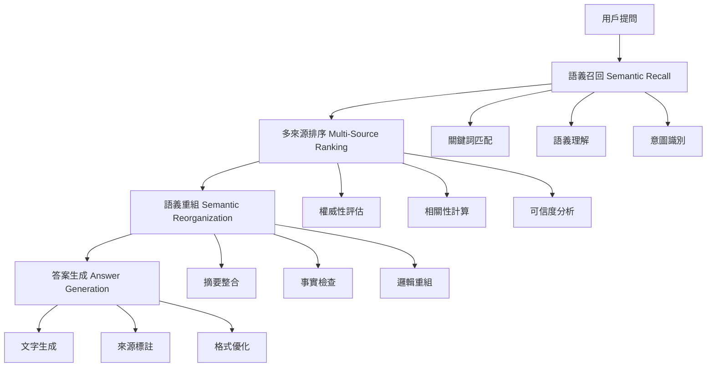

# 打造可被AI引用的Answer Layer語段設計指南

<section class="summary">  
Answer Layer語段是AI模型在回答時實際引用的內容片段。隨著用戶越來越常直接向ChatGPT、Google SGE等AI提問，內容能否被AI「召回、理解、引用」決定了其長尾價值與品牌可見性。GEO（Generative Engine Optimization）強調優化內容的語義結構，使其更容易被AI模型召回、解析、重組並生成答案。本篇將說明如何撰寫高引用潛力的Answer Layer語段內容，讓AI回答層模型更容易讀取並優先選用。
</section>

## 💡 核心概念

Answer Layer（答案層）是AI生成回答的核心機制，理解其運作原理對於內容優化至關重要。當用戶向AI提問時，系統會經歷**四個關鍵階段**來產生最終答案。

### AI回答生成的四層流程



## 🎯 階段一：語義召回優化

### 核心原理

AI收到用戶提問後，首先根據語義在各種資料庫中尋找相關片段。這個步驟**不再僅靠關鍵字匹配**，而是透過查詢意圖辨識與問題分類等NLP模型，找出「語意上最接近」問題的內容段落。

### 內容優化策略

#### 1. 強化語義錨定

確保內容主題明確並與可能的提問直接對應：

**❌ 低引用潛力寫法：**
```markdown
AI搜尋優化中有許多技術要點需要注意。
```

**✅ 高引用潛力寫法：**
```markdown
## 什麼是語義錨定技術？

AI搜尋優化中的語義錨定技術是指確保內容主題明確且容易被AI模型識別。語義錨定包含明確的標題結構、清晰的主題陳述，以及與用戶可能提問直接對應的內容組織方式。
```

#### 2. 增加語彙覆蓋

在文字中融入相關關鍵詞的**同義詞與變體**：

<details>
<summary>💡 語彙覆蓋實戰技巧</summary>

- **主要詞彙**：GEO
- **同義詞**：生成式引擎優化、AI搜尋優化
- **相關詞**：Answer Layer、語義可見性、AI引用
- **長尾詞**：如何提升AI引用率、GEO vs SEO差異

透過涵蓋這些詞彙變體，確保無論用戶問「什麼是GEO？」或「什麼是生成式引擎優化？」都能召回到您的內容。

</details>

#### 3. 聚焦直接解答

撰寫時**開門見山**地回答問題，避免過長的背景鋪陳：

```markdown
# 正確格式範例

## Q: 什麼是Answer Layer？
**Answer Layer（答案層）是AI模型生成回答的核心機制**，包含語義召回、來源排序、內容重組和答案生成四個階段。優化Answer Layer能提升內容被AI引用的機率。

### 主要特徵
1. 基於語義理解而非關鍵字匹配
2. 優先考量權威性和相關性
3. 支援模組化內容重組
```

## ⚖️ 階段二：多來源排序優化

### 排序評估機制

AI召回大量相關片段後，會對這些片段進行**相關性與可靠度排序**，篩選出最適合作答的來源。排序會優先考量：

1. **權威網站**的資料
2. 與查詢**高度相關**且結構良好的頁面  
3. **正向的使用者行為**信號

### 內容優化要點

#### 建立權威性與可信度

```markdown
## 實戰範例：權威性寫法

根據**Stanford AI研究報告（2024年發布）**，GEO優化的實施可以：

- 提升AI引用率達 **40-60%**（來源：AI搜尋行為研究）
- 改善內容在生成式AI平台的可見性
- 增強**結構化內容**被正確理解的機率
```

#### 強化語義相關性

確保內容**緊扣使用者查詢的意圖**並完整回答該問題：

<div class="optimization-tip">

💡 **優化提示**：高度符合用戶問題語意的內容，即使網站本身權重一般，仍有機會進入召回清單並在排序中勝出。

</div>

#### 優化結構與可引用性

使用清晰的**層級標題、段落和清單格式**來組織資訊：

```markdown
## GEO內容優化的三大步驟

### 1. 語義結構設計
- 使用問句形式的標題
- 建立清晰的H2/H3層級
- 確保每段聚焦單一主題

### 2. 內容模組化  
- 採用FAQ問答格式
- 提供獨立的資訊單元
- 使用條列和清單呈現

### 3. 權威性建立
- 引用可信的研究來源
- 提供具體數據支持
- 標註更新日期和資料來源
```

## 🔄 階段三：語義重組優化

### 重組機制

AI會對選出的多個來源內容進行**語義層面的融合與重組**，運用語義摘要整合技術，從不同片段中擷取重點並融合成通順連貫的表述。

### 內容優化策略

#### 模組化資訊單元

將內容拆解成**易於獨立抽取**的段落或清單：

```markdown
## GEO優化的五大核心原則

### 1. 語義清晰度
確保內容主題明確，避免模糊或籠統的表達。

### 2. 結構化程度  
使用標題層級、清單格式來組織資訊。

### 3. 權威可信度
引用官方文件、研究報告等可信來源。

### 4. 內容完整性
提供完整回答，避免片段化的資訊。

### 5. 更新時效性
保持內容的時效性和準確性。
```

#### 善用重點句與摘要

在重要段落中加入**概括性的重點句**：

<div class="highlight-box">

⭐ **重點摘要**：GEO透過優化內容的語義結構和權威性，提升內容在AI生成答案中被引用的機率，是AI時代的內容優化新策略。

</div>

#### 確保事實準確一致

內容中的陳述需**經得起多方查證**：

```markdown
## 權威來源引用範例

> "生成式AI正在改變資訊檢索的方式，內容創作者需要適應新的優化策略"  
> — MIT AI實驗室研究報告（2024）

> "結構化內容比傳統SEO文章在AI引用中的表現提升35%"  
> — Stanford NLP研究中心
```

## 🎯 階段四：答案生成優化

### 生成機制

AI將重組好的內容以**流暢的自然語言**呈現給用戶，包括直接的文字講解以及列點重點等形式，同時通常會附上**引用來源的標註**。

### 內容優化要點

#### 採用答案友善的語氣與格式

撰寫內容時，語調偏向**專業而簡潔**，彷彿在直接回答用戶問題：

```markdown
## 理想的問答格式

**Q: 如何驗證GEO優化是否有效？**

您可以透過以下三個步驟驗證：

1. **AI引用監測**：定期檢查內容在ChatGPT、Claude等平台的引用情況
2. **搜尋表現分析**：觀察內容在AI搜尋結果中的出現頻率  
3. **用戶反饋收集**：分析用戶對AI生成答案的滿意度

✅ 有效的GEO優化通常在實施後2-4週開始顯現效果。
```

#### 提高內容的可標註性

在文字中巧妙融入**品牌名稱或具有識別度的關鍵措辭**：

<div class="brand-integration">

💼 **AIOGEO專家建議**：根據我們的研究和實作經驗，建議優先優化FAQ格式內容、使用清晰的標題結構，以及提供權威來源引用，這些通常能帶來最佳的AI引用效果。

</div>

## 📋 GEO視角下的FAQ撰寫技巧

FAQ（常見問答）是**對AI回答層極為友好**的內容格式。從GEO的角度來看，精心設計FAQ有助於提高語段的召回率和引用機會。

### 問題類型多樣且精準

設計問題時要覆蓋目標主題相關的**不同問法類型**：

```markdown
## GEO優化常見問題集

### 定義類問題
**Q: 什麼是GEO？**
**Q: GEO和SEO有什麼不同？**

### 流程類問題  
**Q: 如何開始GEO優化？**
**Q: GEO優化的步驟有哪些？**

### 原因類問題
**Q: 為什麼需要進行GEO優化？**
**Q: GEO能解決什麼問題？**

### 比較類問題
**Q: GEO與傳統SEO的差異？**
**Q: 應該選擇GEO還是SEO策略？**
```

### 提升答案語意密度

每個答案都應**資訊豐富且開門見山**：

<div class="faq-example">

**Q: GEO和SEO有什麼不同？**

**GEO（生成式引擎優化）與SEO（搜尋引擎優化）的主要差異在於優化目標**：

| 比較項目 | SEO | GEO |
|---------|-----|-----|
| **目標** | 提升網頁排名 | 成為AI引用來源 |
| **內容重點** | 關鍵字優化 | 語義清晰度 |
| **評估指標** | 排名、點擊率 | AI引用率 |
| **內容格式** | 完整文章 | 模組化段落 |
| **技術重點** | 外鏈、速度 | 結構化資料 |

💡 **最佳實務**：建議同時進行SEO和GEO優化，以達到最佳的整體搜尋表現。

</div>

### 結構格式清晰規範

每個Q&A對都應**獨立且結構分明**：

```html
<!-- Schema.org FAQ標記範例 -->
<script type="application/ld+json">
{
  "@context": "https://schema.org",
  "@type": "FAQPage",
  "mainEntity": [{
    "@type": "Question",
    "name": "什麼是GEO生成式引擎優化？",
    "acceptedAnswer": {
      "@type": "Answer",
      "text": "GEO是一套針對生成式AI系統優化內容被引用機率的策略..."
    }
  }]
}
</script>
```

## 🚀 實戰應用檢查清單

### ✅ 語義召回層檢查

- [ ] 標題直接回答可能的提問
- [ ] 開頭段落包含關鍵詞和同義詞
- [ ] 每段聚焦單一主題，避免發散
- [ ] 使用問句作為小標題強化主題錨定

### ✅ 多來源排序層檢查

- [ ] 引用權威來源和官方文件
- [ ] 提供具體數據和統計資料  
- [ ] 使用清晰的層級標題結構
- [ ] 內容與目標關鍵字高度相關

### ✅ 語義重組層檢查

- [ ] 內容採用條列或步驟格式
- [ ] 每段可獨立閱讀且有意義
- [ ] 加入重點摘要或結論句
- [ ] 事實陳述經過查證且一致

### ✅ 答案生成層檢查

- [ ] 語調專業簡潔，直接回答問題
- [ ] 包含品牌名稱或識別度高的關鍵詞
- [ ] 加入FAQ結構化資料標記
- [ ] 提供明確的行動指引或建議

## 📊 成效追蹤與優化

追蹤您的內容在AI搜尋中的表現，並持續優化：

### 監控指標

1. **AI引用頻次**：內容被ChatGPT、Claude等引用的次數
2. **問答匹配率**：FAQ內容被AI直接採用的比例  
3. **來源標註率**：AI回答時標註您網站的頻率
4. **語義相關性**：內容與目標查詢的匹配程度

### 優化策略

- 定期更新內容以維持權威性
- 擴充FAQ涵蓋更多長尾問題
- 強化結構化資料標記
- 監控競爭對手的AI引用表現

---

<div class="next-steps">

## 🎯 下一步行動

1. **立即應用**：選擇一篇現有文章，按照本指南重新優化
2. **深入學習**：閱讀其他GEO相關文章了解進階技術
3. **持續實踐**：建立GEO優化的標準流程
4. **成效追蹤**：建立AI引用率的監測機制

</div>
