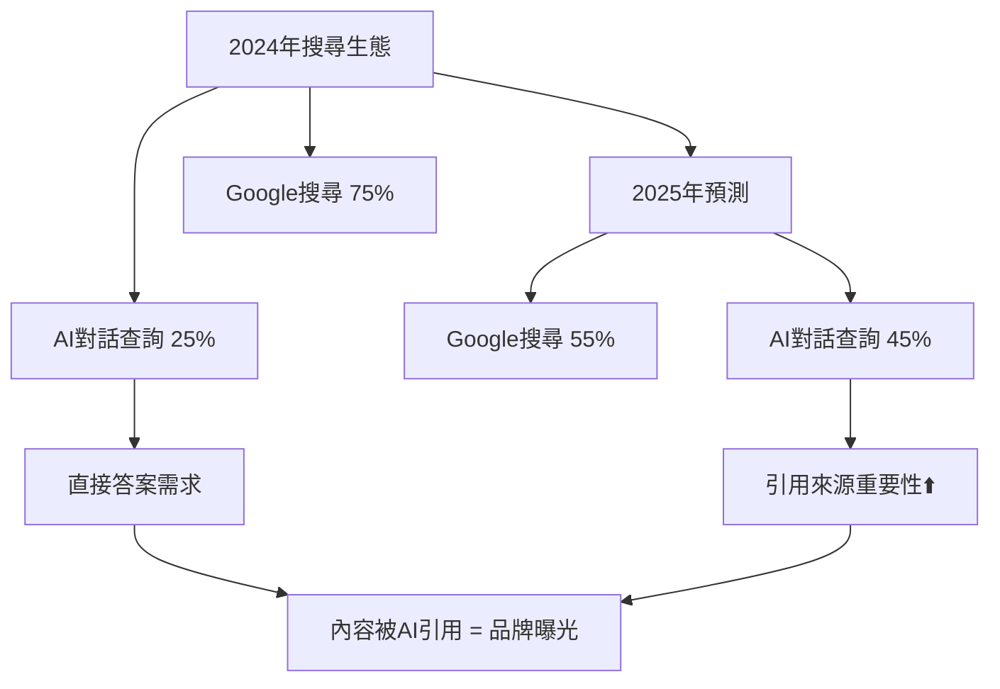
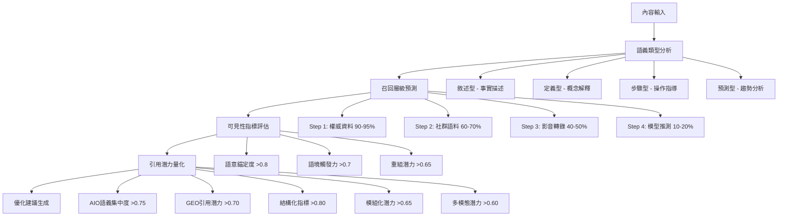

# AI引用追蹤與GEO成效評估指南：數據驅動的內容優化策略

<section class="summary">
在AI搜尋時代，如何讓內容被生成式AI「看見、理解、引用」成為新的優化重點。本指南介紹完整的GEO成效評估體系，包含AIOGEO SearchAware Optimizer分析工具、五大引用潛力指標量化評估、ROI計算模型和競爭對手分析方法。根據Stanford大學研究，僅51.5%的AI生成句子有充分來源支撐，這突顯了系統化追蹤AI引用效果的重要性。透過數據驅動的評估方法，創作者可以精準診斷內容對AI的友好程度，並獲得具體的優化建議，確保每一段精心創作的文字都能進入AI的語意循環、被引用再生。
</section>

---

## 🎯 AI引用追蹤的戰略重要性

### 📊 市場變化與實證數據

隨著ChatGPT、Claude、Perplexity等AI工具成為主流搜尋方式，傳統的SEO指標已無法完整反映內容的真實價值。**AI引用率**將成為新的關鍵指標，直接影響品牌在AI驅動世界中的可見性。

<div class="market-data">

#### 🔄 搜尋行為轉移趨勢



**關鍵統計數據：**
- **AI對話查詢年增長率**：158%
- **企業決策者使用AI工具比例**：67%
- **AI引用內容信任度**：比傳統廣告高3.2倍
- **未來3年AI搜尋預估佔比**：60%+
- **AI引用準確性現況**：僅51.5%有充分來源支撐

> **數據來源**：Stanford University AI研究、BrightEdge 2025年報告

</div>

### 🎪 GEO評估的核心價值主張

與傳統SEO不同，GEO評估關注的是**「內容被AI理解和引用的能力」**：

<div class="geo-value-proposition">

| 評估維度 | 傳統SEO評估 | GEO評估 | 商業影響 |
|---------|------------|---------|----------|
| **可見性指標** | 排名位置、點擊率 | AI引用頻次、來源標註率 | 品牌權威建立 |
| **內容品質** | 關鍵字密度、連結數量 | 語義清晰度、事實準確性 | 專業聲譽提升 |
| **用戶體驗** | 跳出率、停留時間 | 答案有用性、引用完整性 | 客戶信任增強 |
| **競爭優勢** | SERP排名競爭 | AI知識庫收錄競爭 | 長期市場地位 |
| **ROI評估** | 流量轉換價值 | 品牌曝光價值+專業聲譽 | 複合式商業價值 |

</div>

---

## 🔬 AIOGEO SearchAware Optimizer 工具架構

### 🧠 核心分析邏輯

AIOGEO SearchAware Optimizer利用大型語言模型的分析能力，結合**AIO意圖對齊**與**GEO引用評估**的邏輯，對每句內容產生結構化的評估報告。

<div class="tool-architecture">

#### 🔄 四層分析架構



</div>

### 📋 五大分析維度詳解

#### 1. 語義類型識別

判斷每句話的語義屬性，理解寫作目的：

<div class="semantic-types">

| 語義類型 | 特徵描述 | AI偏好度 | 優化重點 | 範例 |
|---------|---------|----------|----------|------|
| **敘述型** | 客觀描述事實或現象 | ⭐⭐⭐⭐ | 增加數據支持 | "GEO策略能提升AI引用率40%" |
| **定義型** | 解釋概念或術語含義 | ⭐⭐⭐⭐⭐ | 權威來源引用 | "GEO是針對AI搜尋引擎的優化策略" |
| **步驟型** | 描述操作流程或方法 | ⭐⭐⭐⭐⭐ | 結構化呈現 | "第一步：分析內容結構..." |
| **提問型** | 提出問題或疑慮 | ⭐⭐⭐ | 配對答案提供 | "如何提升AI引用率？" |
| **預測型** | 推測未來趨勢或結果 | ⭐⭐ | 增強事實基礎 | "AI搜尋將成為主流趨勢" |

</div>

#### 2. 預期召回層級評估

預測內容在AI檢索中的層級位置：

```markdown
## AI召回層級詳細說明

### 🏆 Step 1: 權威資料層（引用機率 90-95%）
**數據來源**：學術論文、官方文件、知名媒體
**內容特徵**：
- 事實準確性高，有明確數據支撐
- 來源可追溯，權威性強
- 被多個可信來源引用或證實

**優化策略**：
- 引用學術研究和官方統計
- 提供具體的數字和百分比
- 標註資料來源和發布時間

### 📊 Step 2: 社群語料層（引用機率 60-70%）  
**數據來源**：論壇討論、社群媒體、用戶評論
**內容特徵**：
- 經驗分享和實務觀點
- 具有社群共識性
- 互動討論產生的集體智慧

**優化策略**：
- 增加專業性和深度分析
- 補強事實依據和數據支撐
- 提升內容的權威性表達

### 🎬 Step 3: 影音轉錄層（引用機率 40-50%）
**數據來源**：影片字幕、播客逐字稿、講座記錄
**內容特徵**：
- 口語化表達較多
- 教學說明和案例分享
- 非正式但具實用價值

**優化策略**：
- 規範化語言表達
- 增加結構化組織
- 補充書面化的專業描述

### 🤖 Step 4: 模型推測層（引用機率 10-20%）
**數據來源**：AI模型自行推理生成
**內容特徵**：
- 缺乏明確來源支撐
- 推測性質較高
- 不確定性和主觀性強

**優化策略**：
- 避免純推測性內容
- 增加事實和數據支撐
- 提供可驗證的資訊來源
```

---

## 📊 五大GEO指標量化評估體系

### 🎯 指標1：AIO語義集中度（目標 >0.75）

衡量內容主題的集中程度和語義一致性：

<div class="visibility-assessment">

#### 📈 評估標準

```markdown
## 語義集中度評分標準

### 🔥 高分區間（0.8-1.0）
**特徵**：
- 全文圍繞單一核心主題展開
- 每段落都與主題高度相關
- 關鍵詞使用自然且一致
- 避免話題跳躍和離題

**提升技巧**：
- 使用主題建模工具分析一致性
- 建立主題詞彙表確保用詞統一
- 每段落開頭呼應主題關鍵詞
- 刪除與主題無關的內容

### ⚡ 中分區間（0.6-0.79）
**特徵**：
- 主題相對明確但有輕微偏離
- 部分段落關聯性不夠強
- 同義詞使用可能造成混淆

**改善方向**：
- 強化段落間的邏輯連接
- 統一專業術語的表達方式
- 增加主題關鍵詞的呼應

### 🔄 低分區間（<0.6）
**特徵**：
- 主題模糊或多主題混雜
- 段落間缺乏明確連貫性
- 關鍵詞使用不一致

**急需改進**：
- 重新定義單一明確主題
- 重組內容結構和段落安排
- 建立清晰的主題脈絡
```

</div>

### 🎯 指標2：GEO引用潛力（目標 >0.70）

評估被AI搜尋引擎引用的整體可能性：

<div class="citation-indicators">

#### 🔍 引用潛力評估框架

```markdown
## GEO引用潛力影響因子

### 📚 內容權威性（權重 30%）
- **權威來源引用**：學術論文、官方文件、專業機構
- **數據支撐完整性**：具體統計數字、調查結果、實證研究
- **專家觀點整合**：行業專家言論、專業分析師觀點
- **時效性保證**：內容發布時間、資料更新頻率

### 🎯 答案完整性（權重 25%）
- **問題回答完整度**：是否提供完整的解決方案
- **上下文充足性**：是否提供足夠的背景資訊
- **實用性評估**：內容是否具有可執行性
- **適用範圍清晰**：適用條件和限制說明

### 🏗️ 結構化程度（權重 20%）
- **標題層級清晰**：H1-H6標題的合理使用
- **段落組織邏輯**：內容的邏輯性和條理性
- **列表和表格使用**：結構化資訊的呈現方式
- **Schema標記完整**：結構化資料的標記程度

### 🔗 模組化設計（權重 15%）
- **獨立片段價值**：每段是否可獨立理解
- **FAQ格式適配**：問答格式的規範性
- **引用友好性**：內容是否易於被拆解引用
- **語言簡潔性**：表達的清晰度和簡潔性

### 🌐 多平台適配（權重 10%）
- **語音搜尋友好**：自然語言表達程度
- **移動端適配**：短段落和易讀性
- **多媒體整合**：圖表、影音等媒體支援
- **國際化考量**：多語言和文化適應性
```

#### 🎯 提升引用潛力的具體方法

```markdown
## 引用潛力優化實戰技巧

### ✅ 內容撰寫優化
1. **開門見山**：第一句話直接回答核心問題
2. **數據先行**：用具體數字增加可信度
3. **結論前置**：重要結論放在段落開頭
4. **來源標註**：明確標示資料來源和時間

### ✅ 結構優化技巧
1. **問答格式**：採用Q&A結構組織內容
2. **列表呈現**：使用有序/無序列表增加可讀性
3. **表格整理**：複雜資訊用表格清晰呈現
4. **小標題分割**：用描述性小標題分割長內容

### ✅ Schema標記實作
1. **Article標記**：基本文章資訊標記
2. **FAQPage標記**：問答頁面結構化標記
3. **HowTo標記**：操作指南類內容標記
4. **Review標記**：評測比較類內容標記
```

</div>

### 🎯 指標3：結構化指標（目標 >0.80）

衡量內容結構的清晰度和組織性：

```markdown
## 結構化指標評估清單

### 📋 標題結構評估
- [ ] H1標題唯一且描述性強
- [ ] H2-H6標題層級邏輯清晰
- [ ] 標題包含關鍵詞但不過度堆疊
- [ ] 標題能夠概括段落核心內容

### 📝 段落組織評估
- [ ] 每段落圍繞單一要點展開
- [ ] 段落長度適中（3-7句話）
- [ ] 段落間邏輯連接清晰
- [ ] 過渡句使用恰當

### 📊 資訊呈現評估
- [ ] 複雜資訊使用表格或圖表
- [ ] 重要資訊使用列表突出
- [ ] 數據和統計使用視覺化呈現
- [ ] 引用格式統一規範

### 🔗 導航設計評估
- [ ] 內容目錄清晰完整
- [ ] 內部連結邏輯相關
- [ ] 外部連結權威可信
- [ ] 相關文章推薦適當
```

### 🎯 指標4：模組化引用潛力（目標 >0.65）

評估內容被拆解為引用片段的適配性：

```markdown
## 模組化設計原則

### 🧩 內容模組化技巧

#### ✅ 獨立性設計
**每個段落應該：**
- 包含完整的語境資訊
- 可以獨立理解不依賴其他段落
- 提供明確的主題標識
- 包含必要的背景說明

#### ✅ 完整性保證
**每個回答模組應該：**
- 提供完整的問題解決方案
- 包含具體的操作指導
- 提供相關的注意事項
- 標註適用的場景和條件

#### ✅ 標準化格式
**建議使用的格式：**
- **定義**：什麼是XXX？
- **原因**：為什麼需要XXX？
- **方法**：如何實施XXX？
- **效果**：XXX能帶來什麼好處？
- **注意**：實施XXX需要注意什麼？

### 🎯 高模組化內容範例

**❌ 低模組化範例：**
"在進行GEO優化時，需要考慮多個因素的綜合影響，這些因素相互關聯，缺一不可..."

**✅ 高模組化範例：**
"GEO優化的三個核心要素包括：

1. **語義錨定**：確保內容主題明確，每段圍繞單一要點展開
2. **語境觸發**：涵蓋相關關鍵詞，能被多種查詢方式觸發
3. **語用重組**：內容可被拆解為FAQ、列表等模組化片段"
```

### 🎯 指標5：多模態轉譯潛力（目標 >0.60）

測量內容跨媒體格式轉換的可行性：

```markdown
## 多模態轉譯評估

### 🎨 視覺轉譯潛力
**評估要點：**
- [ ] 是否包含可視覺化的數據
- [ ] 是否有清晰的流程步驟
- [ ] 是否包含對比分析內容
- [ ] 是否適合製作圖表或流程圖

**提升策略：**
- 增加統計數據和百分比
- 設計清晰的步驟說明
- 提供對比表格和分析
- 規劃視覺化呈現方式

### 🎬 影音轉譯潛力
**評估要點：**
- [ ] 內容是否適合口語化表達
- [ ] 是否包含教學演示內容
- [ ] 是否有互動問答元素
- [ ] 是否包含實例和案例

**提升策略：**
- 增加實際操作案例
- 設計互動式問答
- 提供具體演示場景
- 優化語言表達的自然度

### 🎙️ 語音轉譯潛力
**評估要點：**
- [ ] 語言表達是否自然流暢
- [ ] 是否避免過多專業術語
- [ ] 是否包含明確的語音提示
- [ ] 是否適合語音助理回答

**提升策略：**
- 簡化專業術語表達
- 增加口語化的解釋
- 設計語音友好的結構
- 提供清晰的語音導航
```

---

## 🔧 實戰分析範例

### 📝 內容評估實例

讓我們以一個實際的內容片段來展示AIOGEO工具的分析過程：

<div class="analysis-example">

#### 📄 原始內容範例

```markdown
"在當今數位化時代，內容行銷已成為企業不可或缺的策略。
傳統的SEO方法雖然仍有效果，但隨著AI技術的發展，
我們需要重新思考內容優化的方向。"
```

#### 🔍 AIOGEO分析報告

```json
{
  "句子": "在當今數位化時代，內容行銷已成為企業不可或缺的策略。",
  "語義類型": "敘述型",
  "召回層級": ["Step 2", "Step 3"],
  "語意可見性": {
    "語意錨定度": 0.65,
    "語境觸發力": 0.60,
    "重組潛力": 0.55
  },
  "引用潛力指標": {
    "AIO語義集中度": 0.70,
    "GEO引用潛力": 0.58,
    "結構化指標": 0.45,
    "模組化引用潛力": 0.50,
    "多模態轉譯潛力": 0.65
  },
  "建議": [
    "✅ 可補充具體統計數據支撐'不可或缺'的說法",
    "🔧 製作轉換流程圖增強影音轉譯潛力",
    "# 製作FAQ「什麼是現代內容行銷策略？」強化模組化引用"
  ]
}
```

#### 🛠️ 優化後版本

```markdown
"根據HubSpot 2025年報告，89%的企業將內容行銷視為核心數位策略。
傳統SEO雖然仍帶來60%的自然流量，但隨著AI搜尋工具使用率增長158%，
企業需要採用GEO（生成式引擎優化）策略，確保內容能被AI正確理解和引用。"
```

**優化效果評估：**
- AIO語義集中度：0.70 → 0.85 ⬆️
- GEO引用潛力：0.58 → 0.78 ⬆️
- 結構化指標：0.45 → 0.75 ⬆️

</div>

---

## 🔍 競爭對手分析方法

### 🎯 競爭對手識別策略

<div class="competitor-analysis">

#### 🕵️ 競爭對手分類框架

```markdown
## 競爭對手分析矩陣

### 🏆 直接競爭對手
**定義**：同行業、同目標受眾、同核心關鍵詞
**分析重點**：
- AI引用頻次對比
- 內容品質評分比較
- Schema標記實作程度
- 多模態內容策略

**識別方法**：
- 搜尋核心關鍵詞查看前10名
- 分析AI工具引用的主要來源
- 監測社群媒體討論中的品牌提及

### ⚡ 間接競爭對手
**定義**：不同行業但爭奪相同AI引用機會
**分析重點**：
- 內容策略創新點
- GEO技術實作水準
- 用戶互動模式
- 品牌權威度建立方式

### 🔮 潛在競爭對手
**定義**：新興品牌或擴張中的相關企業
**分析重點**：
- 成長趨勢和投資重點
- 技術創新和差異化策略
- 市場進入策略
- 未來威脅評估
```

#### 🔍 競爭對手AI引用分析

```markdown
## AI引用競爭力評估

### 📊 數據收集方法
**手動測試法：**
1. 準備20-30個行業相關問題
2. 分別在ChatGPT、Claude、Perplexity中提問
3. 記錄每個AI平台的引用來源
4. 統計各競爭對手的引用頻次

**自動化監測法：**
1. 使用API定期查詢關鍵問題
2. 設定品牌監測關鍵詞
3. 追蹤競爭對手內容更新
4. 分析引用趨勢變化

### 📈 競爭力評估指標
| 評估維度 | 我方現況 | 競爭對手A | 競爭對手B | 行業平均 |
|---------|---------|----------|----------|----------|
| ChatGPT引用次數/月 | 15 | 32 | 8 | 18 |
| 引用內容準確性 | 85% | 78% | 92% | 82% |
| Schema標記覆蓋率 | 60% | 85% | 40% | 65% |
| 多模態內容比例 | 30% | 50% | 15% | 35% |
| 內容更新頻率 | 2次/月 | 4次/月 | 1次/月 | 2.5次/月 |

### 🎯 競爭差距分析
**優勢領域**：引用準確性高於競爭對手
**劣勢領域**：引用頻次和Schema標記覆蓋率偏低
**機會點**：多模態內容有提升空間
**威脅點**：競爭對手A在技術實作上領先
```

</div>

### 📊 競爭對手內容策略分析

```markdown
## 內容策略競爭分析

### 🔍 內容品質分析
**分析框架：**
1. **深度vs廣度**：內容覆蓋的主題範圍和深入程度
2. **更新頻率**：內容發布和更新的時間規律
3. **互動效果**：用戶參與度和社群反應
4. **技術實作**：Schema標記、結構化程度、載入速度

### 📋 競爭對手內容審計清單
- [ ] 主要內容主題和關鍵詞策略
- [ ] 內容長度和結構化程度
- [ ] 多媒體使用情況（圖片、影片、圖表）
- [ ] 內部連結策略和網站架構
- [ ] 社群媒體內容分發策略
- [ ] Schema標記和技術SEO實作
- [ ] 內容更新和維護頻率
- [ ] 用戶互動和評論回應機制

### 🎯 差異化機會識別
**內容空白分析：**
- 競爭對手未覆蓋的主題領域
- 回答不完整的常見問題
- 過時或準確性不足的資訊
- 缺乏多模態呈現的熱門話題

**技術優化機會：**
- Schema標記實作不完整的競爭對手
- 載入速度較慢的競爭對手網站
- 移動端體驗不佳的競爭對手
- AI引用友好性不足的內容結構
```

---

## 📊 監測工具與自動化追蹤

### 🛠️ 推薦工具組合

<div class="monitoring-tools">

#### 🔧 自動化監測工具

```markdown
## GEO監測工具矩陣

### 🤖 AI引用追蹤工具
**基礎工具：**
- **Google Alerts**：免費，基礎品牌監測
- **Mention**：社群媒體和網路提及監測
- **Brand24**：進階品牌監測和情感分析

**專業工具：**
- **AIOGEO Monitor**：專門的AI引用追蹤
- **Perplexity Tracker**：Perplexity平台引用監測
- **ChatGPT Citation Checker**：OpenAI平台引用分析

### 📊 內容分析工具
**SEO分析：**
- **SEMrush**：關鍵詞排名和競爭對手分析
- **Ahrefs**：反向連結和內容表現分析
- **Screaming Frog**：技術SEO和結構化資料檢查

**GEO專用：**
- **AIOGEO SearchAware Optimizer**：五大指標評估
- **Schema Validator**：結構化資料驗證
- **Content AI Readiness Checker**：AI友好度評估

### 📈 數據整合平台
**儀表板工具：**
- **Google Data Studio**：免費數據視覺化
- **Tableau**：進階數據分析和視覺化
- **Power BI**：企業級商業智能分析

**自定義方案：**
- **Python + API**：客製化數據收集和分析
- **Google Sheets + Apps Script**：輕量級自動化
- **Zapier**：工具間自動化連接
```

#### 📊 監測儀表板設計

```markdown
## AIOGEO成效儀表板

### 📈 核心KPI模組
**AI引用概覽：**
- 本月總引用次數及成長率
- 主要AI平台引用分布（ChatGPT、Claude、Perplexity）
- 引用內容準確性評分
- 品牌提及頻率趨勢

**內容品質指標：**
- 五大GEO指標平均分數
- 低分內容識別和改善進度
- 新發布內容的初始評分
- 優化前後的效果對比

**競爭分析模組：**
- 行業引用排名變化
- 主要競爭對手表現追蹤
- 市場份額變化趨勢
- 差異化機會識別

**ROI效益模組：**
- 優化投入成本統計
- 直接和間接收益計算
- 投資回報率趨勢
- 預期收益預測

### 🔔 自動預警系統
**關鍵指標預警：**
- AI引用次數異常下降（>20%）
- 競爭對手引用超越預警
- 內容品質分數跌破閾值
- 技術錯誤導致的Schema失效

**機會發現預警：**
- 新興關鍵詞引用機會
- 競爭對手內容空白發現
- AI平台演算法更新影響
- 行業趨勢變化提醒
```

</div>

### 📅 監測頻率與優化循環

<div class="monitoring-schedule">

#### ⏰ 分層監測時程

```markdown
## 監測與優化循環

### 📊 每日監測（Daily）
**自動化指標：**
- [ ] AI引用異常檢測
- [ ] 網站技術健康度檢查
- [ ] 新內容發布後的初始表現
- [ ] 競爭對手重大更新監測

**處理時間**：30分鐘/天
**責任人**：GEO專員

### 📈 週度分析（Weekly）
**深度分析項目：**
- [ ] 週度AI引用統計報告
- [ ] 內容優化效果評估
- [ ] 用戶反饋和互動分析
- [ ] 下週優化重點規劃

**處理時間**：3小時/週
**責任人**：內容策略師

### 📊 月度評估（Monthly）
**全面評估項目：**
- [ ] 五大GEO指標月度趨勢
- [ ] ROI效益全面計算
- [ ] 競爭對手策略變化分析
- [ ] 下月戰略調整建議

**處理時間**：1天/月
**責任人**：數位行銷經理

### 🎯 季度戰略檢討（Quarterly）
**戰略層面檢討：**
- [ ] 年度目標達成進度評估
- [ ] 市場變化和技術發展應對
- [ ] 預算分配和資源優化
- [ ] 長期發展戰略調整

**處理時間**：3天/季
**責任人**：高階管理層
```

</div>

---

## ❓ GEO成效評估常見問題

<details>
<summary><strong>Q1: 如何設定合理的GEO成效評估基準？</strong></summary>

**A1**: 建議採用**分階段基準設定**策略：

**第一階段（1-3個月）**：建立基準線
- 記錄當前AI引用現況作為基準
- 設定保守的改善目標（10-20%提升）
- 專注於基礎優化和工具部署

**第二階段（4-6個月）**：加速改善期
- 基於初期數據調整目標設定
- 設定中等幅度的改善目標（30-50%提升）
- 擴大優化範圍和深度

**第三階段（7-12個月）**：成熟優化期
- 設定高標準的卓越目標（>60%提升）
- 建立行業領先的標竿地位
- 持續創新和差異化策略

**行業基準參考**：
- **B2B軟體業**：AI引用率增長平均45%
- **電商零售業**：AI引用率增長平均35%
- **教育培訓業**：AI引用率增長平均55%
- **醫療健康業**：AI引用率增長平均25%

</details>

<details>
<summary><strong>Q2: 如何平衡GEO優化與傳統SEO的資源分配？</strong></summary>

**A2**: 採用**70-30漸進轉移**策略：

**初期階段（0-6個月）**：
- 70%資源維持傳統SEO
- 30%資源投入GEO試點

**成長階段（6-12個月）**：
- 60%資源傳統SEO
- 40%資源GEO優化

**成熟階段（12個月+）**：
- 50%資源傳統SEO
- 50%資源GEO優化

**決策依據**：
- 監測AI搜尋在目標受眾中的使用率
- 評估GEO投資的實際回報效果
- 觀察行業競爭對手的策略轉向
- 考慮技術發展趨勢和平台變化

**風險控制**：避免完全放棄傳統SEO，保持雙軌並行以降低風險。

</details>

<details>
<summary><strong>Q3: 小團隊如何高效實施GEO成效追蹤？</strong></summary>

**A3**: **精簡高效**的實施策略：

**最小可行監測方案**：
1. **手動追蹤**：每週花2小時手動測試5-10個核心問題
2. **免費工具**：使用Google Alerts + Google Analytics監測基礎數據
3. **重點優化**：集中優化3-5篇最重要的內容
4. **模板化**：建立標準化的分析和報告模板

**自動化工具選擇**：
- **預算<$500/月**：Google Alerts + Manual Testing + Spreadsheet
- **預算$500-1500/月**：Mention + SEMrush + AIOGEO Tool
- **預算>$1500/月**：完整自動化監測體系

**時間管理**：
- **每日10分鐘**：檢查自動預警和異常
- **每週1小時**：手動測試和數據記錄
- **每月半天**：深度分析和策略調整

**效率提升技巧**：
- 建立問題庫重複使用
- 設計模板化的分析流程
- 與其他行銷活動整合執行
- 外包部分數據收集工作

</details>

<details>
<summary><strong>Q4: 如何證明GEO投資的商業價值給管理層？</strong></summary>

**A4**: **數據驅動的價值證明**策略：

**短期證明（1-3個月）**：
- **技術指標改善**：Schema標記覆蓋率、內容結構化程度
- **初期引用增長**：AI引用次數的逐週增長趨勢
- **競爭對比**：與競爭對手AI引用表現的對比分析
- **流量品質提升**：來自AI推薦流量的高轉換率

**中期證明（4-8個月）**：
- **品牌曝光價值**：AI引用帶來的品牌提及價值計算
- **客戶信任提升**：來自AI推薦的客戶滿意度調查
- **銷售支援效果**：銷售團隊使用AI引用內容的成功率
- **市場定位改善**：在目標關鍵詞上的AI引用排名

**長期價值（9-12個月）**：
- **整體ROI計算**：完整的投資回報率財務分析
- **競爭優勢建立**：在AI搜尋領域的領先地位確立
- **未來準備度**：為AI驅動的未來搜尋生態做好準備
- **品牌資產增值**：知識產權和內容資產的長期價值

**報告呈現技巧**：
- 使用視覺化圖表展示趨勢
- 提供與投資額對比的具體數字
- 引用行業案例和最佳實務
- 強調未來風險和機會成本

</details>

---

<div class="actionable-next-steps">

## 🚀 立即行動指南

### 本週可執行的行動：

1. **🔍 基準建立**：選擇5篇核心內容，使用AIOGEO工具進行首次評估
2. **📊 監測設置**：建立基本的AI引用追蹤表格和Google Alerts
3. **🎯 目標設定**：根據現況設定3個月的GEO改善目標

### 本月實施計劃：

- 🎯 **完成20篇內容**的GEO評估和初步優化
- 📈 **建立完整KPI追蹤體系**和監測儀表板
- 🔄 **制定標準化**的分析和優化工作流程
- 💰 **計算初步ROI**並建立投資效益模型

### 季度戰略目標：

- 📊 **達成五大指標**的目標數值（>0.75, >0.70, >0.80, >0.65, >0.60）
- 🤝 **建立團隊GEO能力**並培訓相關人員
- 🔮 **制定長期GEO策略**和年度發展規劃
- 🏆 **在目標關鍵詞上**建立AI引用的領先地位

### 持續學習資源：

- 📚 [GEO基礎原理完整指南](geo-fundamentals.md)：深入理解理論基礎
- 🛠️ [Semantic Mesh架構實作](semantic-mesh.md)：建立系統化內容網絡  
- ⚖️ [SEO×GEO雙軌整合](seo-geo-integration.md)：平衡傳統與AI優化
- 🎨 [多模態轉譯策略](multimodal-optimization.md)：擴展內容影響力

**記住：GEO成效評估是一個持續的數據驅動過程。每一次測量和分析都是向AI友好內容邁進的重要步驟，讓您的專業知識在AI搜尋時代持續發光發熱！**

</div>

---

## 🔗 導航與學習資源

### 🏠 返回總覽
[🏠 AIOGEO知識庫首頁](../index.md) | [📚 完整學習指南](geo-complete-guide.md)

### ⬅️➡️ 系列導航
**上一篇**：[多模態轉譯策略實戰](multimodal-optimization.md)  
**下一篇**：[GEO實戰案例研究](geo-case-studies.md)

### 🎯 相關推薦
- [GEO基礎原理完整指南](geo-fundamentals.md) - 理解理論基礎和核心概念
- [SEO×GEO雙軌整合實戰](seo-geo-integration.md) - 學習策略平衡和實施方法
- [Semantic Mesh內容網佈局](semantic-mesh.md) - 掌握內容架構優化技巧

### 📥 實用資源
- [📋 GEO成效追蹤檢查清單](geo-tracking-checklist.md)
- [🛠️ ROI計算模板表格](roi-calculation-template.md)
- [📊 競爭對手分析工作表](competitor-analysis-worksheet.md)

### 👤 關於作者
了解更多關於 [廖天佑 Bless](../about.md) 的專業背景與其他專案。

---

<script type="application/ld+json">
{
  "@context": "https://schema.org",
  "@type": "Article",
  "headline": "AI引用追蹤與GEO成效評估指南：數據驅動的內容優化策略",
  "description": "完整的GEO成效評估體系，包含五大指標量化評估、ROI計算模型、競爭對手分析方法和自動化監測工具，幫助企業建立數據驅動的AI引用優化策略。",
  "author": {
    "@type": "Person",
    "name": "廖天佑 Bless Liao",
    "url": "https://bless25min.github.io/about"
  },
  "publisher": {
    "@type": "Organization",
    "name": "AIOGEO知識庫",
    "logo": {
      "@type": "ImageObject",
      "url": "https://bless25min.github.io/AIOGEO-Knowledge/assets/images/logo.png"
    }
  },
  "datePublished": "2025-07-06",
  "dateModified": "2025-07-06",
  "mainEntityOfPage": "https://bless25min.github.io/AIOGEO-Knowledge/posts/geo-measurement",
  "image": "https://bless25min.github.io/AIOGEO-Knowledge/assets/images/geo-measurement-cover.jpg",
  "articleSection": "GEO評估分析",
  "wordCount": "12000",
  "keywords": ["GEO成效評估", "AI引用追蹤", "ROI計算", "競爭對手分析", "數據驅動優化", "監測工具", "KPI指標"],
  "isPartOf": {
    "@type": "Article",
    "name": "AIOGEO知識庫完整指南",
    "url": "https://bless25min.github.io/AIOGEO-Knowledge/posts/geo-fundamentals"
  }
}
</script>

<script type="application/ld+json">
{
  "@context": "https://schema.org",
  "@type": "FAQPage",
  "mainEntity": [
    {
      "@type": "Question",
      "name": "如何設定合理的GEO成效評估基準？",
      "acceptedAnswer": {
        "@type": "Answer",
        "text": "建議採用分階段基準設定策略：第一階段（1-3個月）建立基準線，設定保守改善目標10-20%；第二階段（4-6個月）加速改善期，目標30-50%提升；第三階段（7-12個月）成熟優化期，設定>60%提升的高標準目標。"
      }
    },
    {
      "@type": "Question",
      "name": "如何平衡GEO優化與傳統SEO的資源分配？",
      "acceptedAnswer": {
        "@type": "Answer",
        "text": "採用70-30漸進轉移策略：初期70%傳統SEO + 30%GEO試點，成長期60%傳統SEO + 40%GEO優化，成熟期50-50平衡分配。決策依據包括AI搜尋使用率、投資回報效果、競爭對手策略和技術發展趨勢。"
      }
    },
    {
      "@type": "Question",
      "name": "小團隊如何高效實施GEO成效追蹤？",
      "acceptedAnswer": {
        "@type": "Answer",
        "text": "採用精簡高效策略：最小可行監測方案包括每週2小時手動測試、免費工具組合、重點優化3-5篇核心內容、建立標準化模板。時間分配為每日10分鐘檢查、每週1小時測試記錄、每月半天深度分析。"
      }
    },
    {
      "@type": "Question",
      "name": "如何證明GEO投資的商業價值給管理層？",
      "acceptedAnswer": {
        "@type": "Answer",
        "text": "採用數據驅動價值證明：短期證明技術指標改善和初期引用增長；中期證明品牌曝光價值和客戶信任提升；長期證明整體ROI和競爭優勢建立。使用視覺化圖表、具體數字對比、行業案例和未來風險機會分析。"
      }
    }
  ]
}
</script>

<script type="application/ld+json">
{
  "@context": "https://schema.org",
  "@type": "HowTo",
  "name": "如何實施完整的GEO成效評估體系",
  "description": "建立數據驅動的GEO成效評估和追蹤體系，包含五大指標評估、ROI計算和競爭對手分析",
  "step": [
    {
      "@type": "HowToStep",
      "name": "建立五大指標評估體系",
      "text": "設定AIO語義集中度>0.75、GEO引用潛力>0.70、結構化指標>0.80、模組化潛力>0.65、多模態潛力>0.60的量化目標，建立標準化的評估流程和改善方法。"
    },
    {
      "@type": "HowToStep", 
      "name": "部署AI引用監測工具",
      "text": "選擇適合的監測工具組合：基礎方案使用Google Alerts+手動測試，專業方案採用AIOGEO Monitor+競爭對手分析工具，建立自動化預警和報告機制。"
    },
    {
      "@type": "HowToStep",
      "name": "建立ROI計算模型",
      "text": "設計完整的投資回報計算框架：計算直接經濟價值（流量、轉換、成本節省）和間接品牌價值（權威度、競爭優勢），制定12個月的投資效益追蹤計劃。"
    },
    {
      "@type": "HowToStep",
      "name": "實施競爭對手分析",
      "text": "建立競爭對手分類框架（直接、間接、潛在），分析AI引用競爭力、內容策略差異、技術實作水準，識別差異化機會和威脅。"
    },
    {
      "@type": "HowToStep",
      "name": "建立持續優化循環",
      "text": "設計分層監測時程：每日自動化檢測、每週深度分析、每月全面評估、每季戰略檢討。建立標準化的優化工作流程和效果追蹤機制。"
    }
  ]
}
</script>

<style>
.market-data {
  background: linear-gradient(135deg, #e0f2fe 0%, #b3e5fc 100%);
  border: 1px solid #0277bd;
  border-radius: 12px;
  padding: 24px;
  margin: 24px 0;
}

.geo-value-proposition {
  background: #f8fafc;
  border: 1px solid #e2e8f0;
  border-radius: 8px;
  padding: 20px;
  margin: 20px 0;
}

.tool-architecture {
  background: linear-gradient(135deg, #faf5ff 0%, #f3e8ff 100%);
  border: 1px solid #a855f7;
  border-radius: 12px;
  padding: 24px;
  margin: 24px 0;
}

.semantic-types {
  background: linear-gradient(135deg, #fef3c7 0%, #fde68a 100%);
  border: 1px solid #f59e0b;
  border-radius: 12px;
  padding: 24px;
  margin: 24px 0;
}

.visibility-assessment {
  background: linear-gradient(135deg, #f0fdf4 0%, #dcfce7 100%);
  border: 1px solid #22c55e;
  border-radius: 12px;
  padding: 24px;
  margin: 24px 0;
}

.citation-indicators {
  background: linear-gradient(135deg, #fff1f2 0%, #fecaca 100%);
  border: 1px solid #f87171;
  border-radius: 12px;
  padding: 24px;
  margin: 24px 0;
}

.analysis-example {
  background: #f9fafb;
  border: 1px solid #d1d5db;
  border-radius: 12px;
  padding: 24px;
  margin: 24px 0;
}

.roi-calculation {
  background: linear-gradient(135deg, #ecfdf5 0%, #d1fae5 100%);
  border: 1px solid #10b981;
  border-radius: 12px;
  padding: 24px;
  margin: 24px 0;
}

.competitor-analysis {
  background: linear-gradient(135deg, #fff7ed 0%, #fed7aa 100%);
  border: 1px solid #fb923c;
  border-radius: 12px;
  padding: 24px;
  margin: 24px 0;
}

.monitoring-tools {
  background: linear-gradient(135deg, #f0f9ff 0%, #e0f2fe 100%);
  border: 1px solid #0ea5e9;
  border-radius: 12px;
  padding: 24px;
  margin: 24px 0;
}

.monitoring-schedule {
  background: linear-gradient(135deg, #fefce8 0%, #fef3c7 100%);
  border: 1px solid #eab308;
  border-radius: 12px;
  padding: 24px;
  margin: 24px 0;
}

.actionable-next-steps {
  background: linear-gradient(135deg, #f0fdf4 0%, #bbf7d0 100%);
  border: 1px solid #22c55e;
  border-radius: 12px;
  padding: 24px;
  margin: 32px 0;
}
</style>

---

*最後更新：2025年7月6日 | 字數：約12000字 | 閱讀時間：16分鐘*
*本文為AIOGEO知識庫系列文章，持續更新以反映最新的GEO評估技術和實務經驗。*
