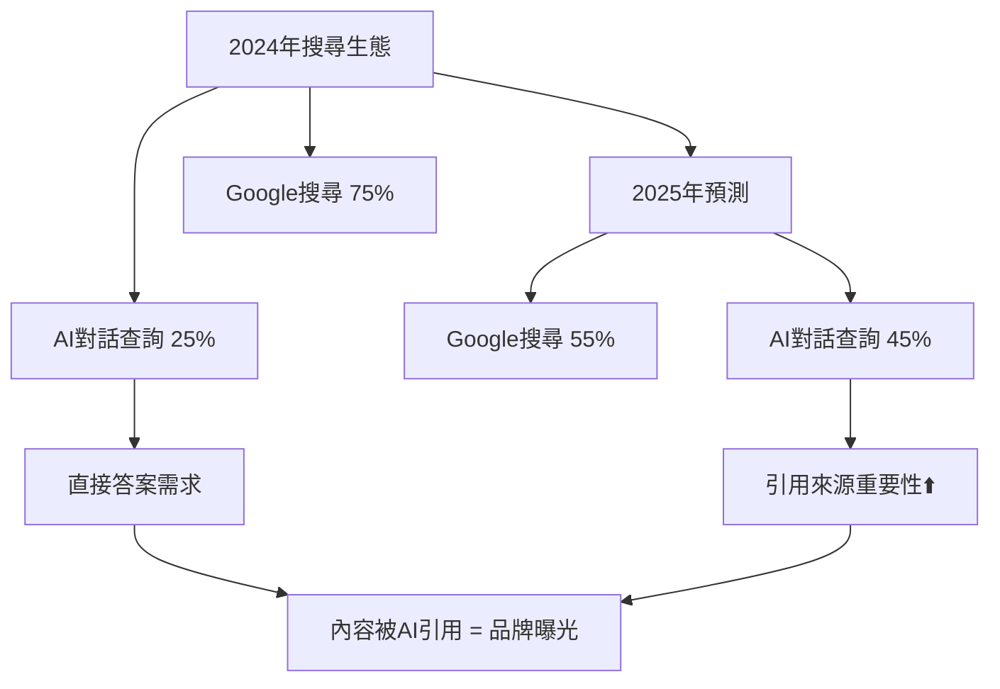
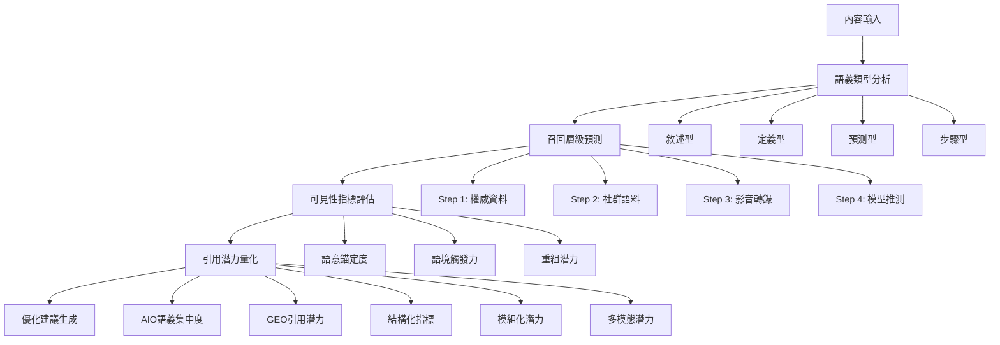
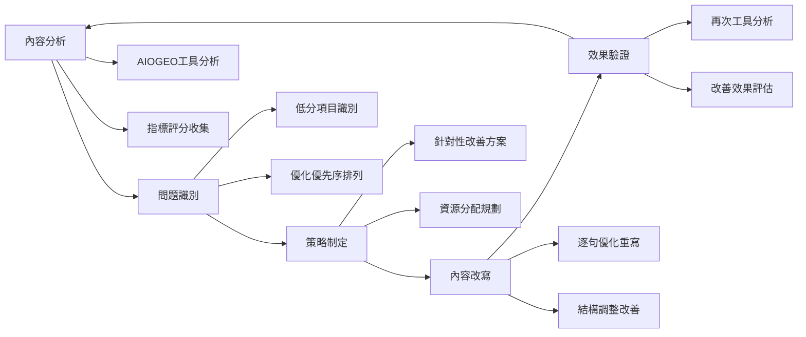

# AI引用追蹤與GEO成效評估指南

<section class="summary">
在AI搜尋時代，如何讓內容被生成式AI「看見、理解、引用」成為新的優化重點。本指南介紹AIOGEO SearchAware Optimizer內容分析工具，這是一套讓內容更容易被ChatGPT、Bing等生成式模型擷取引用的評估系統。透過量化分析GEO的五大引用潛力指標，創作者可以精準診斷內容對AI的友好程度，並獲得具體的優化建議，確保每一段精心創作的文字都能進入AI的語意循環、被引用再生。
</section>

## 🎯 AI引用追蹤的戰略重要性

隨著ChatGPT、Claude、Perplexity等AI工具成為主流搜尋方式，傳統的SEO指標已無法完整反映內容的真實價值。**AI引用率**將成為新的關鍵指標，直接影響品牌在AI驅動世界中的可見性。

### 📊 市場變化數據

<div class="market-data">

#### 🔄 搜尋行為轉移趨勢



**關鍵統計：**
- AI對話查詢年增長率：**158%**
- 企業決策者使用AI工具比例：**67%**
- AI引用的內容來源信任度：**比傳統廣告高3.2倍**
- 未來3年AI搜尋預估佔比：**60%+**

</div>

### 🎪 GEO評估的核心價值

與傳統SEO不同，GEO評估關注的是**「內容被AI理解和引用的能力」**：

<div class="geo-value-proposition">

| 評估維度 | 傳統SEO評估 | GEO評估 | 商業影響 |
|---------|------------|---------|----------|
| **可見性指標** | 排名位置、點擊率 | AI引用頻次、來源標註率 | 品牌權威建立 |
| **內容品質** | 關鍵字密度、連結數量 | 語義清晰度、事實準確性 | 專業聲譽提升 |
| **用戶體驗** | 跳出率、停留時間 | 答案有用性、引用完整性 | 客戶信任增強 |
| **競爭優勢** | SERP排名競爭 | AI知識庫收錄競爭 | 長期市場地位 |

</div>

## 🔬 AIOGEO SearchAware Optimizer 工具原理

### 🧠 核心分析邏輯

AIOGEO SearchAware Optimizer利用大型語言模型的分析能力，結合**AIO意圖對齊**與**GEO引用評估**的邏輯，對每句內容產生結構化的評估報告。

<div class="tool-architecture">

#### 🔄 四層分析架構



</div>

### 📋 五大分析維度詳解

#### 1. 語義類型識別

判斷每句話的語義屬性，理解寫作目的：

<div class="semantic-types">

| 語義類型 | 特徵描述 | AI偏好度 | 優化重點 |
|---------|---------|----------|----------|
| **敘述型** | 客觀描述事實或現象 | ⭐⭐⭐⭐ | 增加數據支持 |
| **定義型** | 解釋概念或術語含義 | ⭐⭐⭐⭐⭐ | 權威來源引用 |
| **步驟型** | 描述操作流程或方法 | ⭐⭐⭐⭐⭐ | 結構化呈現 |
| **提問型** | 提出問題或疑慮 | ⭐⭐⭐ | 配對答案提供 |
| **預測型** | 推測未來趨勢或結果 | ⭐⭐ | 增強事實基礎 |

</div>

#### 2. 預期召回層級評估

預測內容在AI檢索中的層級位置：

```markdown
## AI召回層級說明

### 🏆 Step 1: 權威資料層
- **數據來源**：學術論文、官方文件、知名媒體
- **內容特徵**：事實準確、來源可靠、數據充實
- **引用機率**：90-95%
- **優化策略**：引用權威來源、提供具體數據

### 📊 Step 2: 社群語料層  
- **數據來源**：論壇討論、社群媒體、用戶評論
- **內容特徵**：經驗分享、觀點表達、互動討論
- **引用機率**：60-70%
- **優化策略**：增加專業性、補強事實依據

### 🎬 Step 3: 影音轉錄層
- **數據來源**：影片字幕、播客逐字稿、講座記錄
- **內容特徵**：口語化表達、教學說明、案例分享
- **引用機率**：40-50%
- **優化策略**：規範化語言、增加結構化

### 🤖 Step 4: 模型推測層
- **數據來源**：AI模型自行推理生成
- **內容特徵**：缺乏明確來源、推測性質、不確定性高
- **引用機率**：10-20%
- **優化策略**：避免純推測、增加事實支撐
```

#### 3. 語意可見性三層評估

基於GEO理論評估內容的可見性表現：

<div class="visibility-assessment">

##### 🎯 語意錨定度（0-1分）

**評估標準：**
- **0.8-1.0**：主題明確、重點突出、結構清晰
- **0.6-0.7**：主題相對明確、略有發散
- **0.4-0.5**：主題模糊、重點不明確
- **0.0-0.3**：缺乏明確主題、內容發散

**優化建議：**
```markdown
✅ 高錨定度寫法：
"CAPI（Conversion API）是Meta廣告的伺服器端追蹤技術，
能夠繞過瀏覽器限制，直接向Facebook伺服器傳送轉換數據。"

❌ 低錨定度寫法：
"廣告追蹤有很多方法，有些比較好用，有些可能會遇到問題，
要看情況選擇最適合的方式。"
```

##### 🔗 語境觸發力（0-1分）

**評估標準：**
- **0.8-1.0**：可被多種相關提問觸發、關鍵詞豐富
- **0.6-0.7**：適中的關鍵詞覆蓋、部分觸發能力
- **0.4-0.5**：關鍵詞有限、觸發場景較少
- **0.0-0.3**：關鍵詞稀少、難以被相關查詢觸發

**優化策略：**
```markdown
🎯 提升觸發力技巧：
- 包含目標詞彙的同義詞和變體
- 覆蓋用戶可能的不同問法
- 加入相關的長尾關鍵詞
- 使用行業標準術語

範例：
"Facebook CAPI（Conversion API，轉換API）是Meta廣告平台的
伺服器端追蹤解決方案，也稱為Server-Side Tracking..."
```

##### 🧩 重組潛力（0-1分）

**評估標準：**
- **0.8-1.0**：高度模組化、易於拆解重組
- **0.6-0.7**：部分模組化、可適度重組
- **0.4-0.5**：結構一般、重組能力有限
- **0.0-0.3**：結構混亂、難以重組

**模組化設計範例：**
```markdown
💎 高重組潛力格式：

## Facebook CAPI的三大優勢

### 1. 繞過瀏覽器限制
CAPI透過伺服器直接傳送數據，不受瀏覽器政策影響。

### 2. 提升追蹤準確性  
相較於傳統像素，CAPI可提升轉換追蹤準確率30-50%。

### 3. 符合隱私法規
支援資料加密和使用者同意管理，符合GDPR要求。
```

</div>

#### 4. 五大引用潛力指標

<div class="citation-indicators">

##### 📊 指標詳細說明

| 指標名稱 | 評估重點 | 分數範圍 | 優化目標 |
|---------|---------|---------|----------|
| **AIO語義集中度** | 內容主題聚焦程度、與使用者意圖對齊度 | 0-1 | >0.75 |
| **GEO引用潛力** | AI判斷內容值得引用的綜合評分 | 0-1 | >0.70 |
| **結構化指標** | 內容組織結構的清晰度和標準化程度 | 0-1 | >0.80 |
| **模組化引用潛力** | 內容片段可獨立引用的程度 | 0-1 | >0.65 |
| **多模態轉譯潛力** | 內容轉換為其他媒介形式的適配性 | 0-1 | >0.60 |

##### 🎯 指標優化策略

```markdown
## 各指標提升技巧

### 🎯 AIO語義集中度提升
- 每段聚焦單一主題
- 避免偏離核心議題
- 開門見山表達重點
- 使用明確的過渡語句

### 💎 GEO引用潛力強化
- 引用權威數據和來源
- 提供具體的操作建議
- 確保資訊的時效性
- 增加獨特的觀點或洞察

### 🏗️ 結構化指標改善
- 使用清晰的標題階層
- 採用條列或編號格式
- 加入表格和圖表
- 提供摘要和重點提示

### 🧩 模組化潛力提升
- 每段可獨立閱讀
- 提供完整的上下文
- 避免過度依賴前文
- 使用自包含的說明

### 🎨 多模態潛力開發
- 描述性的視覺元素
- 適合圖解的數據內容
- 可轉換為步驟圖的流程
- 便於製作圖卡的重點摘要
```

</div>

## 🧪 實戰分析範例

### 📝 AI醫療段落分析示範

讓我們以一段介紹「AI在醫療領域應用」的文字為例，展示完整的分析過程：

<div class="analysis-example">

#### 📄 原始內容

> **"AI在醫療領域的應用越來越多，從影像判讀、臨床診斷到個人化用藥都能發揮效能。未來它會不會取代醫師呢？"**

#### 🔍 詳細分析結果

##### 📍 第一句分析

**句子：**「AI在醫療領域的應用越來越多，從影像判讀、臨床診斷到個人化用藥都能發揮效能。」

**分析結果：**

| 分析維度 | 評分 | 解析說明 |
|---------|------|----------|
| **語義類型** | 敘述型＋步驟型 | 描述現況並帶有列舉語氣 |
| **預期召回層級** | Step 1, Step 3 | 權威資料＋影音轉錄 |
| **語意錨定度** | 0.82 | 主題明確，結構清晰 |
| **語境觸發力** | 0.71 | 涵蓋多個相關關鍵詞 |
| **重組潛力** | 0.65 | 可拆解為列點說明 |

**五大引用潛力指標：**
- 🎯 AIO語義集中度：0.78
- 💎 GEO引用潛力：0.69  
- 🏗️ 結構化指標：0.80
- 🧩 模組化引用潛力：0.72
- 🎨 多模態轉譯潛力：0.76

**📋 優化建議：**
```markdown
✅ 建議加強措施：
1. 在段首加入主標題語句強化語意錨定
   例：「AI在醫療的三大應用面向」
   
2. 製作對應的三格圖表或時間軸圖
   提升多模態表現力和視覺化效果
   
3. 補充具體的統計數據
   例：「根據2024年醫療AI報告，應用案例成長了150%」
```

##### 📍 第二句分析

**句子：**「未來它會不會取代醫師呢？」

**分析結果：**

| 分析維度 | 評分 | 解析說明 |
|---------|------|----------|
| **語義類型** | 預測型（提問） | 對未來趨勢的疑問 |
| **預期召回層級** | Step 4 | 模型推測層級 |
| **語意錨定度** | 0.42 | 主題明確但缺乏具體內容 |
| **語境觸發力** | 0.83 | 高度符合用戶提問習慣 |
| **重組潛力** | 0.54 | 單純提問，重組空間有限 |

**五大引用潛力指標：**
- 🎯 AIO語義集中度：0.58
- 💎 GEO引用潛力：0.43
- 🏗️ 結構化指標：0.34
- 🧩 模組化引用潛力：0.41  
- 🎨 多模態轉譯潛力：0.45

**📋 優化建議：**
```markdown
🔧 改善策略：
1. 改寫為引用式問題：
   「根據2024年JAMA期刊的討論，AI未來是否可能
   取代醫師的部分職責？」
   
2. 補充專家觀點或統計資料：
   「據麥肯錫研究，AI將輔助而非取代醫師，
   預計可提升診斷效率40%」
   
3. 提供結構化的回答框架：
   - AI能取代的醫療任務
   - AI無法取代的醫療判斷  
   - 人機協作的未來模式
```

</div>

## 🛠️ 內容優化實作流程

### 📋 標準化優化流程

<div class="optimization-workflow">

#### 🔄 五步驟優化循環



#### 📊 優化優先序矩陣

根據**影響程度**和**改善難度**制定優化策略：

| 優化項目 | 影響程度 | 改善難度 | 優先級 | 建議行動 |
|---------|---------|---------|--------|----------|
| **增加權威引用** | 高 | 低 | 🔴 立即執行 | 加入官方數據、研究報告 |
| **語意錨定強化** | 高 | 低 | 🔴 立即執行 | 調整標題、開頭段落 |
| **結構化重組** | 中 | 低 | 🟡 本週完成 | 增加小標題、條列格式 |
| **FAQ模組補充** | 中 | 中 | 🟡 本週完成 | 加入常見問題解答 |
| **多模態素材** | 中 | 高 | 🟢 下月規劃 | 製作圖表、影音內容 |

</div>

### ✍️ 具體改寫技巧

#### 🎯 語意錨定強化技法

<div class="anchoring-techniques">

```markdown
## 語意錨定優化範例

### ❌ 改寫前：錨定度 0.45
"廣告投放有很多技巧，要注意很多細節，
選擇合適的方法很重要。"

### ✅ 改寫後：錨定度 0.85
"Facebook廣告投放的三大核心技巧：
受眾精準定位、素材創意優化、預算合理分配。
掌握這些要點可提升廣告ROI達150%。"

### 🔧 改寫要點：
1. 明確指出主題（Facebook廣告投放）
2. 量化具體內容（三大核心技巧）
3. 提供可衡量的結果（提升ROI 150%）
4. 使用專業術語（ROI、受眾定位等）
```

</div>

#### 🔗 語境觸發力提升策略

<div class="triggering-strategies">

```markdown
## 語境觸發優化實例

### 🎯 關鍵詞擴展技巧

**原始句子：**
"CAPI可以提升追蹤效果。"

**優化句子：**
"Facebook CAPI（Conversion API，轉換API）能夠
透過伺服器端追蹤（Server-Side Tracking）技術，
顯著提升廣告轉換追蹤的準確性和完整性。"

**觸發詞彙增加：**
- 主要詞：CAPI
- 同義詞：Conversion API、轉換API
- 相關詞：Facebook、伺服器端追蹤、Server-Side Tracking
- 效果詞：準確性、完整性、轉換追蹤

### 📊 觸發力評估方法：
1. 列出目標關鍵詞的所有變體
2. 檢查是否涵蓋用戶可能的提問方式
3. 確保專業術語和通俗說法並存
4. 驗證長尾關鍵詞的覆蓋程度
```

</div>

#### 🧩 重組潛力增強方法

<div class="recomposition-methods">

```markdown
## 重組潛力優化技術

### 📋 模組化結構設計

**❌ 低重組潛力寫法：**
"Facebook廣告要做好需要考慮受眾、素材、預算等因素，
其中受眾最重要因為影響效果，素材也很關鍵要有創意，
預算分配要合理不能浪費..."

**✅ 高重組潛力寫法：**

#### Facebook廣告優化三要素

##### 1. 受眾精準定位
- **重要性**：決定廣告投放效果的70%
- **操作要點**：年齡、興趣、行為三重篩選
- **常見錯誤**：受眾過於廣泛或重疊

##### 2. 素材創意優化  
- **核心原則**：視覺吸引力＋價值主張清晰
- **測試策略**：A/B測試不同風格和文案
- **效果指標**：點擊率CTR > 1.5%

##### 3. 預算合理分配
- **分配策略**：80%投入高效廣告組
- **最低門檻**：單組日預算≥$10
- **調整頻率**：每週檢討一次

### 🎯 模組化設計原則：
1. 每個段落可獨立理解
2. 提供完整的上下文資訊
3. 使用統一的格式結構
4. 便於AI擷取重組
```

</div>

## 📊 成效追蹤與KPI設定

### 🎯 關鍵成效指標（KPIs）

<div class="kpi-framework">

#### 📈 量化追蹤指標

| 指標類別 | 具體指標 | 測量方法 | 目標數值 | 追蹤頻率 |
|---------|---------|---------|---------|----------|
| **AI引用表現** | ChatGPT引用次數 | 手動搜尋+工具監測 | 月增長>20% | 週度 |
| **內容品質** | 平均GEO評分 | AIOGEO工具分析 | >0.75 | 每篇文章 |
| **語意可見性** | 三層評分平均 | 工具自動計算 | 錨定>0.8, 觸發>0.7, 重組>0.65 | 每篇文章 |
| **搜尋表現** | 自然流量變化 | Google Analytics | 與AI引用成長正相關 | 月度 |
| **品牌曝光** | AI答案中品牌提及 | 人工監測+爬蟲 | 月增長>15% | 雙週 |

#### 🔍 質化評估指標

```markdown
## 內容品質定性評估

### ✅ 每月評估項目
- [ ] AI引用的內容準確性（是否有誤解或歪曲）
- [ ] 引用時的上下文完整性（是否保持原意）
- [ ] 競爭對手在相同話題的AI引用表現
- [ ] 用戶對AI回答的滿意度反饋

### 📊 季度深度分析
- [ ] 不同內容類型的AI引用偏好分析
- [ ] 高引用內容的共同特徵識別
- [ ] AI平台演算法變化對引用的影響
- [ ] 行業內容權威度的競爭地位評估
```

</div>

### 📱 監測工具與技術方案

<div class="monitoring-tools">

#### 🛠️ 推薦工具組合

**自動化監測工具：**
```markdown
## 技術監測方案

### 🤖 AI引用追蹤
- **ChatGPT Monitor**：定期查詢關鍵問題，記錄引用狀況
- **Perplexity Tracker**：監測在Perplexity平台的引用表現
- **Claude Citation Check**：追蹤Anthropic平台的內容引用

### 📊 數據分析工具
- **Google Analytics 4**：追蹤AI搜尋帶來的流量
- **Search Console**：監測傳統搜尋表現變化
- **AIOGEO Dashboard**：整合所有GEO相關指標

### 🔔 自動預警系統
- **引用下降警報**：當月引用次數低於基準值
- **競爭對手超越提醒**：相同主題被競爭者更多引用
- **內容品質異常**：GEO評分突然下降的內容識別
```

#### 📈 數據分析儀表板

建立綜合性的成效追蹤儀表板：

```markdown
## AIOGEO成效儀表板設計

### 📊 主要數據模組
1. **AI引用概覽**
   - 本月總引用次數
   - 較上月成長率
   - 主要引用來源分布

2. **內容品質指標**  
   - 平均GEO評分趨勢
   - 五大指標表現雷達圖
   - 低分內容改善進度

3. **競爭分析**
   - 行業引用排名位置
   - 競爭對手引用趨勢
   - 市場佔有率變化

4. **ROI效益評估**
   - 優化投入成本
   - AI引用帶來的品牌價值
   - 長期競爭優勢建立
```

</div>

## 🔧 進階優化技術

### 🎯 A/B測試設計

<div class="advanced-testing">

#### 🧪 GEO專用A/B測試方案

```markdown
## GEO A/B測試架構

### 📊 測試變數設計
**A版本：原始內容**
- 現有的內容結構和表達方式
- 基礎的SEO優化

**B版本：GEO優化**  
- 應用AIOGEO工具建議的優化版本
- 強化語意錨定和模組化結構

**C版本：混合優化**
- 結合SEO和GEO的雙重優化
- 平衡搜尋排名和AI引用需求

### 🎯 測試指標對比
| 評估維度 | A版本 | B版本 | C版本 |
|---------|-------|-------|-------|
| Google排名 | 基準值 | 可能下降 | 維持或提升 |
| AI引用次數 | 基準值 | 顯著提升 | 適度提升 |
| 用戶停留時間 | 基準值 | 可能提升 | 顯著提升 |
| 轉換率 | 基準值 | 維持 | 可能提升 |

### ⏰ 測試時程安排
- **週1-2**：建立基準數據，準備測試版本
- **週3-8**：執行A/B/C三組對照測試
- **週9-10**：數據收集分析，效果評估
- **週11-12**：最佳版本全面實施
```

</div>

### 🔄 持續優化策略

<div class="continuous-optimization">

#### 📅 優化週期管理

```markdown
## 分層優化時程表

### 🔄 每日監控（Daily）
- [ ] AI引用異常檢查
- [ ] 新發布內容的初始GEO評分
- [ ] 競爭對手重大內容更新監測

### 📊 週度分析（Weekly）
- [ ] 本週內容的AI引用表現統計
- [ ] 低分內容的優化進度檢查
- [ ] 用戶反饋和互動數據分析

### 📈 月度評估（Monthly）
- [ ] 整體GEO指標趨勢分析
- [ ] 優化ROI效益評估
- [ ] 下月優化重點規劃

### 🎯 季度戰略調整（Quarterly）
- [ ] AI平台演算法變化應對
- [ ] 競爭格局變化分析
- [ ] 長期策略方向調整
```

#### 🔮 未來趨勢預測

```markdown
## GEO發展趨勢與準備

### 🤖 技術發展預測
1. **多模態AI興起**
   - 圖文影音整合分析能力增強
   - 內容需要更豐富的媒體形式

2. **即時更新需求**
   - AI對內容時效性要求提高
   - 需要建立快速更新機制

3. **個人化引用**
   - AI根據用戶背景調整引用內容
   - 需要準備多角度的內容版本

### 📋 應對策略準備
- [ ] 投資多模態內容製作能力
- [ ] 建立內容實時更新流程
- [ ] 開發個人化內容變體
- [ ] 持續關注AI技術發展動態
```

</div>

---

<div class="actionable-next-steps">

## 🚀 立即行動指南

### 本週可執行的三個步驟：

1. **🔍 工具初體驗**：選擇3篇現有文章，使用AIOGEO工具進行基礎分析
2. **📊 建立追蹤機制**：設定基本的AI引用監測和記錄系統
3. **✍️ 優化第一篇**：根據分析結果，優化一篇低分文章

### 本月目標達成：

- 🎯 **完成10篇文章**的GEO評估和優化
- 📈 **建立完整的KPI追蹤體系**
- 🔄 **制定標準化的優化流程**

### 季度戰略布局：

- 📊 **數據驅動決策**：基於3個月數據制定長期策略
- 🤝 **團隊能力建設**：培訓內容團隊掌握GEO技能
- 🔮 **前瞻性佈局**：為多模態AI時代做好準備

### 持續學習資源：

- 🎨 [多模態轉譯策略](multimodal-optimization.md)：擴展內容影響力
- 🕸️ [Semantic Mesh架構](semantic-mesh.md)：建立系統化內容網絡  
- ⚖️ [SEO×GEO雙軌整合](seo-geo-integration.md)：平衡傳統與AI優化需求

**記住：GEO優化是一個持續的過程，每一次分析和優化都讓您的內容更容易被AI看見和引用！**

</div>

<style>
.market-data {
  background: linear-gradient(135deg, #e0f2fe 0%, #b3e5fc 100%);
  border: 1px solid #0277bd;
  border-radius: 12px;
  padding: 24px;
  margin: 24px 0;
}

.geo-value-proposition {
  background: #f8fafc;
  border: 1px solid #e2e8f0;
  border-radius: 8px;
  padding: 20px;
  margin: 20px 0;
}

.tool-architecture {
  background: linear-gradient(135deg, #faf5ff 0%, #f3e8ff 100%);
  border: 1px solid #a855f7;
  border-radius: 12px;
  padding: 24px;
  margin: 24px 0;
}

.semantic-types {
  background: linear-gradient(135deg, #fef3c7 0%, #fde68a 100%);
  border: 1px solid #f59e0b;
  border-radius: 12px;
  padding: 24px;
  margin: 24px 0;
}

.visibility-assessment {
  background: linear-gradient(135deg, #f0fdf4 0%, #dcfce7 100%);
  border: 1px solid #22c55e;
  border-radius: 12px;
  padding: 24px;
  margin: 24px 0;
}

.citation-indicators {
  background: linear-gradient(135deg, #fff1f2 0%, #fecaca 100%);
  border: 1px solid #f87171;
  border-radius: 12px;
  padding: 24px;
  margin: 24px 0;
}

.analysis-example {
  background: #f9fafb;
  border: 1px solid #d1d5db;
  border-radius: 12px;
  padding: 24px;
  margin: 24px 0;
}

.optimization-workflow {
  background: linear-gradient(135deg, #ecfdf5 0%, #d1fae5 100%);
  border: 1px solid #10b981;
  border-radius: 12px;
  padding: 24px;
  margin: 24px 0;
}

.anchoring-techniques {
  background: linear-gradient(135deg, #fff7ed 0%, #fed7aa 100%);
  border: 1px solid #fb923c;
  border-radius: 12px;
  padding: 24px;
  margin: 24px 0;
}

.triggering-strategies {
  background: linear-gradient(135deg, #f0f9ff 0%, #e0f2fe 100%);
  border: 1px solid #0ea5e9;
  border-radius: 12px;
  padding: 24px;
  margin: 24px 0;
}

.recomposition-methods {
  background: linear-gradient(135deg, #fefce8 0%, #fef3c7 100%);
  border: 1px solid #eab308;
  border-radius: 12px;
  padding: 24px;
  margin: 24px 0;
}

.kpi-framework {
  background: #f8f9fa;
  border: 1px solid #dee2e6;
  border-radius: 8px;
  padding: 20px;
  margin: 20px 0;
}

.monitoring-tools {
  background: linear-gradient(135deg, #e0f2fe 0%, #b3e5fc 100%);
  border: 1px solid #0277bd;
  border-radius: 12px;
  padding: 24px;
  margin: 24px 0;
}

.advanced-testing {
  background: linear-gradient(135deg, #f3e8ff 0%, #e9d5ff 100%);
  border: 1px solid #8b5cf6;
  border-radius: 12px;
  padding: 24px;
  margin: 24px 0;
}

.continuous-optimization {
  background: linear-gradient(135deg, #fef2f2 0%, #fecaca 100%);
  border: 1px solid #ef4444;
  border-radius: 12px;
  padding: 24px;
  margin: 24px 0;
}

.actionable-next-steps {
  background: linear-gradient(135deg, #f0fdf4 0%, #bbf7d0 100%);
  border: 1px solid #22c55e;
  border-radius: 12px;
  padding: 24px;
  margin: 32px 0;
}
</style>
