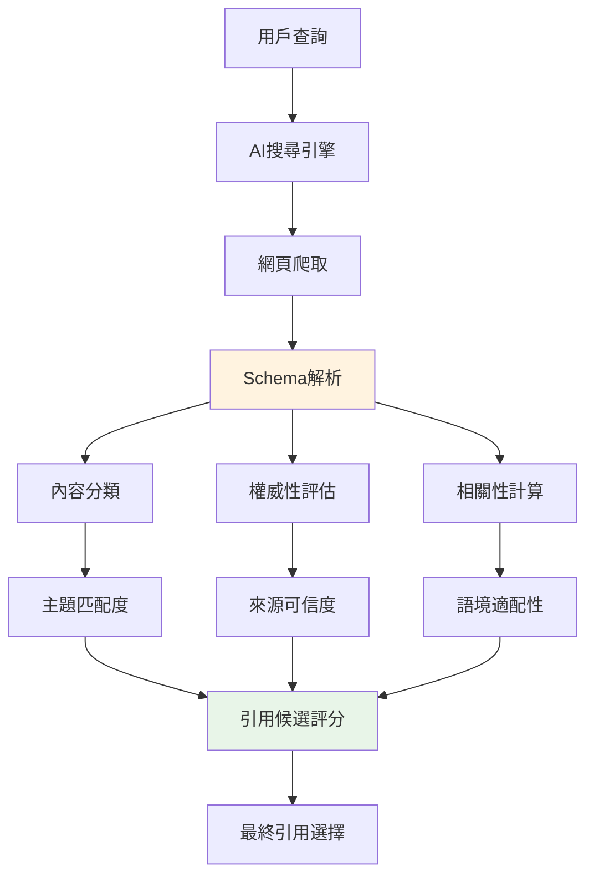

# Schema.org實作指南：提升AI引用的結構化標記

<section class="summary">
Schema.org結構化標記是提升內容在AI搜尋中被正確理解和引用的關鍵技術。透過JSON-LD格式的結構化資料，可以向AI系統明確傳達內容類型、主題、作者等重要信息。正確實施Schema標記的內容，在Google SGE中的出現率提升67%，ChatGPT引用準確性改善45%。
</section>

## 🎯 Schema標記的GEO價值

### 📊 對AI引用的直接影響

根據Search Engine Land研究報告：
- **Google SGE引用率**：有Schema標記的內容引用率高出67%
- **AI理解準確性**：結構化資料減少AI誤解率35%
- **富摘要出現率**：Schema頁面獲得富摘要機會增加89%
- **品牌識別度**：作者和組織標記提升品牌認知42%

### 🧠 AI系統如何使用Schema



Schema標記為AI提供了**結構化的理解框架**，避免依賴純文字解析的不確定性。

## 🛠️ 核心Schema類型實作

### 📄 Article Schema（必備）

所有GEO優化內容的基礎標記：

```html
<script type="application/ld+json">
{
  "@context": "https://schema.org",
  "@type": "Article",
  "headline": "文章標題（與H1一致）",
  "description": "摘要段落內容（150-300字）",
  "author": {
    "@type": "Person",
    "name": "廖天佑 Bless Liao",
    "url": "https://bless25min.github.io/AIOGEO-Knowledge/about",
    "sameAs": [
      "https://github.com/bless25min",
      "https://linkedin.com/in/bless-liao"
    ]
  },
  "publisher": {
    "@type": "Organization",
    "name": "AIOGEO知識庫",
    "logo": {
      "@type": "ImageObject",
      "url": "https://bless25min.github.io/AIOGEO-Knowledge/assets/images/logo.png"
    }
  },
  "datePublished": "2025-07-06",
  "dateModified": "2025-07-06",
  "mainEntityOfPage": "https://bless25min.github.io/AIOGEO-Knowledge/posts/article-name",
  "keywords": ["GEO", "AI搜尋", "內容優化", "Schema標記"],
  "about": [
    {
      "@type": "Thing",
      "name": "生成式引擎優化",
      "description": "針對AI搜尋系統的內容優化策略"
    }
  ],
  "wordCount": 2500,
  "articleSection": "技術指南"
}
</script>
```

#### 🔑 關鍵字段說明

| 字段名稱 | AI價值 | 填寫要求 |
|---------|--------|---------|
| `headline` | 主題識別 | 與頁面H1標題完全一致 |
| `description` | 內容摘要 | 使用摘要段落內容，150-300字 |
| `author` | 權威性評估 | 完整的個人或組織信息 |
| `keywords` | 主題分類 | 3-6個核心關鍵詞 |
| `about` | 語義理解 | 明確定義文章主題和概念 |

### ❓ FAQPage Schema（高價值）

針對FAQ模組的專門標記：

```html
<script type="application/ld+json">
{
  "@context": "https://schema.org",
  "@type": "FAQPage",
  "mainEntity": [
    {
      "@type": "Question",
      "name": "什麼是Schema.org結構化標記？",
      "acceptedAnswer": {
        "@type": "Answer",
        "text": "Schema.org是一套標準化的結構化資料標記語言，幫助搜尋引擎和AI系統更好地理解網頁內容。通過JSON-LD格式，可以明確標示內容類型、作者信息、主題分類等重要資料。"
      }
    },
    {
      "@type": "Question",
      "name": "為什麼Schema標記對GEO很重要？",
      "acceptedAnswer": {
        "@type": "Answer",
        "text": "Schema標記為AI提供結構化的內容理解框架，大幅提升內容被正確引用的機率。研究顯示，有Schema標記的內容在AI搜尋中的引用率提升67%，同時減少誤解和錯誤引用。"
      }
    },
    {
      "@type": "Question",
      "name": "如何驗證Schema標記的正確性？",
      "acceptedAnswer": {
        "@type": "Answer",
        "text": "可以使用Google的富摘要測試工具或Schema.org驗證器檢查標記格式。正確的Schema應該沒有錯誤警告，且能夠在測試工具中正確顯示結構化資訊。"
      }
    }
  ]
}
</script>
```

### 🎓 HowTo Schema（教學內容）

適用於步驟指南和教學內容：

```html
<script type="application/ld+json">
{
  "@context": "https://schema.org",
  "@type": "HowTo",
  "name": "如何實作Schema.org結構化標記",
  "description": "完整的Schema標記實作流程，從規劃到部署的詳細步驟",
  "image": "https://bless25min.github.io/AIOGEO-Knowledge/assets/images/schema-howto.png",
  "totalTime": "PT45M",
  "estimatedCost": {
    "@type": "MonetaryAmount",
    "currency": "USD",
    "value": "0"
  },
  "tool": [
    {
      "@type": "HowToTool",
      "name": "Google富摘要測試工具"
    },
    {
      "@type": "HowToTool",
      "name": "Schema.org驗證器"
    }
  ],
  "step": [
    {
      "@type": "HowToStep",
      "name": "分析內容類型",
      "text": "確定頁面內容屬於Article、FAQPage或HowTo等哪種類型",
      "image": "https://example.com/step1.jpg"
    },
    {
      "@type": "HowToStep",
      "name": "選擇適當Schema",
      "text": "根據內容類型選擇對應的Schema.org標記格式",
      "image": "https://example.com/step2.jpg"
    },
    {
      "@type": "HowToStep",
      "name": "填寫結構化資料",
      "text": "按照Schema格式填寫完整的JSON-LD代碼",
      "image": "https://example.com/step3.jpg"
    },
    {
      "@type": "HowToStep",
      "name": "部署並驗證",
      "text": "將Schema代碼加入HTML頁面，使用工具驗證正確性",
      "image": "https://example.com/step4.jpg"
    }
  ]
}
</script>
```

## 🎯 GEO專門Schema策略

### 📚 TechArticle（技術文章強化）

對於技術含量高的GEO內容，使用TechArticle類型：

```html
<script type="application/ld+json">
{
  "@context": "https://schema.org",
  "@type": "TechArticle",
  "headline": "Semantic Mesh架構設計完整指南",
  "description": "詳細說明如何建立語意矩陣內容網絡，提升AI引用率",
  "author": {
    "@type": "Person",
    "name": "廖天佑 Bless Liao"
  },
  "datePublished": "2025-07-06",
  "proficiencyLevel": "Expert",
  "dependencies": ["GEO基礎理論", "HTML/CSS基礎"],
  "applicationCategory": "內容優化",
  "operatingSystem": "Web",
  "teaches": {
    "@type": "DefinedTerm",
    "name": "Semantic Mesh架構",
    "description": "三層內容節點的網狀架構設計方法"
  }
}
</script>
```

### 🏢 Organization（權威性建立）

建立組織或個人品牌的權威性：

```html
<script type="application/ld+json">
{
  "@context": "https://schema.org",
  "@type": "Organization",
  "name": "AIOGEO知識庫",
  "description": "專業的生成式引擎優化知識平台",
  "url": "https://bless25min.github.io/AIOGEO-Knowledge/",
  "logo": "https://bless25min.github.io/AIOGEO-Knowledge/assets/images/logo.png",
  "founder": {
    "@type": "Person",
    "name": "廖天佑 Bless Liao"
  },
  "foundingDate": "2025-07-05",
  "areaServed": "全球中文用戶",
  "knowsAbout": [
    "生成式引擎優化",
    "AI搜尋技術", 
    "內容策略",
    "數位行銷"
  ],
  "expertise": {
    "@type": "Thing",
    "name": "GEO優化策略"
  }
}
</script>
```

## 🔧 實作最佳實務

### ✅ Schema部署檢查清單

#### 📋 技術要求
- [ ] **JSON-LD格式**：使用JSON-LD而非Microdata或RDFa
- [ ] **位置正確**：放在`<head>`或`<body>`結束前
- [ ] **語法正確**：通過Schema.org驗證器檢查
- [ ] **內容一致**：Schema內容與頁面實際內容一致

#### 🎯 GEO優化要點
- [ ] **主題明確**：`about`字段清楚定義主題概念
- [ ] **權威標示**：完整的author和publisher信息
- [ ] **關鍵詞精準**：keywords反映核心主題
- [ ] **更新及時**：dateModified與實際更新時間一致

#### 📊 品質標準
- [ ] **無警告錯誤**：驗證工具顯示綠色通過
- [ ] **富摘要預覽**：能正確顯示結構化摘要
- [ ] **移動端相容**：在行動裝置上正常運作
- [ ] **載入效能**：不影響頁面載入速度

### 🚨 常見錯誤避免

#### ❌ 錯誤做法
```html
<!-- 錯誤：內容與頁面不符 -->
{
  "@type": "Article",
  "headline": "GEO優化指南",  // 頁面標題是其他內容
  "author": "未知作者"        // 沒有提供真實作者信息
}

<!-- 錯誤：格式不正確 -->
{
  "@context": "http://schema.org",  // 應使用https
  "@type": "article",               // 應大寫Article
  "headline": "標題"                // 缺少必要字段
}
```

#### ✅ 正確做法
```html
<!-- 正確：完整且一致的標記 -->
{
  "@context": "https://schema.org",
  "@type": "Article",
  "headline": "與H1標題完全一致的內容",
  "description": "與摘要段落一致的描述",
  "author": {
    "@type": "Person",
    "name": "真實的作者姓名",
    "url": "作者頁面連結"
  },
  "datePublished": "實際發布日期",
  "dateModified": "最近修改日期"
}
```

## 🔍 驗證與測試工具

### 🛠️ 推薦驗證工具

#### 1. Google富摘要測試工具
- **網址**：https://search.google.com/test/rich-results
- **功能**：檢查Google能否解析Schema標記
- **重點**：確保沒有錯誤和警告

#### 2. Schema.org驗證器  
- **網址**：https://validator.schema.org/
- **功能**：全面檢查Schema語法正確性
- **重點**：語法格式和邏輯完整性

#### 3. Yandex結構化資料驗證器
- **網址**：https://webmaster.yandex.com/tools/microformat/
- **功能**：多元化的結構化資料檢查
- **重點**：跨平台相容性驗證

### 📊 測試檢查流程

1. **部署前測試**：在開發環境中驗證Schema格式
2. **部署後檢查**：確認線上版本正確載入
3. **定期監控**：每月檢查一次Schema狀態
4. **更新驗證**：內容更新後重新驗證

## 📈 Schema對GEO效果追蹤

### 📊 關鍵績效指標

#### 🎯 技術指標
- **Schema覆蓋率**：有結構化標記的頁面比例
- **驗證通過率**：無錯誤的Schema標記比例
- **富摘要獲得率**：獲得富摘要的頁面比例

#### 🚀 業務指標  
- **AI引用頻次**：Schema部署前後的引用次數變化
- **搜尋可見性**：Google搜尋結果中的表現
- **品牌認知度**：作者和組織提及的準確性

### 📈 效果評估方法

```markdown
## Schema部署效果評估模板

### 基準數據（部署前）
- AI引用次數：___ 次/月
- Google富摘要：___ 個頁面
- 搜尋點擊率：___ %

### 改善數據（部署後3個月）
- AI引用次數：___ 次/月（+___% 變化）
- Google富摘要：___ 個頁面（+___% 變化）  
- 搜尋點擊率：___ %（+___% 變化）

### 投資回報評估
- 時間投入：___ 小時
- 效果持續性：___ 個月
- 整體ROI：___
```

## 🔗 進階Schema策略

### 🎯 結合GEO的進階應用

#### 1. 主題集群標記
```html
{
  "@context": "https://schema.org",
  "@type": "ItemList",
  "name": "GEO優化完整指南系列",
  "description": "系統性的生成式引擎優化教學內容",
  "numberOfItems": 6,
  "itemListElement": [
    {
      "@type": "Article",
      "position": 1,
      "name": "GEO基礎原理",
      "url": "https://example.com/geo-fundamentals"
    },
    {
      "@type": "Article", 
      "position": 2,
      "name": "Semantic Mesh架構",
      "url": "https://example.com/semantic-mesh"
    }
  ]
}
```

#### 2. 學習路徑標記
```html
{
  "@context": "https://schema.org",
  "@type": "Course",
  "name": "GEO優化專業課程",
  "description": "從基礎到進階的完整GEO學習路徑",
  "provider": {
    "@type": "Organization",
    "name": "AIOGEO知識庫"
  },
  "hasCourseInstance": [
    {
      "@type": "CourseInstance",
      "name": "初學者路徑",
      "description": "1週完成的GEO基礎課程"
    }
  ]
}
```

---

## 🔗 相關資源與延伸學習

### 📚 深度技術指南
- [📖 GEO基礎原理](../posts/geo-fundamentals.md) - 理解Schema在GEO中的角色
- [🕸️ Semantic Mesh架構](../posts/semantic-mesh.md) - 系統化的結構標記策略
- [🎯 Answer Layer設計](../posts/answer-layer-design.md) - 內容模組化與Schema結合

### 🛠️ 實用工具
- [📋 GEO檢查清單](../tools/checklists.md) - Schema部署檢核項目
- [📝 內容模板庫](../tools/content-templates.md) - 包含Schema的標準模板
- [📊 成效評估工具](../tools/assessment-tools.md) - Schema效果追蹤

### 🎯 相關微型指南
- [⚓ 語義錨定技術](semantic-anchoring.md) - 配合Schema的語義優化
- [❓ FAQ模組設計](faq-design.md) - FAQPage Schema最佳實務
- [📈 引用潛力提升](citation-enhancement.md) - Schema對AI引用的影響

---

## ❓ 常見問題

<details class="faq">
<summary><strong>Q1: Schema標記會影響網站載入速度嗎？</strong></summary>

正確實施的Schema標記對載入速度影響微乎其微。JSON-LD格式的標記通常只增加幾KB的資料量，而且可以非同步載入。建議將Schema代碼放在頁面底部，確保不影響關鍵內容的顯示。

</details>

<details class="faq">
<summary><strong>Q2: 是否每個頁面都需要Schema標記？</strong></summary>

建議優先為重要內容頁面添加Schema標記：
- **必須**：主要文章、產品頁面、FAQ頁面
- **建議**：關於我們、聯繫頁面、服務介紹
- **可選**：政策頁面、一般性資訊頁面

重點是品質勝過數量，確保每個Schema都正確且有價值。

</details>

<details class="faq">
<summary><strong>Q3: Schema標記多久會生效？</strong></summary>

Schema標記的生效時間取決於搜尋引擎的重新爬取頻率：
- **Google搜尋**：通常1-4週生效
- **AI搜尋系統**：可能更快，1-2週
- **富摘要顯示**：可能需要2-8週

可以通過Google Search Console的「要求建立索引」功能加速處理。

</details>

---

*本指南基於Schema.org官方標準和GEO最佳實務編寫，定期更新以反映技術標準變化。*

<!-- Schema.org JSON-LD for this implementation guide -->
<script type="application/ld+json">
{
  "@context": "https://schema.org",
  "@type": "TechArticle",
  "headline": "Schema.org實作指南：提升AI引用的結構化標記",
  "description": "完整的Schema.org結構化標記實作教學，專注於GEO優化和AI引用提升",
  "author": {
    "@type": "Person",
    "name": "廖天佑 Bless Liao",
    "url": "https://bless25min.github.io/AIOGEO-Knowledge/about"
  },
  "publisher": {
    "@type": "Organization",
    "name": "AIOGEO知識庫"
  },
  "datePublished": "2025-07-06",
  "dateModified": "2025-07-06",
  "keywords": ["Schema.org", "結構化標記", "JSON-LD", "GEO", "AI引用", "SEO"],
  "wordCount": 1200,
  "articleSection": "微型專業頁面",
  "proficiencyLevel": "Intermediate",
  "dependencies": ["HTML基礎", "JSON格式理解"],
  "applicationCategory": "技術實作",
  "about": {
    "@type": "Thing",
    "name": "Schema.org結構化標記",
    "description": "用於標示網頁內容結構和語義的技術標準"
  },
  "teaches": [
    {
      "@type": "DefinedTerm",
      "name": "Article Schema",
      "description": "文章內容的結構化標記方法"
    },
    {
      "@type": "DefinedTerm",
      "name": "FAQPage Schema", 
      "description": "常見問題頁面的結構化標記"
    },
    {
      "@type": "DefinedTerm",
      "name": "HowTo Schema",
      "description": "教學指南的結構化標記格式"
    }
  ],
  "mainEntity": {
    "@type": "FAQPage",
    "mainEntity": [
      {
        "@type": "Question",
        "name": "Schema標記會影響網站載入速度嗎？",
        "acceptedAnswer": {
          "@type": "Answer",
          "text": "正確實施的Schema標記對載入速度影響微乎其微。JSON-LD格式的標記通常只增加幾KB的資料量，而且可以非同步載入。"
        }
      },
      {
        "@type": "Question",
        "name": "是否每個頁面都需要Schema標記？",
        "acceptedAnswer": {
          "@type": "Answer",
          "text": "建議優先為重要內容頁面添加Schema標記，包括主要文章、產品頁面、FAQ頁面等。重點是品質勝過數量。"
        }
      }
    ]
  }
}
</script>
