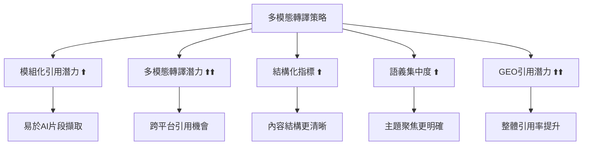
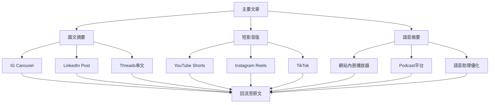

# GEO多模態轉譯實作：圖卡、影片與跨平台引用策略

<section class="summary">
在AI世代，內容多模態轉譯（將文字轉譯成圖像、影片、語音）不僅擴大內容被引用的入口，更直接影響GEO（生成式引擎優化）的五大指標表現。透過將文章模組化拆解並轉換為圖卡、短影音和語音摘要，我們可以顯著提升「多模態轉譯潛力」等關鍵指標，同時強化內容的「模組化引用」價值。換言之，多模態轉譯策略讓內容更易被AI理解、擷取和引用，為內容創作者帶來更高的AI曝光機會。
</section>

## 🌟 多模態轉譯的戰略意義

隨著語音搜尋、圖像識別和多模態AI的快速發展，內容創作者面臨**「單一文字載體局限性」**的挑戰。現代AI系統不僅能理解文字，更能整合圖像、音頻、視頻等多種媒體形式來生成更豐富的回答。

### 📊 市場趨勢數據

<div class="trend-stats">

#### 🚀 關鍵統計數據

- **語音/圖像搜尋量**：已突破總搜尋量的**50%**
- **多模態內容需求年增長率**：高達**320%**  
- **AI多模態引用提升效果**：平均增加**65%**的曝光機會
- **視覺內容分享率**：比純文字內容高出**40倍**

</div>

### 🎯 多模態轉譯與GEO指標的關聯

多模態轉譯策略直接影響GEO評估的**五大核心指標**：



## 📱 圖文摘要轉譯（Carousel/Threads）

### 🎨 核心概念

圖文摘要是將文章內容精華**濃縮為圖像搭配文字**的系列貼文形式，常見於Instagram輪播（Carousel）或Threads等平台的串文。這種轉譯方式適合呈現步驟分明或重點條列的內容。

### 📐 轉譯格式建議

#### 視覺規格設計

<div class="visual-specs">

| 平台 | 建議尺寸 | 比例 | 文字建議 |
|------|---------|------|----------|
| **Instagram Carousel** | 1080×1080 | 1:1 | 20-50字/頁 |
| **Instagram Stories** | 1080×1920 | 9:16 | 15-30字/頁 |
| **Threads** | 1080×1350 | 4:5 | 30-60字/頁 |
| **LinkedIn** | 1200×627 | 1.91:1 | 50-80字/頁 |

</div>

#### 設計最佳實務

```markdown
## 圖卡設計檢查清單

### ✅ 視覺設計
- [ ] 使用一致的品牌色彩和字體
- [ ] 確保移動端可讀性（字體≥24px）
- [ ] 預留足夠的留白空間
- [ ] 使用高對比度的顏色組合

### ✅ 內容結構
- [ ] 每張圖卡聚焦單一重點
- [ ] 使用數字或圖示引導閱讀順序
- [ ] 關鍵詞使用粗體或顏色強調
- [ ] 提供清晰的行動指引（CTA）
```

### 📋 段落對應方式

#### 一段對一頁策略

將原文每個段落濃縮成**單獨一張圖卡**：

<div class="segment-mapping">

**原文段落範例：**
> GEO強調內容需具備三大語意可見性要素：首先是語意錨定，即內容主題明確、結構清晰；其次是語境觸發，代表內容能被多種相關提問喚起；最後是語用重組，表示內容可以被拆解重組成FAQ、清單等不同形式。

**圖卡轉譯：**

**🎯 圖卡1 - 封面**
```
GEO三大語意可見性要素
讓AI輕鬆「看見」你的內容
```

**📌 圖卡2 - 語意錨定**  
```
1️⃣ 語意錨定
✅ 主題明確聚焦
✅ 結構清晰分段
✅ 關鍵詞突出
```

**🎯 圖卡3 - 語境觸發**
```
2️⃣ 語境觸發  
✅ 多種提問方式皆可召回
✅ 相關關鍵詞廣泛覆蓋
✅ 長尾查詢友好
```

**🔄 圖卡4 - 語用重組**
```
3️⃣ 語用重組
✅ 可拆解為FAQ格式
✅ 支援清單條列
✅ 易於模組化引用
```

**📞 圖卡5 - CTA**
```
🔗 閱讀完整教學
掃描QR Code或點擊連結
深入了解GEO優化策略
```

</div>

#### 一問一圖策略

對於FAQ類型內容，採用**每個問題配一張圖卡**的方式：

```markdown
## FAQ圖卡轉譯範例

**圖卡結構：**
- 頂部：問題（大字體，醒目顏色）
- 中部：答案要點（條列或短句）  
- 底部：品牌標識和相關標籤

**SEO技巧範例：**
Q: 什麼是長尾關鍵字？
A: • 3個字以上的具體搜尋詞
   • 搜尋量低但轉換率高
   • 競爭相對較小
   • 例：「台北咖啡豆烘焙課程」
```

## 🎬 短影音轉譯（Shorts/Reels/解說影片）

### 🎥 核心策略

短影音摘要是將內容轉化為**60秒左右的精華視頻**，透過聲音和畫面雙重呈現，能有效吸引用戶注意，也是觸及新受眾與平台的利器。

### 📱 轉譯格式建議

#### 技術規格標準

<div class="video-specs">

| 平台 | 尺寸比例 | 解析度 | 長度 | 重點特色 |
|------|---------|--------|------|----------|
| **YouTube Shorts** | 9:16 | 1080×1920 | 60秒內 | 字幕友好 |
| **Instagram Reels** | 9:16 | 1080×1920 | 90秒內 | 音樂整合 |
| **TikTok** | 9:16 | 1080×1920 | 60秒內 | 快節奏剪輯 |
| **LinkedIn** | 16:9 | 1920×1080 | 3分鐘內 | 專業導向 |

</div>

#### 內容結構設計

```markdown
## 短影音腳本架構（60秒版本）

### 🎣 前3秒：強力鈎子
- 提出令人好奇的問題
- 展示驚人的統計數據
- 預告實用的解決方案

### 📖 中段45秒：價值傳遞
- 3-5個核心要點
- 每個要點8-12秒說明
- 搭配視覺輔助和字幕

### 🎯 後12秒：行動呼籲
- 總結核心訊息
- 引導至完整內容
- 鼓勵互動（點讚、分享、評論）
```

### 🎭 段落對應方式

#### 一主題一影片策略

為每個重要概念**獨立製作一支短影音**：

<div class="video-content-mapping">

**原文概念：**「Answer Layer語段設計」

**短影音腳本（60秒）：**

```
⏰ 0-3秒：
🎣 "為什麼你的內容AI看不見？
   今天教你Answer Layer設計法！"

⏰ 4-18秒：
📋 "AI回答分4個階段：
   1️⃣ 語義召回 - 找到相關內容
   2️⃣ 多源排序 - 評估可信度  
   3️⃣ 語義重組 - 整合資訊
   4️⃣ 答案生成 - 輸出回答"

⏰ 19-45秒：  
💡 "優化技巧：
   ✅ 開門見山回答問題
   ✅ 加入權威來源引用
   ✅ 使用FAQ問答格式
   ✅ 段落模組化設計"

⏰ 46-60秒：
🔗 "想學完整教學？
   點擊個人簡介連結
   獲取詳細GEO指南！
   👆 記得按讚分享"
```

</div>

#### 系列影片策略

將複雜主題拆分為**多支關聯影片**：

```markdown
## 系列短影音規劃：「GEO優化入門」

### 📱 第1集：什麼是GEO？（60秒）
- 定義生成式引擎優化
- 與傳統SEO的差異
- 為什麼現在很重要

### 📱 第2集：三層語意可見性（60秒）  
- 語意錨定的重要性
- 語境觸發技巧
- 語用重組策略

### 📱 第3集：實戰優化步驟（60秒）
- 內容結構調整
- FAQ模組設計
- 成效追蹤方法

### 📱 第4集：常見錯誤避免（60秒）
- 過度關鍵字堆砌
- 忽視使用者意圖
- 缺乏權威來源
```

## 🎙️ 語音朗讀轉譯（TTS/Podcast摘要）

### 🔊 核心價值

語音轉譯讓用戶以**聆聽方式獲取內容**，一方面方便通勤或視障用戶，同時也擴展了AI語音助理引用內容的可能性。

### 🎧 轉譯格式建議

#### 技術規格標準

<div class="audio-specs">

| 格式類型 | 檔案格式 | 建議長度 | 品質設定 | 適用場景 |
|---------|---------|---------|---------|---------|
| **TTS摘要** | MP3 | 3-5分鐘 | 128kbps | 文章朗讀 |
| **Mini Podcast** | MP3 | 5-10分鐘 | 192kbps | 深度討論 |
| **語音導覽** | M4A | 2-3分鐘 | 256kbps | 教學指引 |

</div>

#### 內容結構設計

```markdown
## 語音內容腳本架構

### 🎵 開場（30秒）
"歡迎收聽《AIOGEO知識庫》語音摘要，
 我是主持人Bless，今天我們將討論
 『如何優化Answer Layer語段設計』"

### 📖 主要內容（3-4分鐘）
- 核心概念解釋（60秒）
- 三個關鍵策略（每個60秒）  
- 實戰案例分享（60秒）

### 🔗 結尾（30秒）
"更多完整內容請造訪我們的網站，
 連結在節目描述中，記得訂閱我們的
 更新通知，我們下次見！"
```

### 📝 段落對應方式

#### 順序朗讀策略

語音轉譯通常**遵循原文段落順序**，確保邏輯連貫：

<div class="audio-mapping">

**原文結構：**
1. 引言段落
2. 核心概念說明  
3. 實戰技巧分享
4. 常見問題解答
5. 結論與行動建議

**語音腳本對應：**

```
🎙️ 段落1：背景引言（45秒）
"隨著AI搜尋的興起，傳統內容優化面臨新挑戰..."

🎙️ 段落2：概念定義（90秒）  
"Answer Layer語段是指AI模型在回答時實際引用的內容片段，
 它經歷四個關鍵階段：語義召回、多源排序..."

🎙️ 段落3：實戰技巧（120秒）
"要優化Answer Layer，我們需要掌握三個核心技巧：
 首先是強化語義錨定..."

🎙️ 段落4：問題解答（60秒）
"聽眾最常問的問題是：如何判斷內容是否具備引用潛力？
 答案是..."

🎙️ 段落5：總結行動（45秒）
"總結今天的內容，立即可以行動的三個步驟是..."
```

</div>

#### 模組化錄製策略

將每段落**各錄製成獨立語音clip**，方便後續重新剪輯：

```markdown
## 模組化語音檔案命名

📁 project_name/
├── 🎵 intro_opening.mp3          # 開場音樂+介紹
├── 📖 segment_01_background.mp3  # 背景說明段落
├── 💡 segment_02_concepts.mp3    # 核心概念段落  
├── 🛠️ segment_03_tactics.mp3     # 實戰技巧段落
├── ❓ segment_04_faq.mp3         # 常見問題段落
├── 🎯 segment_05_conclusion.mp3  # 結論行動段落
└── 🎵 outro_closing.mp3          # 結尾音樂+CTA
```

### 🔧 TTS優化技巧

使用文字轉語音工具時的**專業建議**：

<div class="tts-optimization">

#### ✅ TTS最佳實務

```markdown
## 語音轉換優化清單

### 📝 文本預處理
- [ ] 移除過長的句子（建議<20字）
- [ ] 簡化複雜的專業術語  
- [ ] 加入適當的停頓標記（。，！？）
- [ ] 編輯發音字典（縮寫、外文詞）

### 🎚️ 參數調整
- [ ] 語速設定：正常速度的0.9倍
- [ ] 語調變化：適度起伏避免單調
- [ ] 音量控制：-3dB避免破音
- [ ] 背景音樂：輕柔且音量<20%

### 🔍 品質檢查
- [ ] 專有名詞發音正確性
- [ ] 語句間停頓自然度
- [ ] 整體語調一致性  
- [ ] 檔案格式相容性
```

</div>

## 🎨 AI摘要友善圖卡的結構建議

### 📐 五段式圖卡架構

將**多模態轉譯成果整合運用**，製作AI摘要友善的圖卡組合：

<div class="card-structure">

#### 🏗️ 標準五卡結構

```markdown
📱 卡片1 - 封面（Cover）
🎯 目的：吸引注意，建立期待
📝 內容：主標題 + 吸引人的副標題 + 品牌標識
🎨 設計：大字體，鮮明對比，簡潔有力

📱 卡片2 - 主張（Proposition）  
🎯 目的：核心價值主張明確傳達
📝 內容：一句話點出最重要的洞見或結論
🎨 設計：突出關鍵詞，使用強調色彩

📱 卡片3 - 要點（Key Points）
🎯 目的：關鍵資訊條列呈現
📝 內容：3-5個核心要點，使用數字或圖示
🎨 設計：清單格式，圖示輔助，易於掃描

📱 卡片4 - FAQ（Questions & Answers）
🎯 目的：預先解答讀者疑問
📝 內容：1-2個常見問題 + 簡潔解答
🎨 設計：問答對比色，Q&A標識明確

📱 卡片5 - CTA（Call to Action）
🎯 目的：引導進一步行動
📝 內容：明確指示 + QR碼或連結 + 聯絡方式
🎨 設計：按鈕風格，引導性色彩，醒目位置
```

</div>

### 🖼️ 實戰圖卡範例

以**「Semantic Mesh佈局教學」**為例，展示完整的五卡設計：

<div class="card-examples">

#### 📱 完整圖卡系列展示

**🎬 卡片1 - 封面**
```
🌐 Semantic Mesh佈局教學
打造語義內容網，提高AI引用率的佈局技巧
📊 由 廖天佑 Bless 製作
```

**💡 卡片2 - 主張**  
```
🚀 語意矩陣內容網：
將主題拆解多層次頁面，
全面提升內容語義可見性！
```

**📋 卡片3 - 要點**
```
🏗️ 三層架構設計

1️⃣ 主幹頁作為總覽
建立一頁彙總主題框架與各子頁連結

2️⃣ 子主題頁深入解說  
每個要點各自成篇，詳細闡述並相互鏈結

3️⃣ 內部連結成網絡
透過上下篇與延伸閱讀鏈接，強化內容關聯性
```

**❓ 卡片4 - FAQ**
```
💬 常見問題

Q: 需要額外撰寫新內容嗎？
A: 不需要。將現有文章拆分重組，
   補充必要銜接詞句，即可形成
   Semantic Mesh架構。

✅ 既節省時間又提升效果！
```

**🔗 卡片5 - CTA**
```
📖 閱讀完整佈局教學 👆

🔗 bless25min.github.io/AIOGEO-Knowledge

📧 更多GEO策略：
   • Answer Layer設計
   • 多模態轉譯技巧
   • SEO×GEO雙軌整合

🎯 讓AI看見你的內容！
```

</div>

## 🔄 多模態內容工作流程

### 📋 製作優先序與時程規劃

建議按以下**優先順序**進行多模態轉譯：

#### 🚀 第一階段：圖文轉譯（週1-2）

```markdown
## 圖文內容製作清單

### 👥 人力配置
- 內容策劃：1人（提取重點、撰寫文案）
- 視覺設計：1人（製作圖卡、統一風格）
- 平台管理：1人（發布、互動回覆）

### 📱 平台優先序
1. Instagram Carousel（視覺友好用戶）
2. LinkedIn Carousel（專業受眾）  
3. Threads文字串（即時討論）
4. Facebook多圖貼文（廣泛觸及）

### ⏰ 製作時程
- 內容提取與文案撰寫：2-3小時/主題
- 視覺設計與排版：3-4小時/主題
- 平台發布與優化：1小時/主題
```

#### 🎬 第二階段：影音轉譯（週3-4）

```markdown
## 影音內容製作清單

### 🎥 製作類型優先序
1. 解說型短影音（知識型內容）
2. 動畫式圖文影片（靜態圖卡+動效）
3. 真人出鏡教學（建立個人品牌）
4. 畫面錄製示範（實際操作流程）

### 📊 製作效益評估
| 類型 | 製作成本 | 觸及效果 | 專業度 | 建議比例 |
|------|---------|---------|-------|----------|
| 解說短影音 | 中 | 高 | 高 | 40% |
| 動畫圖文 | 低 | 中 | 中 | 30% |
| 真人教學 | 高 | 高 | 極高 | 20% |
| 畫面錄製 | 低 | 中 | 高 | 10% |
```

#### 🎙️ 第三階段：語音轉譯（週5-6）

```markdown
## 語音內容製作清單

### 🔊 內容形式規劃
1. **文章朗讀版**：忠實呈現原文（80%內容）
2. **摘要精華版**：濃縮重點講解（20%內容）  
3. **FAQ語音解答**：常見問題音頻（補充內容）
4. **實戰案例分享**：真實經驗談（延伸內容）

### 📈 發布策略
- **主要平台**：自有網站（完整控制）
- **輔助平台**：Spotify、Apple Podcasts（觸及擴張）
- **社群整合**：IG Stories語音、Clubhouse（即時互動）
```

### 🔗 跨平台整合策略

#### 內容矩陣交叉引用

<div class="cross-platform-matrix">



</div>

#### 🔄 引流與轉換設計

```markdown
## 跨平台引流策略

### 📱 社群媒體 → 網站
- 圖卡末頁加入QR碼和短網址
- 影片描述放置完整文章連結
- 語音內容提及「完整教學在官網」

### 🌐 網站 → 社群媒體  
- 文章內嵌社群分享按鈕
- 提供「分享到IG限動」功能
- 在文末加入「討論區連結」

### 🔁 跨平台互動
- 鼓勵用戶在不同平台留言討論
- 定期舉辦跨平台的主題活動
- 建立統一的品牌標籤系統
```

## 📊 成效追蹤與優化

### 🎯 多模態內容KPI設定

#### 📈 量化指標

<div class="kpi-metrics">

| 媒體類型 | 主要KPI | 次要KPI | 優化目標 |
|---------|---------|---------|----------|
| **圖文內容** | 分享數、儲存數 | 按讚數、留言數 | 提升儲存率>5% |
| **短影音** | 完播率、分享率 | 觀看數、按讚數 | 完播率>60% |
| **語音內容** | 播放完成率 | 訂閱數、下載數 | 完成率>70% |
| **整體效果** | 網站流量成長 | AI引用頻次 | 流量成長>30% |

</div>

#### 🔍 質化評估

```markdown
## 內容品質評估清單

### ✅ 使用者反饋分析
- [ ] 評論內容的正面/負面情緒比例
- [ ] 用戶主動分享時的附加評語  
- [ ] 詢問問題的深度和相關性
- [ ] 後續行動的執行意願

### ✅ AI引用表現評估
- [ ] ChatGPT引用頻率變化
- [ ] Google SGE出現機率
- [ ] 語音助理回答採用率
- [ ] 多模態搜尋結果排名
```

### 🔧 持續優化策略

#### A/B測試設計

<div class="ab-testing-multimodal">

```markdown
## 多模態內容A/B測試方案

### 🎨 圖文內容測試
**A版本**：極簡風格 + 大字體
**B版本**：資訊豐富 + 小字體  
**測試指標**：分享率、儲存率、回流率

### 🎬 影音內容測試  
**A版本**：快節奏剪輯 + 背景音樂
**B版本**：慢節奏解說 + 純人聲
**測試指標**：完播率、分享率、訂閱率

### 🎙️ 語音內容測試
**A版本**：真人錄音 + 自然語調
**B版本**：AI語音 + 標準發音
**測試指標**：播放完成率、重播率、下載率
```

</div>

#### 📅 優化週期安排

```markdown
## 持續改進時程表

### 📊 每週檢討（Monday）
- 上週各平台數據回顧
- 使用者反饋整理分析
- 本週內容主題調整

### 🔄 每月優化（First Tuesday）  
- A/B測試結果評估
- 製作流程效率改善
- 跨平台策略調整

### 📈 季度策略調整（每季末）
- 整體ROI評估分析
- 市場趨勢變化應對
- 新平台機會探索
```

---

<div class="action-plan">

## 🚀 立即行動計畫

### 本週就能開始的三個步驟：

1. **📱 選擇一篇現有文章**：挑選表現最好的內容進行圖卡轉譯測試
2. **🎨 製作5張圖卡**：按照封面-主張-要點-FAQ-CTA結構設計  
3. **📊 建立追蹤機制**：設定基本的分享率和回流率監控

### 下個月的進階目標：

- 🎬 **影音轉譯測試**：製作第一支解說型短影音
- 🎙️ **語音內容嘗試**：錄製一期3分鐘的摘要音頻
- 🔄 **跨平台整合**：建立完整的內容分發流程

### 持續學習資源：

- 📖 [SEO×GEO雙軌整合](seo-geo-integration.md)：平衡多模態與SEO需求
- 🛠️ [成效追蹤與評估](geo-measurement.md)：建立全面的分析體系
- 💡 [Semantic Mesh架構](semantic-mesh.md)：深化內容結構優化

</div>

<style>
.trend-stats {
  background: linear-gradient(135deg, #e0f2fe 0%, #b3e5fc 100%);
  border: 1px solid #0277bd;
  border-radius: 12px;
  padding: 24px;
  margin: 24px 0;
}

.visual-specs {
  background: #f8fafc;
  border: 1px solid #e2e8f0;
  border-radius: 8px;
  padding: 20px;
  margin: 20px 0;
}

.segment-mapping {
  background: linear-gradient(135deg, #fef3c7 0%, #fde68a 100%);
  border: 1px solid #f59e0b;
  border-radius: 12px;
  padding: 24px;
  margin: 24px 0;
}

.video-specs {
  background: #f0fdf4;
  border: 1px solid #22c55e;
  border-radius: 8px;
  padding: 20px;
  margin: 20px 0;
}

.video-content-mapping {
  background: linear-gradient(135deg, #faf5ff 0%, #f3e8ff 100%);
  border: 1px solid #a855f7;
  border-radius: 12px;
  padding: 24px;
  margin: 24px 0;
}

.audio-specs {
  background: #fef2f2;
  border: 1px solid #ef4444;
  border-radius: 8px;
  padding: 20px;
  margin: 20px 0;
}

.audio-mapping {
  background: linear-gradient(135deg, #ecfdf5 0%, #d1fae5 100%);
  border: 1px solid #10b981;
  border-radius: 12px;
  padding: 24px;
  margin: 24px 0;
}

.tts-optimization {
  background: linear-gradient(135deg, #fff7ed 0%, #fed7aa 100%);
  border: 1px solid #fb923c;
  border-radius: 12px;
  padding: 24px;
  margin: 24px 0;
}

.card-structure {
  background: linear-gradient(135deg, #f8fafc 0%, #e2e8f0 100%);
  border: 1px solid #64748b;
  border-radius: 12px;
  padding: 24px;
  margin: 24px 0;
}

.card-examples {
  background: #f9fafb;
  border: 1px solid #d1d5db;
  border-radius: 12px;
  padding: 24px;
  margin: 24px 0;
}

.cross-platform-matrix {
  background: linear-gradient(135deg, #f0f9ff 0%, #e0f2fe 100%);
  border: 1px solid #0ea5e9;
  border-radius: 12px;
  padding: 24px;
  margin: 24px 0;
}

.kpi-metrics {
  background: #f8f9fa;
  border: 1px solid #dee2e6;
  border-radius: 8px;
  padding: 20px;
  margin: 20px 0;
}

.ab-testing-multimodal {
  background: linear-gradient(135deg, #fff1f2 0%, #fecaca 100%);
  border: 1px solid #f87171;
  border-radius: 12px;
  padding: 24px;
  margin: 24px 0;
}

.action-plan {
  background: linear-gradient(135deg, #f0fdf4 0%, #bbf7d0 100%);
  border: 1px solid #22c55e;
  border-radius: 12px;
  padding: 24px;
  margin: 32px 0;
}
</style>
