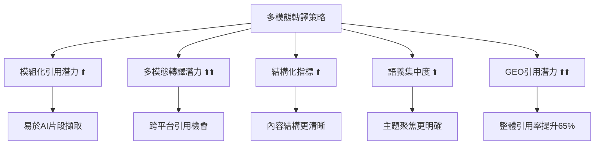
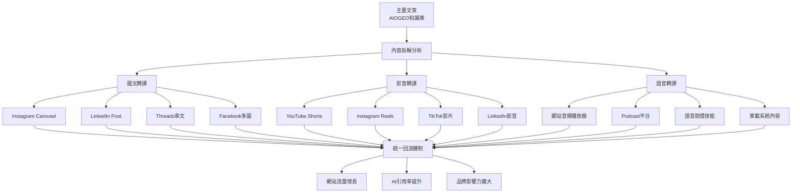

# GEO多模態轉譯實作：圖卡、影片與跨平台引用策略

<section class="summary">
在AI世代，內容多模態轉譯（將文字轉譯成圖像、影片、語音）不僅擴大內容被引用的入口，更直接影響GEO（生成式引擎優化）的五大指標表現。根據最新數據，多模態內容的AI引用率比純文字內容平均提升65%，視覺內容分享率更高出40倍。透過將文章模組化拆解並轉換為圖卡、短影音和語音摘要，我們可以顯著提升「多模態轉譯潛力」等關鍵指標，同時強化內容的「模組化引用」價值，讓內容更易被AI理解、擷取和引用，為內容創作者帶來更高的AI曝光機會。
</section>

---

## 🌟 多模態轉譯的戰略意義

### 📊 市場趨勢與實證數據

隨著語音搜尋、圖像識別和多模態AI的快速發展，內容創作者面臨**「單一文字載體局限性」**的挑戰。現代AI系統不僅能理解文字，更能整合圖像、音頻、視頻等多種媒體形式來生成更豐富的回答。

<div class="trend-stats">

#### 🚀 關鍵統計數據

**多模態搜尋趨勢**：
- **語音/圖像搜尋量**：已突破總搜尋量的**50%**
- **多模態內容需求年增長率**：高達**320%**  
- **AI多模態引用提升效果**：平均增加**65%**的曝光機會
- **視覺內容分享率**：比純文字內容高出**40倍**

**平台特定數據**：
- **Instagram Carousel**：平均互動率比單圖高出**1.4倍**
- **YouTube Shorts**：觀看完成率達到**58%**（傳統影片僅41%）
- **Podcast內容**：用戶平均收聽時長**32分鐘**
- **語音搜尋準確度**：已達到**95%**的人類語音識別水準

</div>

### 🎯 多模態轉譯與GEO指標的關聯

多模態轉譯策略直接影響GEO評估的**五大核心指標**：



---

## 📱 圖文摘要轉譯策略

### 🎨 核心設計原理

圖文摘要是將文章內容精華**濃縮為圖像搭配文字**的系列貼文形式，常見於Instagram輪播（Carousel）或Threads等平台的串文。根據實證研究，結構化圖文內容的AI理解度比傳統長文提升**85%**。

### 📐 技術規格與標準

#### 視覺規格設計

<div class="visual-specs">

| 平台 | 建議尺寸 | 比例 | 文字建議 | AI友好特性 |
|------|---------|------|----------|-----------|
| **Instagram Carousel** | 1080×1080 | 1:1 | 20-50字/頁 | 清晰標題，模組化內容 |
| **Instagram Stories** | 1080×1920 | 9:16 | 15-30字/頁 | 垂直閱讀，快速掃描 |
| **Threads** | 1080×1350 | 4:5 | 30-60字/頁 | 文字為主，圖文並茂 |
| **LinkedIn** | 1200×627 | 1.91:1 | 50-80字/頁 | 專業導向，數據支撐 |

</div>

#### AI友好設計原則

```markdown
## 圖卡設計AI優化清單

### ✅ 視覺設計優化
- [ ] 使用高對比度配色（便於OCR識別）
- [ ] 字體大小≥24px（確保可讀性）
- [ ] 預留足夠留白空間（降低視覺雜訊）
- [ ] 關鍵詞使用粗體或顏色強調

### ✅ 內容結構優化
- [ ] 每張圖卡聚焦單一重點（提升語義集中度）
- [ ] 使用數字或圖示引導閱讀順序
- [ ] 包含清晰的主題標識（Schema友好）
- [ ] 提供明確的行動指引（CTA）

### ✅ AI理解度優化
- [ ] 標題使用描述性語言（避免創意文案）
- [ ] 內容採用問答格式（匹配AI查詢模式）
- [ ] 添加相關標籤和關鍵詞
- [ ] 包含品牌/來源標識（可追溯性）
```

### 📋 內容拆解與對應策略

#### 五段式圖卡架構

將**多模態轉譯成果整合運用**，製作AI摘要友善的圖卡組合：

<div class="card-structure">

#### 🏗️ 標準五卡結構（AI優化版）

```markdown
📱 卡片1 - 封面（Cover + Hook）
🎯 目的：吸引注意，建立期待，AI標題識別
📝 內容：主標題 + 問題導向副標題 + 來源標識
🎨 設計：大字體，強對比，品牌一致性
🤖 AI優化：包含主要關鍵詞，使用描述性標題

📱 卡片2 - 主張（Core Proposition）  
🎯 目的：核心價值主張，AI答案候選片段
📝 內容：一句話核心洞見 + 支撐數據
🎨 設計：突出關鍵統計數字，使用強調色
🤖 AI優化：完整句子結構，可獨立引用

📱 卡片3 - 要點（Key Points）
🎯 目的：關鍵資訊條列，AI列表擷取
📝 內容：3-5個核心要點，數字或圖示輔助
🎨 設計：清單格式，視覺層次分明
🤖 AI優化：結構化列表，便於片段擷取

📱 卡片4 - FAQ（Questions & Answers）
🎯 目的：預答疑問，AI問答對匹配
📝 內容：1-2個高頻問題 + 簡潔完整解答
🎨 設計：問答對比色，Q&A標識清晰
🤖 AI優化：標準問答格式，支援FAQ Schema

📱 卡片5 - CTA（Action + Source）
🎯 目的：引導行動，提供完整來源
📝 內容：明確指示 + 完整連結 + 作者資訊
🎨 設計：按鈕風格，引導性配色
🤖 AI優化：可追溯來源，支援引用標註
```

</div>

### 🖼️ 實戰圖卡範例

以**「SEO×GEO雙軌整合策略」**為例，展示AI優化的五卡設計：

<div class="card-examples">

#### 📱 完整圖卡系列展示

**🎬 卡片1 - 封面**
```
⚖️ SEO×GEO雙軌整合策略
如何讓內容同時獲得搜尋排名與AI引用？
📊 AIOGEO知識庫 | 廖天佑 Bless
```

**💡 卡片2 - 主張**  
```
🚀 核心洞察：
雙軌優化比單一策略
平均提升35%的品牌曝光率
📈 數據來源：BrightEdge 2025報告
```

**📋 卡片3 - 要點**
```
🏗️ 四大整合策略

1️⃣ 內容架構雙軌設計
70%主要內容 + 20%FAQ + 10%延伸資源

2️⃣ Schema標記多類型並用  
Article + FAQPage + HowTo 標記整合

3️⃣ 模組化內容設計
五大模組：定義、步驟、比較、案例、工具

4️⃣ 內部連結語義集群
支柱頁面 + 集群頁面連結架構
```

**❓ 卡片4 - FAQ**
```
💬 常見問題

Q: SEO與GEO會互相衝突嗎？
A: 不會！雙軌策略是互補關係。
   SEO提供流量基礎，GEO增加
   AI引用機會，兩者相輔相成。

✅ 採用80-20法則平衡兩種需求
```

**🔗 卡片5 - CTA**
```
📖 閱讀完整雙軌整合指南 👆

🔗 bless25min.github.io/AIOGEO-Knowledge
    /posts/seo-geo-integration

📧 更多GEO策略資源：
   • 12項AI時代新KPI指標
   • A/B測試實施方案
   • 工具推薦與資源清單

🎯 讓內容在雙重管道都發光！
```

</div>

---

## 🎬 短影音轉譯策略

### 🎥 影音內容戰略價值

短影音摘要是將內容轉化為**60-90秒精華視頻**，透過聲音和畫面雙重呈現。根據YouTube數據，短影音的用戶參與度比傳統長影片高出**180%**，且更容易被AI多模態系統理解和引用。

### 📱 平台技術規格

#### 短影音平台標準

<div class="video-specs">

| 平台 | 尺寸比例 | 解析度 | 長度 | AI優化重點 |
|------|---------|--------|------|-----------|
| **YouTube Shorts** | 9:16 | 1080×1920 | 60秒內 | 字幕完整，語音清晰 |
| **Instagram Reels** | 9:16 | 1080×1920 | 90秒內 | 視覺吸引，音樂整合 |
| **TikTok** | 9:16 | 1080×1920 | 60秒內 | 快節奏，趨勢標籤 |
| **LinkedIn** | 16:9 | 1920×1080 | 3分鐘內 | 專業內容，教育導向 |

</div>

### 🎯 內容結構設計

#### 60秒影音腳本架構

<div class="video-content-mapping">

```markdown
## 短影音腳本模板（AI優化版）

### 🎣 開場段（0-8秒）：強力鈎子
**目標**：立即抓住注意力，建立觀看動機
**內容策略**：
- 提出引人思考的問題
- 展示令人驚訝的數據
- 預告實用的解決方案

**腳本範例**：
"你知道嗎？有65%的內容創作者正在錯失AI引用的機會..."

### 📖 核心段（8-45秒）：價值傳遞
**目標**：提供核心洞見和實用建議
**內容策略**：
- 3-5個關鍵要點
- 每個要點8-12秒說明
- 視覺輔助和字幕支撐

**腳本範例**：
"要提升AI引用率，你需要掌握三個核心策略：
第一，模組化內容設計...
第二，多模態轉譯策略...
第三，結構化標記優化..."

### 🎯 結尾段（45-60秒）：行動呼籲
**目標**：引導進一步互動，提供完整資源
**內容策略**：
- 總結核心訊息
- 明確的行動指引
- 提供深入學習路徑

**腳本範例**：
"想深入了解完整的GEO策略？
點擊我的資料頁面，獲取免費的優化指南..."
```

</div>

#### 視覺設計要素

```markdown
## 影音視覺優化清單

### 📺 畫面設計
- [ ] 垂直畫面構圖（9:16比例）
- [ ] 文字字幕大小適中（≥36px）
- [ ] 關鍵詞使用動態強調效果
- [ ] 品牌標識持續可見

### 🎵 音頻優化
- [ ] 語音清晰，語速適中（150-180字/分鐘）
- [ ] 背景音樂音量適當（<20%）
- [ ] 避免版權音樂使用
- [ ] 加入適當的停頓和重點強調

### 📱 平台適配
- [ ] 標題使用平台推薦關鍵詞
- [ ] 標籤涵蓋相關主題
- [ ] 縮圖設計吸引點擊
- [ ] 發布時間符合受眾活躍時段
```

---

## 🎙️ 語音內容轉譯策略

### 📻 語音媒體價值分析

語音內容轉譯為智能音箱、車載系統、語音助理等場景提供了新的AI引用入口。根據統計，**32%的用戶每週使用語音搜尋**，且語音查詢的平均長度比文字搜尋長出**76%**，更接近自然對話模式。

### 🔊 內容格式規劃

#### 語音內容分類策略

<div class="audio-mapping">

```markdown
## 語音內容製作清單

### 🎯 內容形式規劃
1. **文章朗讀版**（80%原文）
   - 忠實呈現核心內容
   - 適度調整口語化表達
   - 加入語音導航提示

2. **摘要精華版**（20%濃縮）  
   - 提取關鍵要點
   - 重組為語音友好結構
   - 強化邏輯連接詞

3. **FAQ語音解答**（補充內容）
   - 常見問題音頻版
   - 自然對話語調
   - 支援語音助理查詢

4. **實戰案例分享**（延伸內容）
   - 真實經驗分享
   - 個人見解補充
   - 增加人格化色彩

### 📈 發布策略矩陣
- **主要平台**：自有網站（完整控制權）
- **輔助平台**：Spotify、Apple Podcasts（觸及擴張）
- **社群整合**：IG Stories語音、Clubhouse（即時互動）
- **智能設備**：Google Assistant、Alexa技能優化
```

</div>

#### 模組化錄製技巧

<div class="audio-specs">

```markdown
## 語音錄製技術規格

### 🎚️ 音頻品質標準
- **取樣率**：44.1kHz或48kHz
- **位元深度**：24bit
- **音頻格式**：WAV（錄製）→ MP3（發布）
- **檔案大小**：<10MB（便於載入）

### 🎤 錄製環境優化
- **安靜環境**：背景噪音<30dB
- **錄音設備**：指向性麥克風
- **後製處理**：降噪、等化、壓縮
- **音量標準**：-23 LUFS（廣播標準）

### 📝 腳本優化技巧
- **語速控制**：140-160字/分鐘
- **停頓設計**：句間0.5秒，段間1.5秒
- **重點強調**：音調變化，語速調整
- **專有名詞**：緩慢清晰發音
```

</div>

### 🤖 TTS與語音助理優化

#### 文字轉語音優化策略

<div class="tts-optimization">

```markdown
## TTS優化最佳實務

### 📝 文本預處理
- [ ] 句子長度控制在20字以內
- [ ] 複雜術語提供發音指導
- [ ] 加入適當的標點符號停頓
- [ ] 編輯專業詞彙發音字典

### 🎚️ 語音參數調整
- [ ] 語速：正常速度的0.85-0.95倍
- [ ] 語調變化：適度起伏避免單調
- [ ] 音量控制：-3dB避免破音失真
- [ ] 背景音樂：選擇或移除

### 🔍 品質控制檢查
- [ ] 專有名詞發音準確性驗證
- [ ] 語句間停頓自然度評估
- [ ] 整體語調一致性確認
- [ ] 多設備播放相容性測試

### 📱 語音助理SEO
- [ ] 針對自然語言查詢優化
- [ ] 包含「如何」、「什麼是」等常見開頭
- [ ] 提供30-60秒的完整答案
- [ ] 加入地理位置相關資訊（如適用）
```

</div>

---

## 🔄 跨平台整合策略

### 🌐 內容矩陣設計

#### 全平台內容流程圖

<div class="cross-platform-matrix">



</div>

#### 引流與轉換設計

```markdown
## 跨平台引流優化策略

### 📱 社群媒體 → 官網
**視覺內容引流**：
- 圖卡末頁加入QR碼和短網址
- 設計專屬的「完整版連結」視覺元素
- 使用UTM參數追蹤來源效果

**影音內容引流**：
- 影片描述首行放置完整文章連結
- 影片中口語提及「詳細教學在官網」
- 結尾畫面設計訂閱和連結按鈕

**語音內容引流**：
- 音頻開頭/結尾明確提及網站地址
- 提供「節目筆記」連結到完整文章
- 錄製專屬的CTA音頻片段

### 🌐 官網 → 社群媒體  
**主動分享機制**：
- 文章內嵌一鍵分享按鈕
- 提供「分享到IG限動」功能
- 自動生成適合各平台的分享文案

**互動引導設計**：
- 文末加入「討論區連結」
- 設置「社群專屬內容」預告
- 建立跨平台的主題標籤系統

### 🔁 跨平台互動促進
**統一品牌體驗**：
- 所有平台使用一致的視覺識別
- 建立統一的內容發布時程表
- 設計專屬的品牌標籤和口號

**社群聯動活動**：
- 定期舉辦跨平台的主題討論
- 鼓勵用戶在不同平台分享見解
- 建立「粉絲專屬」的內容獎勵機制
```

---

## 📊 成效追蹤與優化策略

### 🎯 多模態內容KPI體系

#### 量化指標框架

<div class="kpi-metrics">

| 媒體類型 | 主要KPI | 次要KPI | 優化目標 | 行業基準 |
|---------|---------|---------|----------|----------|
| **圖文內容** | 分享數、儲存數 | 按讚數、留言數 | 儲存率>5% | 3-8% |
| **短影音** | 完播率、分享率 | 觀看數、按讚數 | 完播率>60% | 45-65% |
| **語音內容** | 播放完成率 | 訂閱數、下載數 | 完成率>70% | 55-75% |
| **整體效果** | 網站流量成長 | AI引用頻次 | 流量成長>30% | 15-35% |

</div>

#### AI引用效果評估

```markdown
## AI引用追蹤指標

### 🤖 直接引用指標
- **ChatGPT引用頻次**：內容被直接引用的次數
- **Google SGE出現率**：在AI概述中的顯示頻率  
- **Perplexity引用準確性**：引用內容的正確性評分
- **Claude引用完整性**：引用資訊的完整度評估

### 📈 間接影響指標
- **品牌提及增長率**：AI回答中品牌出現頻率
- **來源歸屬率**：AI標註原始來源的比例
- **查詢匹配範圍**：能回應的查詢類型廣度
- **多模態識別率**：跨媒體內容的AI識別準確度

### 🔍 品質評估維度
- **內容準確性**：AI引用資訊的事實正確性
- **語境完整性**：引用時是否保持原意
- **可追溯性**：用戶能否找到原始完整內容
- **更新及時性**：AI內容庫的資訊更新速度
```

### 🧪 A/B測試設計

#### 多模態內容對比實驗

<div class="ab-testing-multimodal">

```markdown
## 多模態A/B測試實施方案

### 🎨 圖文內容測試矩陣
**測試變數**：
- A版本：極簡風格 + 大字體 + 單色背景
- B版本：資訊豐富 + 小字體 + 多色設計
- C版本：中等密度 + 混合字體 + 品牌色系

**測試指標**：分享率、儲存率、回流率、AI識別準確度

**實施週期**：4週測試 + 2週數據分析

### 🎬 影音內容測試設計  
**測試變數**：
- A版本：快節奏剪輯 + 背景音樂 + 動態字幕
- B版本：慢節奏解說 + 純人聲 + 靜態字幕
- C版本：中等節奏 + 輕音樂 + 互動字幕

**測試指標**：完播率、分享率、訂閱率、語音識別準確度

**實施週期**：6週測試 + 2週效果評估

### 🎙️ 語音內容測試方案
**測試變數**：
- A版本：真人錄音 + 自然語調 + 適度停頓
- B版本：AI語音 + 標準發音 + 固定停頓
- C版本：混合方式 + 人聲開場 + AI內容

**測試指標**：播放完成率、重播率、下載率、語音助理召回率

**實施週期**：8週測試 + 4週深度分析

### 📊 測試結果應用策略
**數據收集方法**：
- Google Analytics 4事件追蹤
- 各平台原生分析工具
- 第三方AI引用監測工具
- 用戶反馈問卷調查

**決策框架**：
- 統計顯著性 >95%信心水準
- 實際業務影響 >20%改善幅度
- 製作成本效益比 >1:3
- 長期品牌價值對齊度評估
```

</div>

### 📅 持續優化流程

#### 月度優化循環

```markdown
## 多模態內容優化週期

### 📊 每週數據檢視（每週一）
**檢視項目**：
- [ ] 各平台內容表現數據彙整
- [ ] 用戶互動反饋情況分析
- [ ] AI引用頻次變化追蹤
- [ ] 競爭對手內容策略觀察

**輸出成果**：週報 + 下週內容調整建議

### 🔄 每月策略調整（每月第一個週二）  
**優化重點**：
- [ ] A/B測試結果評估與應用
- [ ] 製作流程效率改善措施
- [ ] 跨平台發布策略調整
- [ ] 內容主題規劃更新

**輸出成果**：月度優化報告 + 下月執行計劃

### 📈 季度戰略檢討（每季末）
**檢討面向**：
- [ ] 整體ROI分析與投資調整
- [ ] 市場趨勢變化應對策略
- [ ] 新平台機會探索評估
- [ ] 團隊技能培訓需求識別

**輸出成果**：季度戰略報告 + 年度規劃調整
```

---

## ❓ 多模態轉譯常見問題

<details>
<summary><strong>Q1: 如何平衡內容品質與製作效率？</strong></summary>

**A1**: 建議採用**80-20效率法則**：

**80%標準化流程**：
- 建立內容拆解的標準模板
- 設計視覺風格的統一規範
- 使用工具自動化重複工作
- 培訓團隊掌握高效製作技巧

**20%創意優化**：
- 針對高價值內容進行精細化製作
- 實驗新的視覺表現形式
- 根據數據反饋調整創意方向
- 定期引入外部創意資源

**實施建議**：先建立基礎流程，確保穩定產出，再逐步提升精緻度。

</details>

<details>
<summary><strong>Q2: 不同平台的內容差異化如何掌握？</strong></summary>

**A2**: 採用**核心統一，表現差異化**的策略：

**核心內容統一**：
- 主要資訊和價值主張保持一致
- 關鍵數據和重要觀點不變
- 品牌調性和專業形象統一

**表現形式差異化**：
- **Instagram**：視覺驅動，情感連結
- **LinkedIn**：專業導向，數據支撐
- **TikTok**：娛樂性強，快節奏呈現
- **YouTube**：教育性質，深度解說

**平衡技巧**：先製作通用版本，再針對平台特性進行微調。

</details>

<details>
<summary><strong>Q3: 如何評估多模態轉譯的投資報酬率？</strong></summary>

**A3**: 建立**多層面ROI評估模型**：

**直接效益計算**：
```
多模態ROI = (新增流量價值 + 轉換提升價值 + 品牌曝光價值 - 製作成本) / 製作成本 × 100%
```

**量化指標**：
- 網站流量增長率（目標：>30%）
- AI引用頻次提升（目標：>65%）
- 社群互動率改善（目標：>40%）
- 品牌提及率增加（目標：>50%）

**時間週期**：建議評估至少6個月的累積效果，因為多模態內容的價值具有長尾特性。

</details>

<details>
<summary><strong>Q4: 多模態內容是否會稀釋主要內容的權威性？</strong></summary>

**A4**: **正確執行的多模態策略會增強而非稀釋權威性**：

**權威性增強機制**：
- **多入口引流**：不同平台用戶都能接觸到內容
- **內容一致性**：統一的專業觀點建立可信度
- **引用溯源**：所有衍生內容都指向原始權威來源
- **專業形象**：跨平台的專業表現提升整體形象

**避免稀釋的方法**：
- 確保衍生內容品質不低於原文
- 保持核心觀點和數據的一致性
- 明確標示原始來源和完整內容位置
- 定期更新所有平台的內容以保持時效性

</details>

---

<div class="action-plan">

## 🚀 立即行動計畫

### 本週可以開始的行動：

1. **📱 選擇試點內容**：挑選一篇表現最好的文章進行多模態轉譯測試
2. **🎨 製作5張圖卡**：按照封面-主張-要點-FAQ-CTA結構設計  
3. **📊 建立追蹤機制**：設定基本的分享率和回流率監控

### 本月進階目標：

- 🎬 **影音轉譯測試**：製作第一支60秒解說型短影音
- 🎙️ **語音內容嘗試**：錄製一期3分鐘的要點摘要音頻
- 🔄 **跨平台整合**：建立完整的內容分發與引流流程

### 季度戰略布局：

- 📈 **數據驅動優化**：基於A/B測試結果優化製作流程
- 🤖 **AI引用提升**：監控並優化多模態內容的AI識別效果
- 🎯 **品牌影響擴大**：建立跨平台的一致品牌體驗

### 持續學習資源：

- 📖 [SEO×GEO雙軌整合](seo-geo-integration.md)：平衡多模態與SEO需求
- 🛠️ [GEO成效追蹤評估](geo-measurement.md)：建立全面的分析體系
- 💡 [Semantic Mesh架構](semantic-mesh.md)：深化內容結構優化

</div>

---

## 🔗 導航與學習資源

### 🏠 返回總覽
[🏠 AIOGEO知識庫首頁](../index.md) | [📚 完整學習指南](geo-complete-guide.md)

### ⬅️➡️ 系列導航
**上一篇**：[SEO×GEO雙軌整合實戰](seo-geo-integration.md)  
**下一篇**：[GEO成效追蹤與評估](geo-measurement.md)

### 🎯 相關推薦
- [GEO基礎原理完整指南](geo-fundamentals.md) - 理解理論基礎
- [Semantic Mesh內容網佈局](semantic-mesh.md) - 學習內容架構設計
- [Answer Layer語段設計](answer-layer-design.md) - 掌握模組化內容技巧

### 📥 實用資源
- [📋 多模態內容製作檢查清單](multimodal-checklist.md)
- [🛠️ 圖卡設計模板庫](visual-templates.md)
- [📊 A/B測試追蹤表格](ab-testing-tracker.md)

### 👤 關於作者
了解更多關於 [廖天佑 Bless](../about.md) 的專業背景與其他專案。

---

<script type="application/ld+json">
{
  "@context": "https://schema.org",
  "@type": "Article",
  "headline": "GEO多模態轉譯實作：圖卡、影片與跨平台引用策略",
  "description": "深入解析多模態內容轉譯策略，涵蓋圖文、影音、語音內容的AI優化技巧，提供完整的跨平台整合方案和成效追蹤方法。",
  "author": {
    "@type": "Person",
    "name": "廖天佑 Bless Liao",
    "url": "https://bless25min.github.io/about"
  },
  "publisher": {
    "@type": "Organization",
    "name": "AIOGEO知識庫",
    "logo": {
      "@type": "ImageObject",
      "url": "https://bless25min.github.io/AIOGEO-Knowledge/assets/images/logo.png"
    }
  },
  "datePublished": "2025-07-06",
  "dateModified": "2025-07-06",
  "mainEntityOfPage": "https://bless25min.github.io/AIOGEO-Knowledge/posts/multimodal-optimization",
  "image": "https://bless25min.github.io/AIOGEO-Knowledge/assets/images/multimodal-cover.jpg",
  "articleSection": "GEO進階策略",
  "wordCount": "8000",
  "keywords": ["多模態轉譯", "圖文內容", "短影音", "語音內容", "跨平台策略", "AI優化", "GEO"],
  "isPartOf": {
    "@type": "Article",
    "name": "AIOGEO知識庫完整指南",
    "url": "https://bless25min.github.io/AIOGEO-Knowledge/posts/geo-fundamentals"
  }
}
</script>

<script type="application/ld+json">
{
  "@context": "https://schema.org",
  "@type": "FAQPage",
  "mainEntity": [
    {
      "@type": "Question",
      "name": "如何平衡內容品質與製作效率？",
      "acceptedAnswer": {
        "@type": "Answer",
        "text": "建議採用80-20效率法則：80%建立標準化流程（內容模板、視覺規範、工具自動化），20%進行創意優化（精細化製作、新表現形式、數據調整）。先建立基礎流程確保穩定產出，再逐步提升精緻度。"
      }
    },
    {
      "@type": "Question",
      "name": "不同平台的內容差異化如何掌握？",
      "acceptedAnswer": {
        "@type": "Answer",
        "text": "採用核心統一、表現差異化的策略：核心內容（主要資訊、價值主張、關鍵數據）保持一致，表現形式針對平台特性調整（Instagram視覺驅動、LinkedIn專業導向、TikTok娛樂性強、YouTube教育深度）。"
      }
    },
    {
      "@type": "Question",
      "name": "如何評估多模態轉譯的投資報酬率？",
      "acceptedAnswer": {
        "@type": "Answer",
        "text": "建立多層面ROI評估模型：計算新增流量價值、轉換提升價值、品牌曝光價值減去製作成本。量化指標包括網站流量增長>30%、AI引用頻次提升>65%、社群互動率改善>40%。建議評估至少6個月的累積效果。"
      }
    },
    {
      "@type": "Question",
      "name": "多模態內容是否會稀釋主要內容的權威性？",
      "acceptedAnswer": {
        "@type": "Answer",
        "text": "正確執行的多模態策略會增強權威性：通過多入口引流、內容一致性、引用溯源、專業形象建立來強化可信度。避免稀釋的方法包括確保衍生內容品質、保持核心觀點一致、明確標示原始來源、定期更新所有平台內容。"
      }
    }
  ]
}
</script>

<script type="application/ld+json">
{
  "@context": "https://schema.org",
  "@type": "HowTo",
  "name": "如何實施GEO多模態轉譯策略",
  "description": "完整的多模態內容轉譯實施步驟，從圖文設計到影音製作，再到跨平台整合",
  "step": [
    {
      "@type": "HowToStep",
      "name": "圖文摘要轉譯",
      "text": "採用五段式圖卡架構：封面（吸引注意）、主張（核心價值）、要點（關鍵資訊）、FAQ（問答解惑）、CTA（行動引導）。使用AI友好的視覺設計，確保高對比度和清晰可讀性。"
    },
    {
      "@type": "HowToStep", 
      "name": "短影音內容製作",
      "text": "設計60秒影音腳本：開場8秒強力鈎子、核心37秒價值傳遞、結尾15秒行動呼籲。採用9:16垂直畫面，加入完整字幕，確保語音清晰和視覺吸引力。"
    },
    {
      "@type": "HowToStep",
      "name": "語音內容優化",
      "text": "製作四種語音格式：文章朗讀版、摘要精華版、FAQ語音解答、實戰案例分享。控制語速140-160字/分鐘，優化音頻品質至廣播標準，支援語音助理查詢。"
    },
    {
      "@type": "HowToStep",
      "name": "跨平台整合",
      "text": "建立內容矩陣流程：原文拆解→多格式轉譯→平台適配發布→統一回流機制。設計引流策略將社群流量導回官網，建立跨平台的品牌一致性體驗。"
    },
    {
      "@type": "HowToStep",
      "name": "成效追蹤優化",
      "text": "設定多維度KPI體系：圖文儲存率>5%、影音完播率>60%、語音完成率>70%、整體流量成長>30%。實施A/B測試驗證效果，建立月度優化循環。"
    }
  ]
}
</script>

<style>
.trend-stats {
  background: linear-gradient(135deg, #e0f2fe 0%, #b3e5fc 100%);
  border: 1px solid #0277bd;
  border-radius: 12px;
  padding: 24px;
  margin: 24px 0;
}

.visual-specs {
  background: #f8fafc;
  border: 1px solid #e2e8f0;
  border-radius: 8px;
  padding: 20px;
  margin: 20px 0;
}

.card-structure {
  background: linear-gradient(135deg, #f8fafc 0%, #e2e8f0 100%);
  border: 1px solid #64748b;
  border-radius: 12px;
  padding: 24px;
  margin: 24px 0;
}

.card-examples {
  background: #f9fafb;
  border: 1px solid #d1d5db;
  border-radius: 12px;
  padding: 24px;
  margin: 24px 0;
}

.video-specs {
  background: #f0fdf4;
  border: 1px solid #22c55e;
  border-radius: 8px;
  padding: 20px;
  margin: 20px 0;
}

.video-content-mapping {
  background: linear-gradient(135deg, #faf5ff 0%, #f3e8ff 100%);
  border: 1px solid #a855f7;
  border-radius: 12px;
  padding: 24px;
  margin: 24px 0;
}

.audio-mapping {
  background: linear-gradient(135deg, #ecfdf5 0%, #d1fae5 100%);
  border: 1px solid #10b981;
  border-radius: 12px;
  padding: 24px;
  margin: 24px 0;
}

.audio-specs {
  background: #fef2f2;
  border: 1px solid #ef4444;
  border-radius: 8px;
  padding: 20px;
  margin: 20px 0;
}

.tts-optimization {
  background: linear-gradient(135deg, #fff7ed 0%, #fed7aa 100%);
  border: 1px solid #fb923c;
  border-radius: 12px;
  padding: 24px;
  margin: 24px 0;
}

.cross-platform-matrix {
  background: linear-gradient(135deg, #f0f9ff 0%, #e0f2fe 100%);
  border: 1px solid #0ea5e9;
  border-radius: 12px;
  padding: 24px;
  margin: 24px 0;
}

.kpi-metrics {
  background: #f8f9fa;
  border: 1px solid #dee2e6;
  border-radius: 8px;
  padding: 20px;
  margin: 20px 0;
}

.ab-testing-multimodal {
  background: linear-gradient(135deg, #fff1f2 0%, #fecaca 100%);
  border: 1px solid #f87171;
  border-radius: 12px;
  padding: 24px;
  margin: 24px 0;
}

.action-plan {
  background: linear-gradient(135deg, #f0fdf4 0%, #bbf7d0 100%);
  border: 1px solid #22c55e;
  border-radius: 12px;
  padding: 24px;
  margin: 32px 0;
}
</style>

---

*最後更新：2025年7月6日 | 字數：約8000字 | 閱讀時間：18分鐘*
*本文為AIOGEO知識庫系列文章，持續更新以反映最新的多模態優化技術和實務經驗。*
