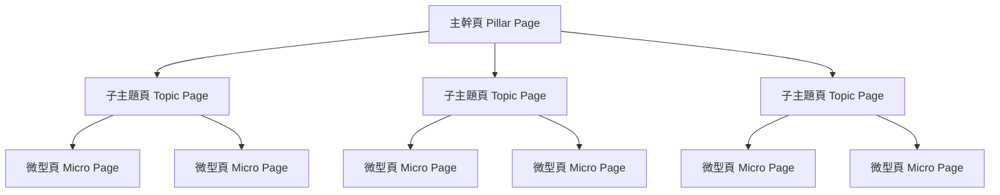
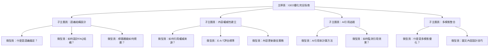

# 打造GEO語意矩陣內容網：Semantic Mesh佈局實作全解

<section class="summary">
Semantic Mesh（語意矩陣內容網）是一種三層式內容架構策略，透過主幹頁、子主題頁、微型頁的有機組合，建立主題集中且相互關聯的內容網絡。這種架構不僅提升用戶體驗，更能有效提高內容在AI搜尋中的語義可見性和引用機率，是GEO優化的重要實作方法。
</section>

## 🎯 Semantic Mesh 核心概念

### 三層架構設計原理

Semantic Mesh採用**分層式主題組織**，將複雜的知識領域拆解為易於理解和檢索的內容單元：



### 各層級功能定位

| 層級 | 功能定位 | 內容特色 | 字數範圍 |
|------|----------|----------|----------|
| **主幹頁** | 主題總覽、導航樞紐 | 完整概述、索引導引 | 2000-4000字 |
| **子主題頁** | 深度探討、專業分析 | 詳細說明、實戰指導 | 1500-3000字 |
| **微型頁** | 精準解答、快速查找 | 單一問題、直接回答 | 300-800字 |

## 🏛️ 主幹頁（Pillar Page）設計策略

### 🎯 角色定位

主幹頁是整個Semantic Mesh的**核心樞紐**，承擔主題概述和導航分發的雙重功能。它需要為讀者提供完整的主題全貌，同時為AI搜尋引擎建立清晰的語義框架。

### ✍️ 內容架構設計

主幹頁應採用**漏斗型資訊架構**：

```markdown
## 理想的主幹頁結構

# 主題完整指南：核心概念與實作策略

<section class="summary">
主題概述：150-300字的精煉摘要，涵蓋主題定義、重要性和核心價值。
</section>

## 🎯 基礎概念
- 核心定義和基本原理
- 重要性和應用價值
- 與相關概念的關聯

## 📚 主要分類
### 分類一：[子主題頁連結](subtopic-1.md)
簡要說明該分類的核心內容和價值

### 分類二：[子主題頁連結](subtopic-2.md)  
簡要說明該分類的核心內容和價值

### 分類三：[子主題頁連結](subtopic-3.md)
簡要說明該分類的核心內容和價值

## 🚀 實作指南
- 入門步驟建議
- 進階應用方向
- 常見問題解答

## 📖 延伸學習
- 相關資源連結
- 推薦學習路徑
- 專家觀點引用
```

### 🔗 導航連結策略

主幹頁必須建立完整的**內部連結網絡**：

- **向下連結**：清楚標示所有子主題頁面
- **橫向連結**：關聯到相關的其他主幹頁
- **外部連結**：引用權威資源和參考文獻

### 🏷️ Schema標記優化

為主幹頁加入適當的結構化資料：

```html
<script type="application/ld+json">
{
  "@context": "https://schema.org",
  "@type": "Article",
  "headline": "GEO優化完整指南",
  "description": "深度探討生成式引擎優化的理論與實作",
  "author": {
    "@type": "Person",
    "name": "廖天佑 Bless"
  },
  "datePublished": "2025-01-01",
  "dateModified": "2025-01-15"
}
</script>
```

## 📖 子主題頁（Topic Page）實作策略

### 🎯 角色定位

子主題頁扮演**深度專業內容**的角色，針對主幹頁中的特定分類進行詳細闡述。它需要在保持專業深度的同時，確保內容對AI模型具有良好的可理解性。

### ✍️ 內容深度與廣度平衡

子主題頁應遵循**專業深度 + 實用指導**的原則：

```markdown
## 子主題頁標準結構

# 專業主題深度解析：理論與實務並重

<section class="summary">
專業摘要：概述該子主題的核心內容、應用場景和學習價值。
</section>

## 📚 理論基礎
### 核心概念解析
深入說明相關理論和概念

### 發展脈絡
歷史發展和現狀分析

## 🛠️ 實作方法
### 操作步驟
詳細的執行指南

### 工具推薦
相關工具和資源

### 最佳實務
經驗分享和注意事項

## 📊 案例分析
### 成功案例
具體實例和成果展示

### 常見問題
FAQ形式的問題解答

## 🔗 相關資源
- [相關微型頁連結](micro-page-1.md)
- [其他子主題連結](topic-page-2.md)
- [回到主幹頁](pillar-page.md)
```

### 🔗 內部連結最佳化

子主題頁的連結策略應考慮：

- **向上連結**：明確回連到主幹頁
- **向下連結**：導向相關的微型頁面
- **平行連結**：連接相關的其他子主題頁

### 🏷️ 結構化資料建議

對子主題頁使用適當的Schema標記：

```html
<!-- Article Schema範例 -->
<script type="application/ld+json">
{
  "@context": "https://schema.org",
  "@type": "Article",
  "headline": "Answer Layer設計完整教學",
  "description": "深入探討AI引用層的設計原理和優化策略",
  "isPartOf": {
    "@type": "Article",
    "name": "GEO優化完整指南"
  }
}
</script>

<!-- FAQ Schema範例 -->
<script type="application/ld+json">
{
  "@context": "https://schema.org",
  "@type": "FAQPage", 
  "mainEntity": [{
    "@type": "Question",
    "name": "什麼是Answer Layer語段？",
    "acceptedAnswer": {
      "@type": "Answer",
      "text": "Answer Layer語段是AI模型在回答時實際引用的內容片段..."
    }
  }]
}
</script>

<!-- HowTo Schema範例 -->
<script type="application/ld+json">
{
  "@context": "https://schema.org",
  "@type": "HowTo",
  "name": "如何優化Answer Layer語段",
  "step": [{
    "@type": "HowToStep",
    "name": "語義錨定優化",
    "text": "確保內容主題明確並與可能的提問直接對應..."
  }]
}
</script>
```

## 🔬 微型頁（Micro-pages）實作策略

### 🎯 角色定位

微型頁是Semantic Mesh中**最細粒度的內容單元**，通常針對非常具體的問題、定義或技巧進行說明。它扮演**語意重組層**的角色：內容精簡而結構清楚，方便AI模型將其作為獨立模組來抽取和組合。

### ✍️ 標題寫法策略

微型頁的標題應**直截了當**地點出問題或主題，最好與使用者可能詢問的語句完全匹配：

```markdown
## 理想的微型頁標題

# 什麼是語義錨定？

# 如何建立FAQ結構化資料？

# GEO中的E-A-T是什麼意思？

# 「三層語意可見性」完全解析

# Answer Layer四階段流程指南
```

### 📝 內容與段落設計

微型頁的內容力求**短小精悍且結構模組化**，建議控制在幾百字以內：

<div class="micro-page-structure">

#### 📋 微型頁三段式結構

```markdown
# 直接問答式標題

<section class="summary">
一兩句話摘要核心答案，為AI提供最快速的內容索引入口
</section>

## 🎯 核心定義/答案
第一段直接給出問題的答案或技巧的要點

## 📖 背景說明  
第二段提供相關的補充說明或背景知識

## 💡 實際應用
第三段舉例說明或提供實際應用情境

## 🔗 相關連結
- [回到上級主題](parent-topic.md)
- [相關微型頁面](related-micro.md)
```

</div>

#### 💎 優秀微型頁範例

<div class="micro-page-example">

```markdown
# 什麼是語義錨定？

<section class="summary">
語義錨定是GEO優化中確保內容主題明確且容易被AI識別的技術，包含清晰的標題結構和主題陳述。
</section>

## 🎯 核心定義
**語義錨定是指在內容中建立明確的主題識別點**，讓AI模型能夠快速理解內容的核心議題。主要包含使用描述性標題、明確的主題陳述，以及與用戶查詢直接對應的內容組織方式。

## 📖 背景說明
隨著AI搜尋技術的發展，傳統的關鍵字匹配逐漸被語義理解取代。語義錨定技術幫助內容創作者建立與AI模型「溝通」的橋樑，確保內容能被正確理解和分類。

## 💡 實際應用
**主要應用場景包括**：
- 部落格文章的標題設計
- 技術文檔的章節組織  
- FAQ頁面的問題設計
- 產品說明的結構規劃

## 🔗 相關連結
- [回到：GEO基礎原理完整指南](geo-fundamentals.md)
- [進階閱讀：語境觸發優化技術](context-triggering.md)
```

</div>

### 🔗 內部連結方式

微型頁應該**回鏈到相關的子主題頁或主幹頁**：

```markdown
## 🧭 層級導覽範例

📍 **當前位置**：  
[GEO完全指南](main-guide.md) > [Answer Layer優化](answer-layer.md) > 什麼是語義錨定？

## 🔄 相關微型頁
- [什麼是語境觸發？](context-triggering.md)
- [什麼是語用重組？](pragmatic-recomposition.md)  
- [如何提升引用潛力？](citation-potential.md)

## ⬆️ 返回上層
- [Answer Layer語段設計完整教學](answer-layer.md)
```

### 🏷️ Schema標記建議

對於微型頁，建議充分利用**FAQ結構化資料標記**：

```html
<script type="application/ld+json">
{
  "@context": "https://schema.org",
  "@type": "FAQPage",
  "mainEntity": [{
    "@type": "Question", 
    "name": "什麼是語義錨定？",
    "acceptedAnswer": {
      "@type": "Answer",
      "text": "語義錨定是GEO優化中確保內容主題明確且容易被AI識別的技術，包含清晰的標題結構和主題陳述。"
    }
  }]
}
</script>
```

## 🏗️ 實戰架構範例

以下提供一個完整的Semantic Mesh架構範例，展示三層內容如何組成語意矩陣網：

### 🌟 範例主題：「GEO優化策略」

<div class="architecture-example">

#### 🏛️ 完整架構展示



#### 📄 具體標題範例

**主幹頁：**
```markdown
GEO優化完全指南：從理論到實作的系統化策略
```

**子主題頁：**
```markdown
語義結構設計完整教學：提升AI理解度的內容架構
內容權威性建立指南：E-A-T標準的GEO應用  
AI引用追蹤與分析：量化GEO優化成效的方法
多模態內容整合策略：文字、圖像、影音的協同優化
```

**微型頁：**
```markdown
什麼是語義錨定技術？
如何設計AI友善的FAQ結構？
標題層級規劃的最佳實務
如何正確引用權威來源？
E-A-T評估標準詳解
什麼是AI引用率？如何計算？
```

</div>

## 🚀 部署實施指南

### 📋 優先順序清單

根據實戰經驗，建議按以下**優先順序**逐步部署Semantic Mesh：

#### 🎯 第一階段：基礎架構（週1-2）

**1. 主題內容規劃**
- [ ] 確定主幹頁的核心主題
- [ ] 規劃3-5個子主題分類
- [ ] 列出每個子主題下的關鍵問題

**2. 內容架構設計**
- [ ] 建立頁面層級關係圖
- [ ] 設計內部連結策略
- [ ] 規劃Schema標記方案

#### 🎯 第二階段：內容創作（週3-4）

**1. 撰寫核心內容**
- [ ] 完成主幹頁初稿
- [ ] 撰寫第一個子主題頁
- [ ] 建立2-3個微型頁

**2. 結構化優化**
- [ ] 加入摘要段落
- [ ] 設定FAQ模組
- [ ] 添加結構化資料標記

#### 🎯 第三階段：網絡建立（週5-6）

**1. 內鏈網絡建構**
- [ ] 建立主幹頁到子主題頁的連結
- [ ] 設定子主題頁間的橫向連結
- [ ] 完成微型頁的回鏈設計

**2. 測試與優化**
- [ ] 使用Google Rich Results測試工具驗證
- [ ] 檢查內鏈的有效性
- [ ] 測試移動端顯示效果

#### 🎯 第四階段：持續擴展（週7+）

**1. 內容擴充**
- [ ] 完成所有規劃的子主題頁
- [ ] 補充更多微型頁
- [ ] 定期更新和維護內容

**2. 成效追蹤**
- [ ] 監測AI引用情況
- [ ] 分析用戶行為數據
- [ ] 根據成效調整策略

### 📊 部署檢查清單

完成Semantic Mesh部署後，請進行以下檢查：

**✅ 內容完整性**
- [ ] 每個層級的內容都已完成
- [ ] 所有內鏈都指向正確目標
- [ ] Schema標記正確且完整

**✅ 用戶體驗**
- [ ] 導航路徑清晰易懂
- [ ] 內容載入速度正常
- [ ] 移動端體驗良好

**✅ 技術優化**
- [ ] 所有結構化資料都通過驗證
- [ ] 頁面SEO要素齊全
- [ ] 無死鏈或錯誤連結

**✅ AI友善度**
- [ ] 內容結構清晰
- [ ] FAQ格式完整
- [ ] 權威來源標註完善

---

<div class="next-steps">

## 🎯 下一步行動

1. **開始規劃**：選擇一個您熟悉的主題，設計Semantic Mesh架構
2. **分階段執行**：按照本指南的優先順序逐步實施
3. **持續優化**：根據AI引用效果調整內容策略
4. **擴展應用**：將成功經驗應用到其他主題領域

**記住**：Semantic Mesh不是一次性的項目，而是需要持續維護和優化的動態內容生態系統。

</div>
