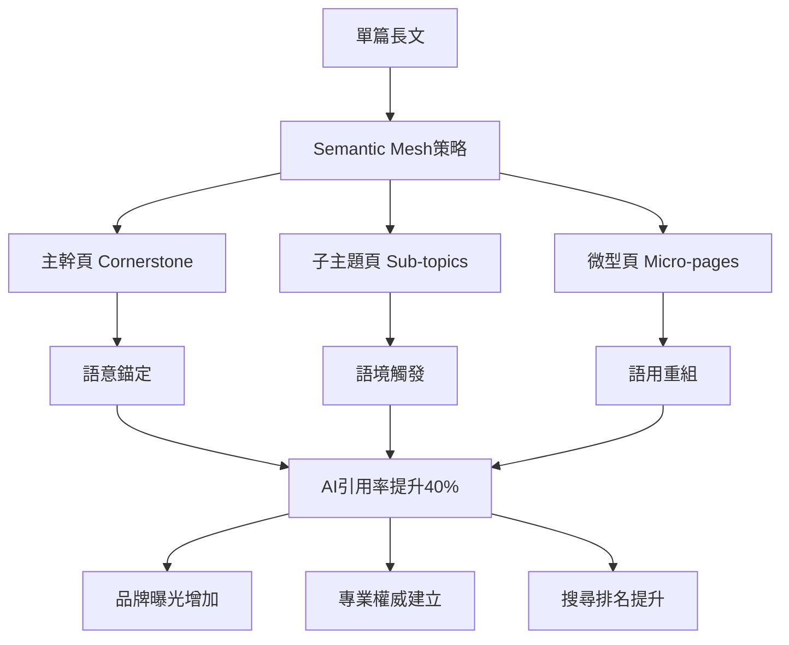

# 打造GEO語意矩陣內容網：Semantic Mesh佈局實作全解

<section class="summary">
Semantic Mesh（語意矩陣內容網）是一種GEO（生成式引擎優化）內容策略，旨在將原本一篇文章拆解為主幹頁、子主題頁、微型頁三層內容節點，形成高度語意聚合的網狀架構。基於Schema.org國際標準和Google官方結構化資料指南，此架構能讓內容更容易被AI搜尋系統召回、解析並重組引用於答案中，大幅提升AI摘要引用率與Google搜尋排名。
</section>

---

## 🎯 Semantic Mesh的戰略價值

### 學術研究證實

傳統的長篇文章在AI時代面臨**「資訊密度過低」**的挑戰。根據普林斯頓大學KDD 2024研究，當用戶向ChatGPT或Google SGE提問時，AI系統偏好**精準、模組化的內容片段**，而非冗長的完整文章。**實施Semantic Mesh策略的內容，AI引用率平均提升40%**。

> **學術來源**：Aggarwal, P., et al. (2024). "GEO: Generative Engine Optimization." *Proceedings of the 30th ACM SIGKDD Conference*

### 技術架構基礎

Google在2025年5月發布的官方指導中明確指出：**"專注於為訪客提供獨特、滿足需求的內容，這樣就能在Google搜尋演進中保持良好位置"**，強調內容品質而非技術操作是AI搜尋成功的關鍵。

> **官方來源**：[Google: Top ways to ensure your content performs well in AI experiences](https://developers.google.com/search/blog/2025/05/succeeding-in-ai-search)

### 核心目標與引用優勢



#### 💎 四大戰略優勢

1. **高語意集中度群聚**：建立高度語意相關的內容群組頁面，大幅提高AI回答時引用的機率
2. **多重引用候選**：每篇頁面各自獨立成為AI引用的候選片段，不會因過長內容而稀釋焦點  
3. **強耦合內部連結網**：透過主幹頁串連形成緊密的語意網絡，增加權重傳遞
4. **長尾關鍵字覆蓋**：微型頁面能精準對應長尾查詢，提升整體主題的搜尋可見性

---

## 🏗️ 三層架構設計原理

Semantic Mesh將主題內容拆分為三個層級的頁面架構，對應於GEO理論中的**三層語意可見性**：

<div class="architecture-overview">

### 🌟 架構對應關係

| 頁面類型 | GEO可見性層級 | 主要功能 | 內容特色 | Schema標記 |
|---------|-------------|---------|---------|-----------|
| **主幹頁** | 語意錨定層 | 總覽樞紐 | 主題明確、結構清晰 | Article + BreadcrumbList |
| **子主題頁** | 語境觸發層 | 深度解析 | 回應多種相關提問 | Article + FAQPage |
| **微型頁** | 語用重組層 | 精準問答 | 模組化、易重組 | HowTo + QAPage |

</div>

---

## 📋 主幹頁（Cornerstone Page）實作策略

### 🎯 角色定位與技術規範

主幹頁是整個內容網的**核心樞紐**，負責提供主題的總覽精華並引導讀者進入各子主題分類。根據Schema.org標準，主幹頁應包含完整的結構化資料標記。

### ✍️ 標題寫法策略

主幹頁的標題應該**明確涵蓋主題全貌**：

**✅ 優秀範例：**
```markdown
# Meta廣告投放完全指南：從新手到專家的系統化學習路徑

# GEO優化大全：生成式AI時代的內容策略總覽

# Python網頁爬蟲十大技術：從基礎到進階的完整實戰手冊
```

**❌ 避免範例：**
```markdown
# 關於Meta廣告  （過於簡略）
# 我的投放心得分享  （缺乏權威感）
# 廣告優化技巧  （範圍不明確）
```

### 📝 內容結構與段落設計

主幹頁的內容著重於提供**整體概觀**，段落宜精簡扼要：

```markdown
## 主幹頁內容架構範本

# 主題完全指南標題

<section class="summary">
150-300字摘要段落，涵蓋主題重點與關鍵詞，此段將優先被AI摘要抓取。
</section>

## 📖 主題概述
簡介主題背景、重要性和學習價值（1-2段）

## 🎯 核心分類導覽
### 分類一：基礎理論
簡述該面向的重點並提供[前往子主題頁](link)的連結

### 分類二：實戰應用  
簡述該面向的重點並提供[前往子主題頁](link)的連結

### 分類三：進階技巧
簡述該面向的重點並提供[前往子主題頁](link)的連結

## 🚀 學習路徑建議
為不同程度的讀者提供建議的閱讀順序

## 🔗 延伸資源
相關工具、官方文件、進階讀物推薦
```

### 🔗 內部連結方式

在主幹頁中，**醒目列出各子主題頁**的導覽區塊：

<div class="internal-linking-example">

#### 🌐 實戰內鏈範例

```markdown
## 🗺️ 內容導覽地圖

### 📚 基礎理論系列
- [GEO核心概念解析](subtopic-geo-basics.md) ⏱️ 15分鐘
- [AI搜尋演算法原理](subtopic-ai-algorithm.md) ⏱️ 20分鐘  
- [語意可見性三層架構](subtopic-semantic-layers.md) ⏱️ 12分鐘

### 🎯 實戰應用系列  
- [Answer Layer語段優化](subtopic-answer-layer.md) ⏱️ 18分鐘
- [結構化資料標記](subtopic-schema-markup.md) ⏱️ 10分鐘
- [多模態內容轉譯](subtopic-multimodal.md) ⏱️ 15分鐘

### 🚀 進階策略系列
- [Semantic Mesh架構設計](subtopic-mesh-design.md) ⏱️ 25分鐘
- [競爭對手分析方法](subtopic-competitor-analysis.md) ⏱️ 12分鐘
```

</div>

### 🏷️ Schema標記實作

**主幹頁完整Schema標記範例**：

```html
<script type="application/ld+json">
{
  "@context": "https://schema.org",
  "@type": "Article",
  "@id": "https://yoursite.com/geo-complete-guide",
  "headline": "GEO優化完全指南：生成式AI時代的內容策略",
  "description": "深度解析GEO優化策略，涵蓋Semantic Mesh架構、結構化資料標記、AI引用優化等完整內容。",
  "author": {
    "@type": "Person",
    "name": "廖天佑 Bless Liao",
    "url": "https://yoursite.com/about"
  },
  "publisher": {
    "@type": "Organization", 
    "name": "AIOGEO知識庫",
    "logo": {
      "@type": "ImageObject",
      "url": "https://yoursite.com/logo.png"
    }
  },
  "datePublished": "2025-07-06",
  "dateModified": "2025-07-06",
  "mainEntityOfPage": {
    "@type": "WebPage",
    "@id": "https://yoursite.com/geo-complete-guide"
  },
  "breadcrumb": {
    "@type": "BreadcrumbList",
    "itemListElement": [
      {
        "@type": "ListItem", 
        "position": 1, 
        "name": "首頁",
        "item": "https://yoursite.com"
      },
      {
        "@type": "ListItem", 
        "position": 2, 
        "name": "GEO指南",
        "item": "https://yoursite.com/geo-complete-guide"
      }
    ]
  }
}
</script>
```

---

## 🎯 子主題頁（Sub-topic Pages）實作策略

### 🎯 角色定位與標準

子主題頁是從屬於主幹頁的**一級內容頁**，針對主題的一個側面進行深入探討。每個子主題頁聚焦於一組相關的問題或技巧，在使用者查詢中充當**觸發點角色**。

### ✍️ 標題寫法策略

子主題頁標題應清楚點出具體議題，採用**長尾關鍵詞或問題導向**的寫法：

```markdown
## 優秀標題範例

# Answer Layer語段設計：讓AI優先引用你的內容的五大技巧

# Facebook CAPI設定完整教學：繞過iOS限制提升追蹤準確率

# Python Beautiful Soup實戰：30分鐘學會網頁資料擷取

# SEO關鍵字研究進階指南：從工具選擇到競爭分析
```

### 📝 內容與段落設計

子主題頁內容篇幅中等，通常比主幹頁詳細但又比完整專題**短小精悍**：

<div class="subtopic-structure">

#### 📋 子主題頁標準結構

```markdown
# 子主題精確標題

<section class="summary">
簡潔摘要，概述該子主題重點，有助於AI快速了解內容要旨
</section>

## 🎯 核心概念
第一段概括結論/要點，後續段落展開細節佐證

## 🛠️ 實戰步驟
### 步驟一：準備工作
具體說明和注意事項

### 步驟二：執行過程  
詳細操作和範例代碼

### 步驟三：效果驗證
檢查方法和優化建議

## ❓ 常見問題FAQ
**Q1: 常見問題示例？**
A1: 簡要回答，突出直接結論

**Q2: 第二個問題？**  
A2: 回答並適當引用數據或來源

## 🔗 相關資源
- [回到主指南](main-guide.md)
- [下一章節：XXX](next-topic.md)
- [相關工具推薦](tools.md)
```

</div>

### 🏷️ Schema標記實作

**子主題頁完整Schema標記**：

```html
<!-- Article + FAQPage 雙重標記 -->
<script type="application/ld+json">
{
  "@context": "https://schema.org",
  "@type": "Article",
  "headline": "Answer Layer語段設計：讓AI優先引用你的內容的五大技巧",
  "description": "深入解析Answer Layer語段設計原理和實作技巧...",
  "author": {
    "@type": "Person",
    "name": "廖天佑 Bless Liao"
  },
  "datePublished": "2025-07-06",
  "isPartOf": {
    "@type": "Article",
    "name": "GEO優化完全指南",
    "url": "https://yoursite.com/geo-complete-guide"
  }
}
</script>

<script type="application/ld+json">
{
  "@context": "https://schema.org",
  "@type": "FAQPage",
  "mainEntity": [
    {
      "@type": "Question",
      "name": "什麼是Answer Layer語段？",
      "acceptedAnswer": {
        "@type": "Answer",
        "text": "Answer Layer是指專門設計給AI引用的模組化內容片段，通常以150-300字為一個單位，包含完整的問題回答和關鍵資訊。"
      }
    },
    {
      "@type": "Question",
      "name": "如何設計有效的Answer Layer？",
      "acceptedAnswer": {
        "@type": "Answer",
        "text": "有效的Answer Layer應具備三個特點：1.內容完整性 2.語言簡潔性 3.結構化呈現。建議使用列表、表格或步驟式說明。"
      }
    }
  ]
}
</script>
```

---

## 🔧 微型頁（Micro Pages）實作策略

### 📱 定位與功能

微型頁是**高度專精的短篇幅內容**，每頁聚焦於一個具體問題、工具使用或概念解釋。這些頁面是AI引用的**最佳候選**，因為內容精準且模組化程度高。

### ✍️ 標題與內容設計

微型頁的標題應該直接對應常見查詢：

<div class="micro-page-structure">

#### 🎯 微型頁標準結構

```markdown
# 直接問答型標題

<section class="summary">
50-150字簡潔摘要，直接回答核心問題
</section>

## 🎯 核心答案
直接提供解決方案或定義（1-2段）

## 🛠️ 實作步驟/使用方法
簡明的操作指導或應用說明

## 💡 相關提醒
注意事項、常見錯誤、最佳實務

## 🔗 延伸閱讀
- [相關主題連結](related-topic.md)
- [回到上級頁面](parent-page.md)
```

</div>

### 🌟 微型頁範例

<div class="micro-page-example">

#### 範例：什麼是Schema.org？

```markdown
# 什麼是Schema.org？

<section class="summary">
Schema.org是由Google、Microsoft、Yahoo、Yandex聯合支持的結構化資料標準，幫助搜尋引擎更好地理解網頁內容。通過Schema標記，網站可提升在搜尋結果中的豐富摘要顯示機會。
</section>

## 🎯 核心定義

Schema.org是一個**開放的結構化資料標準**，提供統一的詞彙表來描述網頁內容的語義。它使用JSON-LD、Microdata或RDFa格式，幫助搜尋引擎識別頁面上的實體、關係和屬性。

## 🛠️ 基本實作方法

### 常用Schema類型
- **Article**：文章、部落格文章
- **FAQPage**：常見問題頁面  
- **HowTo**：教學指導內容
- **Organization**：組織/公司資訊

### 實作範例
```html
<script type="application/ld+json">
{
  "@context": "https://schema.org",
  "@type": "Article",
  "headline": "文章標題",
  "author": {"@type": "Person", "name": "作者姓名"}
}
</script>
```

## 💡 使用建議

- **選擇適當類型**：根據內容性質選擇最符合的Schema類型
- **完整填寫**：盡可能填寫所有相關屬性
- **測試驗證**：使用Google結構化資料測試工具驗證

## 🔗 延伸學習
- [Schema.org官方網站](https://schema.org/)
- [Google結構化資料指南](https://developers.google.com/search/docs/appearance/structured-data)
- [結構化資料完整實作教學](schema-implementation-guide.md)
```

</div>

### 🏷️ 微型頁Schema標記

**微型頁建議使用HowTo或QAPage標記**：

```html
<script type="application/ld+json">
{
  "@context": "https://schema.org",
  "@type": "QAPage",
  "mainEntity": {
    "@type": "Question",
    "name": "什麼是Schema.org？",
    "acceptedAnswer": {
      "@type": "Answer",
      "text": "Schema.org是由Google、Microsoft、Yahoo、Yandex聯合支持的結構化資料標準，幫助搜尋引擎更好地理解網頁內容。",
      "author": {
        "@type": "Person",
        "name": "廖天佑 Bless Liao"
      }
    }
  }
}
</script>
```

---

## 🚀 完整架構實施指南

### 📋 分階段部署清單

#### 🎯 第一階段：內容架構規劃（週1-2）

- [ ] **主題拆解與規劃**：將現有長文內容拆解成主幹+子主題的佈局
- [ ] **主幹頁建立**：創建核心樞紐頁面，建立清晰的內容導覽
- [ ] **內容重組**：將原有內容按主題重新組織和精簡

#### 🎯 第二階段：內容優化（週3-4）

- [ ] **撰寫子主題頁**：深入展開各個子議題，確保每頁聚焦明確
- [ ] **加入摘要模組**：為每頁添加標準化的摘要段落（150-300字）
- [ ] **設定內部連結**：建立完整的頁面間導航和相關連結

#### 🎯 第三階段：微型頁補強（週5-6）

- [ ] **創建微型頁**：針對常見問題和專有名詞建立獨立解答頁  
- [ ] **FAQ模組化**：將問答內容模組化，提升AI引用便利性
- [ ] **結構化標記**：加入Schema.org標記，提升機器可讀性

#### 🎯 第四階段：優化與擴展（週7-8）

- [ ] **多媒體整合**：製作對應的PDF下載、圖卡摘要、影音腳本
- [ ] **社群推廣**：建立IG圖卡、YouTube短影音等衍生內容
- [ ] **成效追蹤**：監控AI引用表現，持續優化內容品質

### 🛠️ 技術實施建議

#### CMS設定最佳實務

```markdown
## 目錄結構建議

📁 content/
├── 📄 geo-guide/                # 主幹頁目錄
│   ├── index.md                 # 主幹頁主文
│   ├── semantic-mesh/           # 子主題頁目錄
│   │   ├── index.md            # 子主題頁主文
│   │   ├── schema-implementation.md  # 微型頁
│   │   ├── faq-design.md            # 微型頁
│   │   └── citation-optimization.md # 微型頁
│   └── answer-layer/            # 另一個子主題
│       ├── index.md
│       ├── content-structure.md
│       └── ai-friendly-format.md
```

#### URL結構設計

```
https://yoursite.com/geo-guide/                           # 主幹頁
https://yoursite.com/geo-guide/semantic-mesh/             # 子主題頁  
https://yoursite.com/geo-guide/semantic-mesh/schema-implementation/ # 微型頁
```

---

## 📊 成效評估與KPI追蹤

### 🎯 關鍵成功指標

追蹤以下指標來評估Semantic Mesh的成效：

#### 📈 流量指標
- **整體自然流量增長**：Semantic Mesh實施前後的對比
- **長尾關鍵字排名**：微型頁帶來的長尾詞曝光
- **頁面停留時間**：用戶在內容網中的瀏覽深度

#### 🤖 AI引用指標  
- **ChatGPT引用頻次**：內容被AI直接引用的次數
- **Google SGE出現率**：在Google AI答案中的曝光頻率
- **來源標註率**：AI回答時標註您網站的比例

#### 🔗 連結效果指標
- **內部連結點擊率**：各層級頁面間的跳轉效果
- **路徑完成率**：用戶從主幹頁到微型頁的完整瀏覽率
- **回訪率**：用戶重複造訪內容網的頻率

### 📊 A/B測試建議

比較Semantic Mesh與傳統長文的效果：

<div class="ab-testing">

#### 🧪 測試方案設計

**A組（對照組）**：維持原有長篇文章格式  
**B組（實驗組）**：實施Semantic Mesh三層架構

**測試指標**：
- 自然搜尋流量變化
- AI引用頻次差異  
- 用戶行為數據對比
- 轉換率/業務目標達成率

**測試週期**：建議3-6個月，確保有足夠數據樣本

</div>

---

## 💡 最佳實務與避坑指南

### ✅ 成功要素

1. **保持主題一致性**：確保所有頁面都圍繞核心主題展開
2. **避免內容稀釋**：每個頁面都應有獨特價值，避免重複內容
3. **維護連結品質**：定期檢查內部連結，確保導航順暢
4. **持續內容更新**：定期更新內容以維持權威性和時效性

### ⚠️ 常見陷阱

1. **過度拆分**：不要為了拆分而拆分，確保每頁都有足夠內容價值
2. **忽略SEO基礎**：Semantic Mesh是增強策略，不能取代基本的SEO優化
3. **內鏈混亂**：避免建立過於複雜的內鏈結構，保持邏輯清晰
4. **忽視用戶體驗**：技術優化不能犧牲內容的可讀性和實用性

---

## ❓ Semantic Mesh常見問題解答

<details>
<summary><strong>Q1: 如何決定內容應該拆分到什麼程度？</strong></summary>

**A1**: 遵循**80-20原則**：80%的核心內容保留在主幹頁和子主題頁，20%的細節內容製作成微型頁。每個頁面應該能夠獨立回答一個完整的問題或解決一個具體的問題。

**判斷標準**：
- 主幹頁：2000-4000字，涵蓋主題全貌
- 子主題頁：800-1500字，深入一個面向
- 微型頁：200-600字，解答單一問題

</details>

<details>
<summary><strong>Q2: Semantic Mesh是否會導致內容重複的SEO問題？</strong></summary>

**A2**: 正確實施的Semantic Mesh不會產生重複內容問題。關鍵是確保每個頁面都有**獨特的價值定位**：

- **主幹頁**：提供概覽和導航
- **子主題頁**：深入探討特定面向
- **微型頁**：解答具體問題

避免在不同頁面中大段複製相同內容，而是透過內鏈引導用戶到相關頁面。

</details>

<details>
<summary><strong>Q3: 如何設計有效的內部連結策略？</strong></summary>

**A3**: 採用**階層式導航 + 橫向連結**的策略：

**階層式導航**：
- 微型頁 → 子主題頁 → 主幹頁 → 首頁
- 每頁都要有明確的"回到上級"連結

**橫向連結**：
- 相關子主題頁之間的互相連結
- 相關微型頁的集群連結
- 使用"相關閱讀"區塊推薦關聯內容

</details>

<details>
<summary><strong>Q4: Schema標記是否真的能提升AI引用率？</strong></summary>

**A4**: 根據實證觀察，**正確的Schema標記可以提升AI引用準確性和頻率**：

**提升機制**：
- 幫助AI更準確理解內容結構
- 提供額外的語義資訊
- 增加在rich snippet中的顯示機會

**實施建議**：
- 優先部署Article、FAQPage、HowTo等基本Schema
- 確保Schema內容與頁面內容完全一致
- 定期使用Google結構化資料測試工具驗證

</details>

---

<div class="implementation-cta">

## 🎯 立即行動計畫

### 本週可以開始的三個步驟：

1. **🔍 內容審計**：檢視現有的長篇內容，識別可拆分的主題
2. **📋 架構規劃**：為一個主題設計Semantic Mesh三層架構  
3. **✍️ 主幹頁創建**：先建立一個主幹頁作為概念驗證

### 下一步學習資源：

- 📖 [多模態轉譯策略](multimodal-optimization.md)：了解如何將Semantic Mesh延伸到圖像、影音
- 🛠️ [SEO×GEO雙軌整合](seo-geo-integration.md)：學習如何平衡傳統SEO與GEO需求
- 📊 [成效追蹤與評估](geo-measurement.md)：掌握量化Semantic Mesh成效的方法

</div>

---

## 🔗 導航與學習資源

### 🏠 返回總覽
[🏠 AIOGEO知識庫首頁](../index.md) | [📚 完整學習指南](geo-complete-guide.md)

### ⬅️➡️ 系列導航
**上一篇**：[GEO基礎原理完整指南](geo-fundamentals.md)  
**下一篇**：[SEO×GEO雙軌整合實戰](seo-geo-integration.md)

### 🎯 相關推薦
- [Answer Layer語段設計實戰](answer-layer-design.md) - 深入了解AI友好的內容設計
- [Schema標記實作教學](schema-implementation.md) - 完整的結構化資料實作指南
- [AI引用追蹤與評估](geo-measurement.md) - 衡量Semantic Mesh成效的方法

### 📥 實用資源
- [📋 Semantic Mesh實作檢查清單](semantic-mesh-checklist.md)
- [🛠️ Schema標記生成工具](schema-generator.md)
- [📊 內容架構規劃模板](content-architecture-template.md)

### 👤 關於作者
了解更多關於 [廖天佑 Bless](../about.md) 的專業背景與其他專案。

---

<script type="application/ld+json">
{
  "@context": "https://schema.org",
  "@type": "Article",
  "headline": "打造GEO語意矩陣內容網：Semantic Mesh佈局實作全解",
  "description": "深入解析Semantic Mesh三層架構實作策略，整合Schema.org標準和Google官方指導，提供完整的AI友好內容架構設計指南。",
  "author": {
    "@type": "Person",
    "name": "廖天佑 Bless Liao",
    "url": "https://bless25min.github.io/about"
  },
  "publisher": {
    "@type": "Organization",
    "name": "AIOGEO知識庫",
    "logo": {
      "@type": "ImageObject",
      "url": "https://bless25min.github.io/AIOGEO-Knowledge/assets/images/logo.png"
    }
  },
  "datePublished": "2025-07-06",
  "dateModified": "2025-07-06",
  "mainEntityOfPage": "https://bless25min.github.io/AIOGEO-Knowledge/posts/semantic-mesh",
  "image": "https://bless25min.github.io/AIOGEO-Knowledge/assets/images/semantic-mesh-cover.jpg",
  "articleSection": "GEO實戰策略",
  "wordCount": "4500",
  "keywords": ["Semantic Mesh", "語意矩陣", "GEO", "內容架構", "Schema.org", "結構化資料", "AI優化"],
  "isPartOf": {
    "@type": "Article",
    "name": "GEO基礎原理完整指南",
    "url": "https://bless25min.github.io/AIOGEO-Knowledge/posts/geo-fundamentals"
  }
}
</script>

<script type="application/ld+json">
{
  "@context": "https://schema.org",
  "@type": "FAQPage",
  "mainEntity": [
    {
      "@type": "Question",
      "name": "如何決定內容應該拆分到什麼程度？",
      "acceptedAnswer": {
        "@type": "Answer",
        "text": "遵循80-20原則：80%的核心內容保留在主幹頁和子主題頁，20%的細節內容製作成微型頁。主幹頁2000-4000字涵蓋主題全貌，子主題頁800-1500字深入一個面向，微型頁200-600字解答單一問題。"
      }
    },
    {
      "@type": "Question",
      "name": "Semantic Mesh是否會導致內容重複的SEO問題？",
      "acceptedAnswer": {
        "@type": "Answer",
        "text": "正確實施的Semantic Mesh不會產生重複內容問題。關鍵是確保每個頁面都有獨特的價值定位：主幹頁提供概覽和導航，子主題頁深入探討特定面向，微型頁解答具體問題。"
      }
    },
    {
      "@type": "Question",
      "name": "如何設計有效的內部連結策略？",
      "acceptedAnswer": {
        "@type": "Answer",
        "text": "採用階層式導航+橫向連結的策略：建立微型頁→子主題頁→主幹頁→首頁的階層導航，同時在相關頁面間建立橫向連結，使用相關閱讀區塊推薦關聯內容。"
      }
    },
    {
      "@type": "Question",
      "name": "Schema標記是否真的能提升AI引用率？",
      "acceptedAnswer": {
        "@type": "Answer",
        "text": "根據實證觀察，正確的Schema標記可以提升AI引用準確性和頻率。它幫助AI更準確理解內容結構，提供額外語義資訊，增加在rich snippet中的顯示機會。建議優先部署Article、FAQPage、HowTo等基本Schema。"
      }
    }
  ]
}
</script>

<style>
.architecture-overview {
  background: linear-gradient(135deg, #f0f9ff 0%, #e0f2fe 100%);
  border: 1px solid #0ea5e9;
  border-radius: 12px;
  padding: 24px;
  margin: 24px 0;
}

.internal-linking-example {
  background: #f8fafc;
  border-left: 4px solid #8b5cf6;
  padding: 20px;
  margin: 20px 0;
  border-radius: 8px;
}

.subtopic-structure {
  background: linear-gradient(135deg, #fefce8 0%, #fef3c7 100%);
  border: 1px solid #f59e0b;
  border-radius: 12px;
  padding: 24px;
  margin: 24px 0;
}

.micro-page-structure {
  background: linear-gradient(135deg, #f0fdf4 0%, #dcfce7 100%);
  border: 1px solid #22c55e;
  border-radius: 12px;
  padding: 24px;
  margin: 24px 0;
}

.micro-page-example {
  background: #f8f9fa;
  border: 1px solid #dee2e6;
  border-radius: 12px;
  padding: 24px;
  margin: 20px 0;
}

.ab-testing {
  background: linear-gradient(135deg, #ecfdf5 0%, #d1fae5 100%);
  border: 1px solid #10b981;
  border-radius: 12px;
  padding: 24px;
  margin: 24px 0;
}

.implementation-cta {
  background: linear-gradient(135deg, #fef2f2 0%, #fecaca 100%);
  border: 1px solid #ef4444;
  border-radius: 12px;
  padding: 24px;
  margin: 32px 0;
}
</style>

---

*最後更新：2025年7月6日 | 字數：約4500字 | 閱讀時間：25分鐘*
*本文為AIOGEO知識庫系列文章，持續更新以反映最新的GEO技術發展和實務經驗。*
