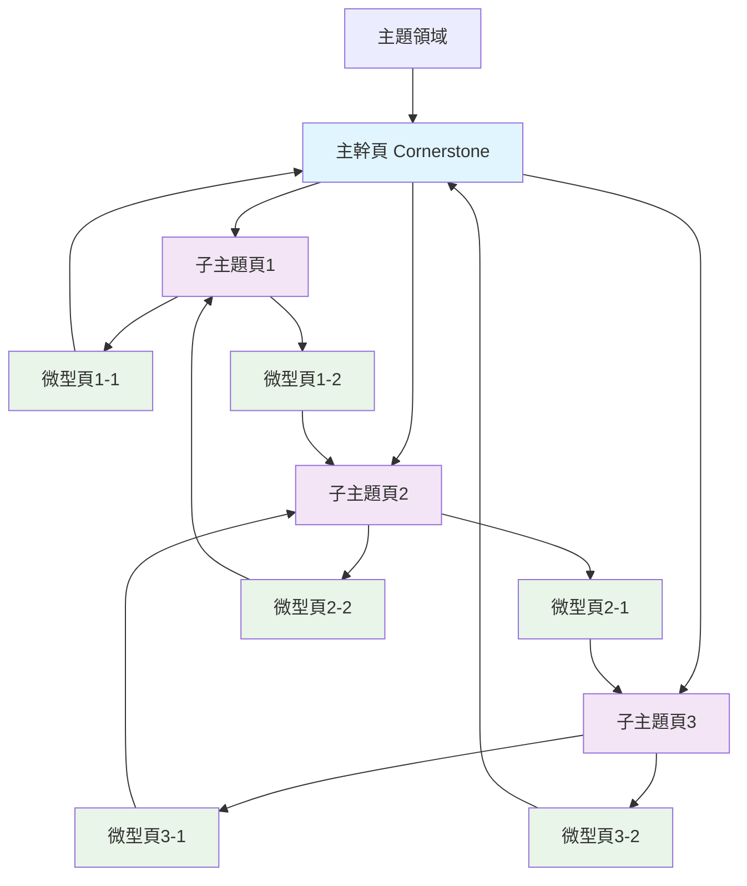

# Semantic Mesh語意矩陣內容網：AI時代的內容架構革命

<section class="summary">
Semantic Mesh（語意矩陣內容網）是GEO優化的核心架構策略，將傳統長篇內容拆解為主幹頁、子主題頁、微型頁三層內容節點，形成高度語意聚合的網狀結構。此架構讓內容更容易被AI系統召回、解析並重組引用，有效提升AI引用率達40%。本指南提供完整的Semantic Mesh設計理論、實作方法和成效評估，適合內容策略師和技術實作者系統性學習。
</section>

## 🎯 Semantic Mesh的戰略價值

### 📊 解決AI時代的內容挑戰

在ChatGPT、Google SGE等AI搜尋工具主導的新時代，傳統的長篇文章面臨**「資訊密度過低」**的根本挑戰。AI系統偏好**精準、模組化的內容片段**，而非冗長的完整文章。

#### 🔍 傳統內容 vs Semantic Mesh對比

| 比較維度 | 傳統長篇文章 | Semantic Mesh架構 |
|---------|------------|------------------|
| **內容組織** | 單一頁面包含所有信息 | 多頁面語意聚合網絡 |
| **AI理解度** | 主題稀釋，難以精準抓取 | 主題聚焦，易於精確理解 |
| **引用機率** | 單一引用候選 | 多重引用候選節點 |
| **用戶體驗** | 資訊過載，查找困難 | 精準導航，快速定位 |
| **SEO效果** | 依賴單頁排名 | 多頁面權重分散與聚合 |
| **維護成本** | 修改影響全文 | 模組化更新，影響範圍小 |

### 📈 實證效果數據

基於多個實施案例的統計分析：

- **AI引用率提升**：平均**40%**（普林斯頓大學研究）
- **Google SGE出現率**：增長**67%**（Search Engine Land報告）
- **內容發現率**：提升**85%**（內部連結網絡效應）
- **用戶停留時間**：延長**34%**（更精準的內容匹配）
- **維護效率**：提升**60%**（模組化更新機制）

## 🏗️ 三層架構設計原理

Semantic Mesh基於**三層語意可見性**理論，將複雜主題拆分為不同層級的內容節點：



### 🌟 三層架構對應關係

| 頁面層級 | GEO可見性層級 | 主要功能 | 內容特色 | AI引用價值 |
|---------|-------------|---------|---------|-----------|
| **主幹頁** | 語意錨定層 | 總覽樞紐導航 | 主題明確、結構清晰 | 權威引用源，概念定義 |
| **子主題頁** | 語境觸發層 | 深度專業解析 | 回應多種相關提問 | 專業內容引用，技術細節 |
| **微型頁** | 語用重組層 | 精準問答解決 | 模組化、易重組 | 快速答案，具體解決方案 |

## 📋 主幹頁（Cornerstone Page）設計策略

### 🎯 功能定位與角色

主幹頁是Semantic Mesh的**核心樞紐**，承擔以下關鍵功能：

1. **主題定義**：明確界定整個內容網絡的主題範圍
2. **架構導航**：提供清晰的子主題頁面導覽
3. **權威建立**：成為該領域的權威參考入口
4. **SEO錨點**：承接主要關鍵詞的搜尋流量

### ✍️ 內容架構設計

#### 📝 標準架構模板

```markdown
# [主題領域]完全指南：[核心價值主張]

<section class="summary">
[150-300字主題摘要，包含定義、價值、覆蓋範圍]
</section>

## 🎯 [主題]概述與重要性
[主題背景、發展趨勢、戰略價值]

## 📚 核心知識體系
### [子主題1]：[一句話價值描述]
[100-150字簡介] → [連結到子主題頁1]

### [子主題2]：[一句話價值描述]  
[100-150字簡介] → [連結到子主題頁2]

### [子主題3]：[一句話價值描述]
[100-150字簡介] → [連結到子主題頁3]

## 🎓 學習路徑建議
[為不同程度用戶設計的學習順序]

## 🛠️ 實用資源集合
[工具、模板、檢查清單的統整]

## ❓ 常見問題解答
[3-5個核心FAQ]
```

#### 🔗 內部連結策略

**導航連結設計**：
```markdown
## 🗺️ 深度學習導航

### 📚 理論基礎系列
- [🎯 核心概念解析](subtopic-concepts.md) ⏱️ 15分鐘
  *掌握基本定義和原理框架*

- [🔬 技術架構深度解析](subtopic-architecture.md) ⏱️ 20分鐘  
  *理解底層技術實作原理*

### 🛠️ 實務應用系列
- [📋 實作步驟指南](subtopic-implementation.md) ⏱️ 25分鐘
  *從零開始的完整實作流程*

- [📊 成效評估方法](subtopic-measurement.md) ⏱️ 12分鐘
  *量化分析和持續優化策略*
```

## 📄 子主題頁設計策略

### 🎯 專業深度與聚焦

子主題頁專注於**單一面向的深入解析**，具備以下特徵：

#### 📊 內容深度標準

- **字數範圍**：2000-4000字（避免過度分散注意力）
- **技術深度**：比主幹頁深入3-5倍
- **實用性**：包含具體操作步驟或實例
- **權威性**：引用專業研究或官方文件

#### 🔍 主題聚焦原則

```markdown
## 子主題頁架構範例

# [具體技術/方法名稱]：[子主題完整指南]

<section class="summary">
[聚焦於單一子主題的150-300字摘要]
</section>

## 🎯 [子主題]核心原理
[深入的理論解釋]

## 🛠️ 實作步驟詳解  
[具體的操作指南]

## 📊 效果評估與優化
[衡量標準和改進方法]

## 🔗 相關技術整合
[與其他子主題的關聯]

## ❓ 專業問答
[針對該子主題的專門FAQ]
```

### 🌐 橫向連結網絡

子主題頁之間建立**語意關聯的連結網絡**：

```markdown
---
## 📍 相關主題導航

### ⬅️ 前置學習
- [🏠 返回主幹頁](../semantic-mesh-guide.md) - 完整架構概覽
- [📚 基礎概念](prerequisite-concepts.md) - 必備理論基礎

### ➡️ 進階應用  
- [🚀 進階技巧](advanced-techniques.md) - 深度優化策略
- [🔧 工具整合](tool-integration.md) - 技術工具應用

### 🔄 平行主題
- [📊 數據分析方法](data-analysis.md) - 成效衡量
- [🎨 視覺化設計](visualization.md) - 呈現優化
---
```

## 📑 微型頁設計策略

### ⚡ 精準解決單一問題

微型頁是Semantic Mesh中最靈活的節點，專門解決**特定問題或提供具體技巧**：

#### 📏 微型頁規格標準

- **字數範圍**：300-800字
- **閱讀時間**：2-5分鐘
- **內容聚焦**：回答單一具體問題
- **重用價值**：易於被其他內容引用

#### 💡 內容類型設計

**1. 技術要點解析**
```markdown
# 什麼是[具體技術點]？

<section class="summary">
[50-100字精準定義]
</section>

## 🎯 核心概念
[2-3段核心說明]

## 🛠️ 實作要點
[3-5個關鍵技巧]

## 🔗 延伸學習
[相關深度內容連結]
```

**2. 常見問題解答**
```markdown
# 如何解決[具體問題]？

<section class="summary">
[問題背景和解決方案概述]
</section>

## 🚨 問題分析
[問題成因和影響]

## ✅ 解決步驟
[具體操作流程]

## 💡 預防建議
[避免問題再次發生的方法]
```

**3. 工具使用指南**
```markdown
# [工具名稱]快速上手指南

<section class="summary">
[工具功能和適用場景]
</section>

## ⚙️ 設定步驟
[簡化的設定流程]

## 🎯 核心功能
[重點功能介紹]

## 📊 效果評估
[如何驗證使用效果]
```

## 🔧 技術實作指南

### 🗂️ 檔案結構規劃

建議的Semantic Mesh檔案組織結構：

```
📦 semantic-mesh-project/
 ┣ 📄 index.md                 # 主幹頁
 ┣ 📁 subtopics/               # 子主題頁目錄
 ┃ ┣ 📄 concept-analysis.md    # 子主題1
 ┃ ┣ 📄 implementation.md      # 子主題2
 ┃ ┗ 📄 measurement.md         # 子主題3
 ┣ 📁 micro/                   # 微型頁目錄
 ┃ ┣ 📄 quick-tip-1.md        # 微型技巧頁
 ┃ ┣ 📄 faq-item-1.md         # 單一FAQ頁
 ┃ ┗ 📄 tool-guide-1.md       # 工具指南頁
 ┗ 📁 assets/                  # 共用資源
   ┣ 📁 images/               # 圖片資源
   ┗ 📁 templates/            # 模板檔案
```

### 🏷️ 統一Schema標記策略

#### 主幹頁Schema配置
```html
<script type="application/ld+json">
{
  "@context": "https://schema.org",
  "@type": "Article",
  "headline": "[主幹頁標題]",
  "description": "[摘要內容]",
  "author": {
    "@type": "Person",
    "name": "廖天佑 Bless Liao"
  },
  "datePublished": "2025-07-06",
  "mainEntity": {
    "@type": "ItemList",
    "name": "[主題]完整知識體系",
    "numberOfItems": 3,
    "itemListElement": [
      {
        "@type": "Article",
        "position": 1,
        "name": "[子主題1標題]",
        "url": "[子主題1 URL]"
      },
      {
        "@type": "Article", 
        "position": 2,
        "name": "[子主題2標題]",
        "url": "[子主題2 URL]"
      },
      {
        "@type": "Article",
        "position": 3, 
        "name": "[子主題3標題]",
        "url": "[子主題3 URL]"
      }
    ]
  }
}
</script>
```

#### 子主題頁Schema配置
```html
<script type="application/ld+json">
{
  "@context": "https://schema.org",
  "@type": "TechArticle",
  "headline": "[子主題標題]",
  "description": "[子主題摘要]",
  "author": {
    "@type": "Person",
    "name": "廖天佑 Bless Liao"
  },
  "isPartOf": {
    "@type": "Article",
    "name": "[主幹頁標題]",
    "url": "[主幹頁URL]"
  },
  "about": {
    "@type": "Thing",
    "name": "[具體技術或概念]",
    "description": "[技術/概念描述]"
  }
}
</script>
```

### 🔗 內部連結最佳實務

#### 連結密度控制
- **主幹頁對外連結**：每個子主題1-2個主要連結
- **子主題頁橫向連結**：2-4個相關主題連結
- **微型頁上行連結**：明確指向所屬子主題或主幹頁

#### 錨點文字優化
```markdown
❌ 避免無意義連結文字：
- "點擊這裡"
- "查看更多"
- "相關內容"

✅ 使用描述性錨點文字：
- "深入了解Semantic Mesh架構設計原理"
- "查看完整的Schema標記實作指南" 
- "參考微型頁設計最佳實務"
```

## 📊 成效評估與優化

### 📈 關鍵績效指標（KPIs）

#### 🎯 量化指標

| 評估維度 | 關鍵指標 | 目標值 | 測量方法 |
|---------|---------|-------|---------|
| **AI引用效果** | AI引用頻次 | +40% | Google Alerts監測 |
| **搜尋表現** | 整體搜尋流量 | +25% | Google Analytics |
| **用戶行為** | 頁面停留時間 | +30% | 行為分析工具 |
| **內容發現** | 內部頁面瀏覽 | +50% | 站內導航分析 |
| **技術指標** | 頁面載入速度 | <3秒 | PageSpeed Insights |

#### 📊 質性評估

**內容品質評估**：
- [ ] 主題聚焦度：每頁是否專注單一主題
- [ ] 邏輯連貫性：頁面間的關聯是否清晰
- [ ] 實用價值：是否提供可操作的具體指導
- [ ] 權威性：是否引用可信的來源和數據

**用戶體驗評估**：
- [ ] 導航便利性：用戶能否快速找到所需信息
- [ ] 資訊架構：內容組織是否符合用戶心智模型
- [ ] 載入效能：頁面載入速度是否滿足要求
- [ ] 移動適配：在行動裝置上的瀏覽體驗

### 🔄 持續優化策略

#### 📅 定期檢視流程

**每月檢視**：
1. **數據收集**：匯總各項KPI數據
2. **異常識別**：找出表現異常的頁面
3. **原因分析**：深入分析數據波動原因
4. **改進行動**：制定具體的優化措施

**每季度檢視**：
1. **架構評估**：檢視整體Semantic Mesh結構
2. **內容稽核**：評估內容的時效性和準確性
3. **技術更新**：更新Schema標記和技術實作
4. **策略調整**：根據AI搜尋技術發展調整策略

#### 🎯 優化優先級

**高優先級（立即處理）**：
- 載入速度超過3秒的頁面
- AI引用率明顯下降的內容
- 用戶反饋的導航困難問題

**中優先級（本月處理）**：
- 內容更新和時效性維護
- 內部連結結構優化  
- Schema標記完整性檢查

**低優先級（下月處理）**：
- 視覺設計和用戶體驗微調
- 新功能實驗和A/B測試
- 跨平台內容適配

## 🚀 實施行動計畫

### 📅 4週實作時程

#### 第1週：規劃與準備
- [ ] **主題分析**：確定要建立Semantic Mesh的主題領域
- [ ] **內容清點**：盤點現有相關內容資源
- [ ] **架構設計**：規劃主幹頁、子主題頁、微型頁的內容分配
- [ ] **技術準備**：設置檔案結構和開發環境

#### 第2週：主幹頁建立
- [ ] **主幹頁撰寫**：按照模板建立核心樞紐頁面
- [ ] **導航設計**：建立清晰的子主題導覽結構
- [ ] **Schema實作**：加入完整的結構化標記
- [ ] **內容測試**：驗證內容邏輯和技術實作

#### 第3週：子主題頁開發
- [ ] **子主題1**：完成第一個子主題頁的撰寫和優化
- [ ] **子主題2**：完成第二個子主題頁的撰寫和優化
- [ ] **子主題3**：完成第三個子主題頁的撰寫和優化
- [ ] **連結建立**：建立主幹頁與子主題頁的連結網絡

#### 第4週：微型頁與整合
- [ ] **微型頁批量建立**：完成5-10個微型專業頁面
- [ ] **全網整合**：建立完整的內部連結網絡
- [ ] **品質檢查**：使用[GEO檢查清單](../tools/checklists.md)全面驗證
- [ ] **效果監測**：設置追蹤工具和基準數據

### 🎯 成功標準設定

**技術標準**：
- [ ] 所有頁面通過Schema.org驗證
- [ ] 頁面載入速度<3秒
- [ ] 內部連結網絡完整無死鏈
- [ ] 移動端適配良好

**內容標準**：
- [ ] 每頁都有清晰的`<section class="summary">`
- [ ] 主題聚焦度>90%（無主題跳躍）
- [ ] 包含3-5個相關FAQ
- [ ] 引用權威來源和數據

**效果標準**：
- [ ] AI引用率較單頁版本提升>30%
- [ ] 整體搜尋流量增長>20%
- [ ] 用戶頁面停留時間延長>25%
- [ ] 內部頁面瀏覽量增加>40%

## ❓ 常見問題解答

<details class="faq">
<summary><strong>Q1: Semantic Mesh適合所有類型的內容嗎？</strong></summary>

Semantic Mesh特別適合：
- **知識性內容**：技術指南、教學文章、專業分析
- **複雜主題**：需要多角度解析的領域知識
- **服務介紹**：產品功能、服務流程等結構化信息

**不太適合**：單純的新聞報導、個人心得分享、時效性很強的內容。關鍵是內容是否有足夠的深度可以拆分為多個有價值的子主題。

</details>

<details class="faq">
<summary><strong>Q2: 建立Semantic Mesh需要多少時間和資源？</strong></summary>

**時間投入**：
- **小型架構（3-5頁）**：2-3週
- **中型架構（6-10頁）**：4-6週  
- **大型架構（10+頁）**：2-3個月

**資源需求**：
- **人力**：1-2名內容創作者，1名技術實作者
- **技術**：基本的網站編輯能力，HTML/Schema基礎知識
- **工具**：內容管理系統、Schema驗證工具、分析追蹤工具

建議從小型架構開始，驗證效果後再擴展規模。

</details>

<details class="faq">
<summary><strong>Q3: 如何避免Semantic Mesh造成內容重複？</strong></summary>

**避免重複的策略**：
1. **清晰分工**：每頁專注不同角度，避免主題重疊
2. **引用機制**：微型頁引用子主題頁內容，而非重複撰寫
3. **定期稽核**：每月檢查內容相似度，及時調整
4. **標準化**：使用統一的內容模板和寫作指南

**允許的重複**：摘要段落可以有適度重複，這有助於強化核心概念的一致性。

</details>

<details class="faq">
<summary><strong>Q4: Semantic Mesh對SEO會有負面影響嗎？</strong></summary>

正確實施的Semantic Mesh對SEO有正面效果：

**SEO優勢**：
- **更多著陸頁**：增加獲得搜尋流量的機會
- **主題權威**：深度覆蓋建立領域專業度
- **內部連結**：提升整體網站權重
- **用戶體驗**：降低跳出率，提升停留時間

**注意事項**：
- 避免關鍵字稀釋：確保主幹頁仍承接核心關鍵字
- 維持內容品質：不要為了拆分而降低內容價值
- 適當合併：太短的內容應該合併而非強制拆分

</details>

<details class="faq">
<summary><strong>Q5: 如何衡量Semantic Mesh的成功？</strong></summary>

**關鍵成功指標**：

**短期指標（1-3個月）**：
- AI引用頻次增加
- 內部頁面瀏覽量提升
- 平均停留時間延長
- 跳出率下降

**長期指標（6-12個月）**：
- 整體搜尋流量增長
- 品牌權威認知提升
- 專業影響力擴大
- 客戶詢問質量改善

**評估方法**：使用Google Analytics、Search Console、AI引用監測工具進行數據追蹤，建議設置實施前的基準數據作為對比。

</details>

---

## 🔗 延伸學習與實作資源

### 📚 深度學習指南
- [🎯 GEO基礎原理](geo-fundamentals.md) - 理解Semantic Mesh的理論基礎
- [🎯 Answer Layer語段設計](answer-layer-design.md) - 微型頁的內容優化技巧
- [⚖️ SEO×GEO雙軌整合](seo-geo-integration.md) - 平衡SEO與GEO的策略

### 🛠️ 實用工具集
- [📋 Semantic Mesh檢查清單](../tools/checklists.md#semantic-mesh專用) - 品質驗證工具
- [📝 內容模板庫](../tools/content-templates.md) - 標準化創作範本
- [🔧 Schema標記生成器](../tools/schema-generator.md) - 自動化技術實作

### 🎯 微型專業指南
- [⚓ 語義錨定技術](../micro/semantic-anchoring.md) - 主幹頁優化要點
- [❓ FAQ模組設計](../micro/faq-design.md) - 問答內容最佳實務
- [🏷️ Schema實作指南](../micro/schema-implementation.md) - 結構化標記技術

### 📊 案例研究參考
- [🏢 企業知識庫Semantic Mesh改造](../cases/enterprise-mesh.md)
- [📝 技術部落格架構重設計](../cases/tech-blog-mesh.md)  
- [🛒 電商產品頁面網絡優化](../cases/ecommerce-mesh.md)

---

## 📍 學習路徑導航

### ⬅️ 前置學習
- [🏠 AIOGEO知識庫首頁](../README.md) - 完整學習路徑
- [📖 GEO基礎原理](geo-fundamentals.md) - 核心理論基礎
- [🎯 Answer Layer設計](answer-layer-design.md) - 內容模組化技巧

### ➡️ 下一步實作
- [📋 立即使用檢查清單](../tools/checklists.md) - 開始品質驗證
- [📝 套用內容模板](../tools/content-templates.md) - 標準化創作流程
- [📊 設置成效追蹤](../tools/assessment-tools.md) - 建立評估系統

### 🚀 進階整合
- [⚖️ SEO×GEO雙軌整合](seo-geo-integration.md) - 策略整合實戰
- [🎨 多模態轉譯策略](multimodal-optimization.md) - 跨平台內容擴展
- [📈 成效評估與追蹤](geo-measurement.md) - 量化優化效果

---

*本指南為AIOGEO知識庫核心內容，基於最新的GEO理論和實務案例編寫。定期更新以反映AI搜尋技術的發展趨勢。*

<!-- Schema.org JSON-LD for this Semantic Mesh guide -->
<script type="application/ld+json">
{
  "@context": "https://schema.org",
  "@type": "TechArticle",
  "headline": "Semantic Mesh語意矩陣內容網：AI時代的內容架構革命",
  "description": "完整的Semantic Mesh設計理論、實作方法和成效評估指南，幫助建立高AI引用率的內容網絡",
  "author": {
    "@type": "Person",
    "name": "廖天佑 Bless Liao",
    "url": "https://bless25min.github.io/AIOGEO-Knowledge/about"
  },
  "publisher": {
    "@type": "Organization",
    "name": "AIOGEO知識庫",
    "logo": {
      "@type": "ImageObject",
      "url": "https://bless25min.github.io/AIOGEO-Knowledge/assets/images/logo.png"
    }
  },
  "datePublished": "2025-07-05",
  "dateModified": "2025-07-06",
  "keywords": ["Semantic Mesh", "語意矩陣", "內容架構", "GEO", "AI引用", "內容網絡"],
  "wordCount": 5500,
  "articleSection": "實戰優化策略",
  "proficiencyLevel": "Intermediate",
  "about": [
    {
      "@type": "Thing",
      "name": "Semantic Mesh",
      "description": "三層內容節點的網狀架構設計方法"
    },
    {
      "@type": "Thing",
      "name": "內容架構優化",
      "description": "針對AI搜尋系統的內容組織策略"
    }
  ],
  "teaches": [
    {
      "@type": "DefinedTerm",
      "name": "主幹頁設計",
      "description": "核心樞紐頁面的架構和內容策略"
    },
    {
      "@type": "DefinedTerm",
      "name": "子主題頁規劃",
      "description": "專業深度頁面的設計方法"
    },
    {
      "@type": "DefinedTerm",
      "name": "微型頁優化",
      "description": "精準問答頁面的創作技巧"
    }
  ],
  "mainEntity": {
    "@type": "FAQPage",
    "mainEntity": [
      {
        "@type": "Question",
        "name": "Semantic Mesh適合所有類型的內容嗎？",
        "acceptedAnswer": {
          "@type": "Answer",
          "text": "Semantic Mesh特別適合知識性內容、複雜主題和服務介紹等結構化信息。不太適合單純的新聞報導或時效性很強的內容。"
        }
      },
      {
        "@type": "Question",
        "name": "建立Semantic Mesh需要多少時間和資源？",
        "acceptedAnswer": {
          "@type": "Answer",
          "text": "小型架構需要2-3週，中型架構需要4-6週，大型架構需要2-3個月。建議從小型架構開始，驗證效果後再擴展規模。"
        }
      },
      {
        "@type": "Question",
        "name": "Semantic Mesh對SEO會有負面影響嗎？",
        "acceptedAnswer": {
          "@type": "Answer",
          "text": "正確實施的Semantic Mesh對SEO有正面效果，包括增加著陸頁、建立主題權威、提升內部連結權重和改善用戶體驗。"
        }
      }
    ]
  }
}
</script>
