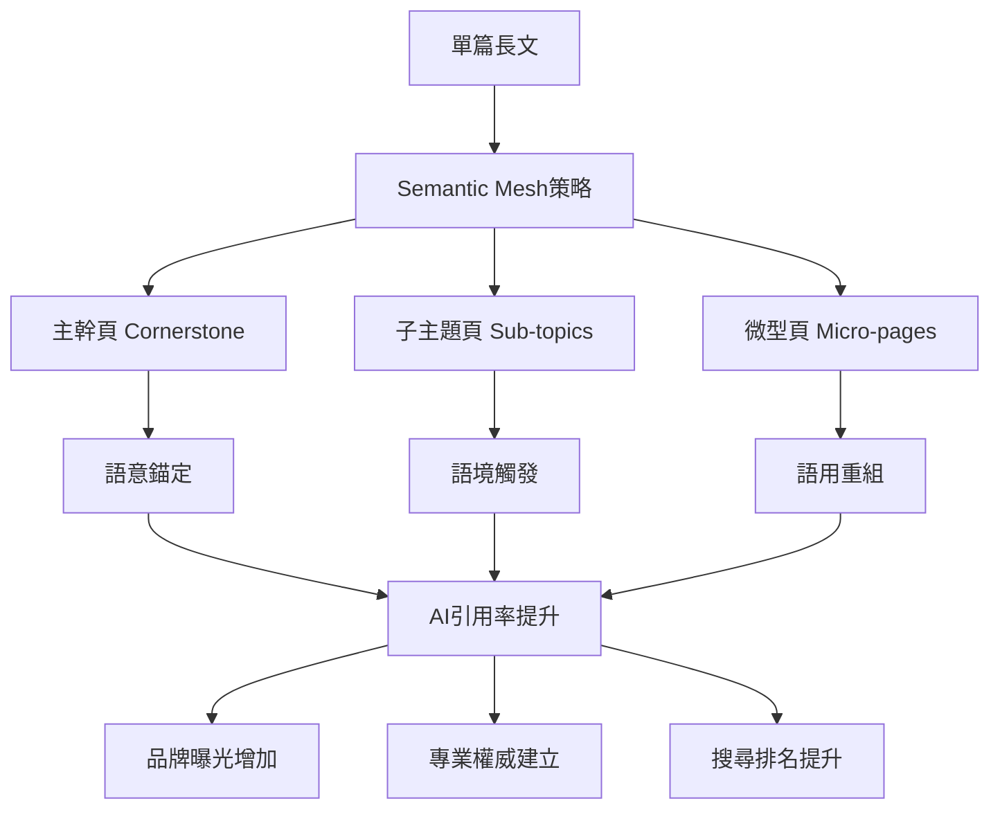
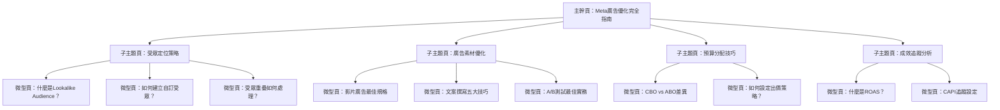

# 打造GEO語意矩陣內容網：Semantic Mesh佈局實作全解

<section class="summary">
Semantic Mesh（語意矩陣內容網）是一種GEO（生成式引擎優化）內容策略，旨在將原本一篇文章拆解為主幹頁、子主題頁、微型頁三層內容節點，形成高度語意聚合的網狀架構。此架構能讓內容更容易被AI搜尋系統召回、解析並重組引用於答案中，大幅提升AI摘要引用率與Google搜尋排名。
</section>

## 🎯 Semantic Mesh的戰略價值

傳統的長篇文章在AI時代面臨**「資訊密度過低」**的挑戰。當用戶向ChatGPT或Google SGE提問時，AI系統偏好**精準、模組化的內容片段**，而非冗長的完整文章。Semantic Mesh策略正是為了解決這個痛點而生。

### 核心目標與引用優勢



#### 💎 四大戰略優勢

1. **高語意集中度群聚**：建立高度語意相關的內容群組頁面，大幅提高AI回答時引用的機率
2. **多重引用候選**：每篇頁面各自獨立成為AI引用的候選片段，不會因過長內容而稀釋焦點  
3. **強耦合內部連結網**：透過主幹頁串連形成緊密的語意網絡，增加權重傳遞
4. **長尾關鍵字覆蓋**：微型頁面能精準對應長尾查詢，提升整體主題的搜尋可見性

## 🏗️ 三層架構設計原理

Semantic Mesh將主題內容拆分為三個層級的頁面架構，對應於GEO理論中的**三層語意可見性**：

<div class="architecture-overview">

### 🌟 架構對應關係

| 頁面類型 | GEO可見性層級 | 主要功能 | 內容特色 |
|---------|-------------|---------|---------|
| **主幹頁** | 語意錨定層 | 總覽樞紐 | 主題明確、結構清晰 |
| **子主題頁** | 語境觸發層 | 深度解析 | 回應多種相關提問 |
| **微型頁** | 語用重組層 | 精準問答 | 模組化、易重組 |

</div>

## 📋 主幹頁（Cornerstone Page）實作策略

### 🎯 角色定位

主幹頁是整個內容網的**核心樞紐**，負責提供主題的總覽精華並引導讀者進入各子主題分類。它在語意上扮演錨定作用，定義了主要議題範疇並建立清晰的內容架構。

### ✍️ 標題寫法策略

主幹頁的標題應該**明確涵蓋主題全貌**：

**✅ 優秀範例：**
```markdown
# Meta廣告投放完全指南：從新手到專家的系統化學習路徑

# GEO優化大全：生成式AI時代的內容策略總覽

# Python網頁爬蟲十大技術：從基礎到進階的完整實戰手冊
```

**❌ 避免範例：**
```markdown
# 關於Meta廣告  （過於簡略）
# 我的投放心得分享  （缺乏權威感）
# 廣告優化技巧  （範圍不明確）
```

### 📝 內容結構與段落設計

主幹頁的內容著重於提供**整體概觀**，段落宜精簡扼要：

```markdown
## 主幹頁內容架構範本

# 主題完全指南標題

<section class="summary">
150-300字摘要段落，涵蓋主題重點與關鍵詞，此段將優先被AI摘要抓取。
</section>

## 📖 主題概述
簡介主題背景、重要性和學習價值（1-2段）

## 🎯 核心分類導覽
### 分類一：基礎理論
簡述該面向的重點並提供[前往子主題頁](link)的連結

### 分類二：實戰應用  
簡述該面向的重點並提供[前往子主題頁](link)的連結

### 分類三：進階技巧
簡述該面向的重點並提供[前往子主題頁](link)的連結

## 🚀 學習路徑建議
為不同程度的讀者提供建議的閱讀順序

## 🔗 延伸資源
相關工具、官方文件、進階讀物推薦
```

### 🔗 內部連結方式

在主幹頁中，**醒目列出各子主題頁**的導覽區塊：

<div class="internal-linking-example">

#### 🌐 實戰內鏈範例

```markdown
## 🗺️ 內容導覽地圖

### 📚 基礎理論系列
- [GEO核心概念解析](subtopic-geo-basics.md) ⏱️ 15分鐘
- [AI搜尋演算法原理](subtopic-ai-algorithm.md) ⏱️ 20分鐘  
- [語意可見性三層架構](subtopic-semantic-layers.md) ⏱️ 12分鐘

### 🎯 實戰應用系列  
- [Answer Layer語段優化](subtopic-answer-layer.md) ⏱️ 18分鐘
- [結構化資料標記](subtopic-schema-markup.md) ⏱️ 10分鐘
- [多模態內容轉譯](subtopic-multimodal.md) ⏱️ 15分鐘

### 🚀 進階策略系列
- [Semantic Mesh架構設計](subtopic-mesh-design.md) ⏱️ 25分鐘
- [競爭對手分析方法](subtopic-competitor-analysis.md) ⏱️ 12分鐘
```

</div>

### 🏷️ Schema標記建議

主幹頁建議使用**Article Schema**作為基本標記：

```html
<script type="application/ld+json">
{
  "@context": "https://schema.org",
  "@type": "Article",
  "@id": "https://yoursite.com/geo-complete-guide",
  "headline": "GEO優化完全指南：生成式AI時代的內容策略",
  "description": "深度解析GEO優化策略...",
  "author": {
    "@type": "Person",
    "name": "廖天佑 Bless",
    "url": "https://yoursite.com/about"
  },
  "publisher": {
    "@type": "Organization", 
    "name": "AIOGEO知識庫"
  },
  "mainEntityOfPage": {
    "@type": "WebPage",
    "@id": "https://yoursite.com/geo-complete-guide"
  },
  "breadcrumb": {
    "@type": "BreadcrumbList",
    "itemListElement": [
      {"@type": "ListItem", "position": 1, "name": "首頁"},
      {"@type": "ListItem", "position": 2, "name": "GEO指南"}
    ]
  }
}
</script>
```

## 🎯 子主題頁（Sub-topic Pages）實作策略

### 🎯 角色定位

子主題頁是從屬於主幹頁的**一級內容頁**，針對主題的一個側面進行深入探討。每個子主題頁聚焦於一組相關的問題或技巧，在使用者查詢中充當**觸發點角色**。

### ✍️ 標題寫法策略

子主題頁標題應清楚點出具體議題，採用**長尾關鍵詞或問題導向**的寫法：

```markdown
## 優秀標題範例

# Answer Layer語段設計：讓AI優先引用你的內容的五大技巧

# Facebook CAPI設定完整教學：繞過iOS限制提升追蹤準確率

# Python Beautiful Soup實戰：30分鐘學會網頁資料擷取

# SEO關鍵字研究進階指南：從工具選擇到競爭分析
```

### 📝 內容與段落設計

子主題頁內容篇幅中等，通常比主幹頁詳細但又比完整專題**短小精悍**：

<div class="subtopic-structure">

#### 📋 子主題頁標準結構

```markdown
# 子主題精確標題

<section class="summary">
簡潔摘要，概述該子主題重點，有助於AI快速了解內容要旨
</section>

## 🎯 核心概念
第一段概括結論/要點，後續段落展開細節佐證

## 🛠️ 實戰步驟
### 步驟一：準備工作
具體說明和注意事項

### 步驟二：執行過程  
詳細操作和範例代碼

### 步驟三：效果驗證
檢查方法和優化建議

## ❓ 常見問題FAQ
**Q1: 常見問題示例？**
A1: 簡要回答，突出直接結論

**Q2: 第二個問題？**  
A2: 回答並適當引用數據或來源

## 🔗 相關資源
- [回到主指南](main-guide.md)
- [下一章節：XXX](next-topic.md)
- [相關工具推薦](tools.md)
```

</div>

### 🔗 內部連結方式

每個子主題頁都應該**清楚標示其隸屬的主題脈絡**：

```markdown
## 🧭 導覽示例

> 📖 **本文屬於**：[《GEO優化完全指南》](main-guide.md) > 實戰應用系列

## 📚 本系列其他文章  
- [⬅️ 上一篇：GEO基礎理論](previous-topic.md)
- [➡️ 下一篇：多模態轉譯策略](next-topic.md)

## 🔍 深入閱讀
- [Semantic Mesh架構設計](semantic-mesh-design.md)
- [實用工具檢查清單](tools-checklist.md)
```

### 🏷️ Schema標記建議

子主題頁除了基本的Article Schema外，應**視內容性質**加入相應的結構化標記：

```html
<!-- FAQ Schema範例 -->
<script type="application/ld+json">
{
  "@context": "https://schema.org",
  "@type": "FAQPage", 
  "mainEntity": [{
    "@type": "Question",
    "name": "什麼是Answer Layer語段？",
    "acceptedAnswer": {
      "@type": "Answer",
      "text": "Answer Layer語段是AI模型在回答時實際引用的內容片段..."
    }
  }]
}
</script>

<!-- HowTo Schema範例 -->
<script type="application/ld+json">
{
  "@context": "https://schema.org",
  "@type": "HowTo",
  "name": "如何優化Answer Layer語段",
  "step": [{
    "@type": "HowToStep",
    "name": "語義錨定優化",
    "text": "確保內容主題明確並與可能的提問直接對應..."
  }]
}
</script>
```

## 🔬 微型頁（Micro-pages）實作策略

### 🎯 角色定位

微型頁是Semantic Mesh中**最細粒度的內容單元**，通常針對非常具體的問題、定義或技巧進行說明。它扮演**語意重組層**的角色：內容精簡而結構清楚，方便AI模型將其作為獨立模組來抽取和組合。

### ✍️ 標題寫法策略

微型頁的標題應**直截了當**地點出問題或主題，最好與使用者可能詢問的語句完全匹配：

```markdown
## 理想的微型頁標題

# 什麼是Facebook CAPI？

# 如何設定Google Analytics 4事件追蹤？

# Python爬蟲中如何處理JavaScript渲染頁面？

# SEO中的E-A-T是什麼意思？

# 「封閉再行銷模型」完全操作指南
```

### 📝 內容與段落設計

微型頁的內容力求**短小精悍且結構模組化**，建議控制在幾百字以內：

<div class="micro-page-structure">

#### 📋 微型頁三段式結構

```markdown
# 直接問答式標題

<section class="summary">
一兩句話摘要核心答案，為AI提供最快速的內容索引入口
</section>

## 🎯 核心定義/答案
第一段直接給出問題的答案或技巧的要點

## 📖 背景說明  
第二段提供相關的補充說明或背景知識

## 💡 實際應用
第三段舉例說明或提供實際應用情境

## 🔗 相關連結
- [回到上級主題](parent-topic.md)
- [相關微型頁面](related-micro.md)
```

</div>

#### 💎 優秀微型頁範例

<div class="micro-page-example">

```markdown
# 什麼是Facebook CAPI？

<section class="summary">
CAPI（Conversion API）是Facebook的伺服器端追蹤技術，可繞過瀏覽器限制直接傳送轉換數據。
</section>

## 🎯 核心定義
**CAPI（Conversion API）是Meta廣告的伺服器端追蹤解決方案**，允許廣告主直接從自己的伺服器向Facebook發送客戶行為數據，而不依賴瀏覽器像素追蹤。

## 📖 背景說明
隨著iOS 14.5推出ATT（App Tracking Transparency）功能，傳統的瀏覽器像素追蹤受到限制，導致轉換數據不完整。CAPI提供了替代方案，確保廣告主仍能獲得準確的追蹤數據。

## 💡 實際應用
**主要應用場景包括**：
- 電商網站追蹤購買轉換
- 線上課程平台追蹤報名註冊  
- SaaS產品追蹤試用和訂閱
- 實體店面整合線上線下數據

## 🔗 相關連結
- [回到：Meta廣告完全指南](meta-ads-guide.md)
- [進階閱讀：CAPI設定教學](capi-setup-guide.md)
- [相關：iOS 14.5對廣告的影響](ios-impact.md)
```

</div>

### 🔗 內部連結方式

微型頁應該**回鏈到相關的子主題頁或主幹頁**：

```markdown
## 🧭 層級導覽範例

📍 **當前位置**：  
[GEO完全指南](main-guide.md) > [Answer Layer優化](answer-layer.md) > 什麼是語義錨定？

## 🔄 相關微型頁
- [什麼是語境觸發？](context-triggering.md)
- [什麼是語用重組？](pragmatic-recomposition.md)  
- [如何提升引用潛力？](citation-potential.md)

## ⬆️ 返回上層
- [Answer Layer語段設計完整教學](answer-layer.md)
```

### 🏷️ Schema標記建議

對於微型頁，建議充分利用**FAQ結構化資料標記**：

```html
<script type="application/ld+json">
{
  "@context": "https://schema.org",
  "@type": "FAQPage",
  "mainEntity": [{
    "@type": "Question", 
    "name": "什麼是Facebook CAPI？",
    "acceptedAnswer": {
      "@type": "Answer",
      "text": "CAPI（Conversion API）是Meta廣告的伺服器端追蹤解決方案，允許廣告主直接從自己的伺服器向Facebook發送客戶行為數據，而不依賴瀏覽器像素追蹤。"
    }
  }]
}
</script>
```

## 🏗️ 實戰架構範例

以下提供一個完整的Semantic Mesh架構範例，展示三層內容如何組成語意矩陣網：

### 🌟 範例主題：「Meta廣告優化策略」

<div class="architecture-example">

#### 🏛️ 完整架構展示



#### 📄 具體標題範例

**主幹頁：**
```markdown
Meta廣告投放完全指南：從新手到專家的系統化優化策略
```

**子主題頁：**
```markdown
Facebook受眾定位完整教學：精準觸及目標客群的五大策略
Meta廣告素材優化指南：提升CTR和轉換率的創意技巧  
廣告預算分配最佳實務：CBO與ABO的選擇與設定
Meta廣告成效分析全攻略：從數據洞察到優化行動
```

**微型頁：**
```markdown
什麼是Facebook Lookalike Audience相似受眾？
如何建立Facebook自訂受眾（Custom Audience）？
Meta廣告受眾重疊問題如何解決？
Facebook影片廣告最佳規格與建議
廣告文案撰寫的五大心理技巧
什麼是ROAS？如何計算廣告投資報酬率？
```

</div>

## 🚀 部署實施指南

### 📋 優先順序清單

根據實戰經驗，建議按以下**優先順序**逐步部署Semantic Mesh：

#### 🎯 第一階段：基礎架構（週1-2）

- [ ] **主題拆解與規劃**：將現有長文內容拆解成主幹+子主題的佈局
- [ ] **主幹頁建立**：創建核心樞紐頁面，建立清晰的內容導覽
- [ ] **內容重組**：將原有內容按主題重新組織和精簡

#### 🎯 第二階段：內容優化（週3-4）

- [ ] **撰寫子主題頁**：深入展開各個子議題，確保每頁聚焦明確
- [ ] **加入摘要模組**：為每頁添加標準化的摘要段落（150-300字）
- [ ] **設定內部連結**：建立完整的頁面間導航和相關連結

#### 🎯 第三階段：微型頁補強（週5-6）

- [ ] **創建微型頁**：針對常見問題和專有名詞建立獨立解答頁  
- [ ] **FAQ模組化**：將問答內容模組化，提升AI引用便利性
- [ ] **結構化標記**：加入Schema.org標記，提升機器可讀性

#### 🎯 第四階段：優化與擴展（週7-8）

- [ ] **多媒體整合**：製作對應的PDF下載、圖卡摘要、影音腳本
- [ ] **社群推廣**：建立IG圖卡、YouTube短影音等衍生內容
- [ ] **成效追蹤**：監控AI引用表現，持續優化內容品質

### 🛠️ 技術實施建議

#### CMS設定最佳實務

```markdown
## 目錄結構建議

📁 content/
├── 📄 meta-ads-guide/           # 主幹頁目錄
│   ├── index.md                 # 主幹頁主文
│   ├── audience-targeting/      # 子主題頁目錄
│   │   ├── index.md            # 子主題頁主文
│   │   ├── lookalike-audience.md  # 微型頁
│   │   ├── custom-audience.md     # 微型頁
│   │   └── audience-overlap.md    # 微型頁
│   └── creative-optimization/   # 另一個子主題
│       ├── index.md
│       ├── video-specs.md
│       └── copywriting-tips.md
```

#### URL結構設計

```
https://yoursite.com/meta-ads-guide/                    # 主幹頁
https://yoursite.com/meta-ads-guide/audience-targeting/ # 子主題頁  
https://yoursite.com/meta-ads-guide/audience-targeting/lookalike-audience/ # 微型頁
```

## 📊 成效評估與KPI追蹤

### 🎯 關鍵成功指標

追蹤以下指標來評估Semantic Mesh的成效：

#### 📈 流量指標
- **整體自然流量增長**：Semantic Mesh實施前後的對比
- **長尾關鍵字排名**：微型頁帶來的長尾詞曝光
- **頁面停留時間**：用戶在內容網中的瀏覽深度

#### 🤖 AI引用指標  
- **ChatGPT引用頻次**：內容被AI直接引用的次數
- **Google SGE出現率**：在Google AI答案中的曝光頻率
- **來源標註率**：AI回答時標註您網站的比例

#### 🔗 連結效果指標
- **內部連結點擊率**：各層級頁面間的跳轉效果
- **路徑完成率**：用戶從主幹頁到微型頁的完整瀏覽率
- **回訪率**：用戶重複造訪內容網的頻率

### 📊 A/B測試建議

比較Semantic Mesh與傳統長文的效果：

<div class="ab-testing">

#### 🧪 測試方案設計

**A組（對照組）**：維持原有長篇文章格式  
**B組（實驗組）**：實施Semantic Mesh三層架構

**測試指標**：
- 自然搜尋流量變化
- AI引用頻次差異  
- 用戶行為數據對比
- 轉換率/業務目標達成率

**測試週期**：建議3-6個月，確保有足夠數據樣本

</div>

## 💡 最佳實務與避坑指南

### ✅ 成功要素

1. **保持主題一致性**：確保所有頁面都圍繞核心主題展開
2. **避免內容稀釋**：每個頁面都應有獨特價值，避免重複內容
3. **維護連結品質**：定期檢查內部連結，確保導航順暢
4. **持續內容更新**：定期更新內容以維持權威性和時效性

### ⚠️ 常見陷阱

1. **過度拆分**：不要為了拆分而拆分，確保每頁都有足夠內容價值
2. **忽略SEO基礎**：Semantic Mesh是增強策略，不能取代基本的SEO優化
3. **內鏈混亂**：避免建立過於複雜的內鏈結構，保持邏輯清晰
4. **忽視用戶體驗**：技術優化不能犧牲內容的可讀性和實用性

---

<div class="implementation-cta">

## 🎯 立即行動計畫

### 本週可以開始的三個步驟：

1. **🔍 內容審計**：檢視現有的長篇內容，識別可拆分的主題
2. **📋 架構規劃**：為一個主題設計Semantic Mesh三層架構  
3. **✍️ 主幹頁創建**：先建立一個主幹頁作為概念驗證

### 下一步學習資源：

- 📖 [多模態轉譯策略](multimodal-optimization.md)：了解如何將Semantic Mesh延伸到圖像、影音
- 🛠️ [SEO×GEO雙軌整合](seo-geo-integration.md)：學習如何平衡傳統SEO與GEO需求
- 📊 [成效追蹤與評估](geo-measurement.md)：掌握量化Semantic Mesh成效的方法

</div>

<style>
.architecture-overview {
  background: linear-gradient(135deg, #f0f9ff 0%, #e0f2fe 100%);
  border: 1px solid #0ea5e9;
  border-radius: 12px;
  padding: 24px;
  margin: 24px 0;
}

.internal-linking-example {
  background: #f8fafc;
  border-left: 4px solid #8b5cf6;
  padding: 20px;
  margin: 20px 0;
  border-radius: 8px;
}

.subtopic-structure {
  background: linear-gradient(135deg, #fefce8 0%, #fef3c7 100%);
  border: 1px solid #f59e0b;
  border-radius: 12px;
  padding: 24px;
  margin: 24px 0;
}

.micro-page-structure {
  background: linear-gradient(135deg, #f0fdf4 0%, #dcfce7 100%);
  border: 1px solid #22c55e;
  border-radius: 12px;
  padding: 24px;
  margin: 24px 0;
}

.micro-page-example {
  background: #f8f9fa;
  border: 1px solid #dee2e6;
  border-radius: 12px;
  padding: 24px;
  margin: 20px 0;
}

.architecture-example {
  background: linear-gradient(135deg, #faf5ff 0%, #f3e8ff 100%);
  border: 1px solid #a855f7;
  border-radius: 12px;
  padding: 24px;
  margin: 24px 0;
}

.ab-testing {
  background: linear-gradient(135deg, #ecfdf5 0%, #d1fae5 100%);
  border: 1px solid #10b981;
  border-radius: 12px;
  padding: 24px;
  margin: 24px 0;
}

.implementation-cta {
  background: linear-gradient(135deg, #fef2f2 0%, #fecaca 100%);
  border: 1px solid #ef4444;
  border-radius: 12px;
  padding: 24px;
  margin: 32px 0;
}
</style>
