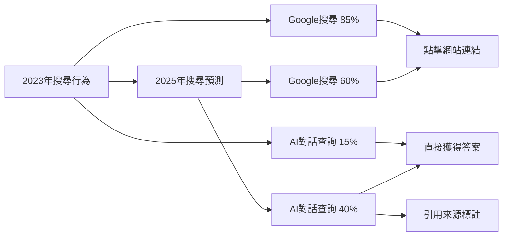
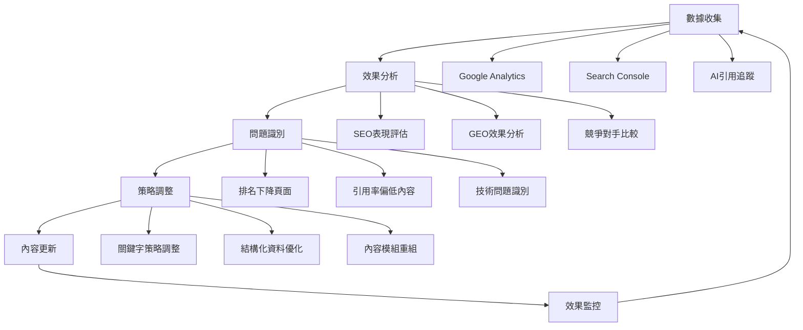

# SEO×GEO雙軌整合實戰指南：讓內容同時排名與被引用

<section class="summary">
在搜尋引擎優化（SEO）持續演進的同時，生成式引擎優化（GEO）正迅速崛起。使用者從傳統Google搜尋逐漸轉向ChatGPT、Perplexity等AI對話查詢。這意味著僅靠單一SEO策略已不足以保持品牌曝光。網站內容必須同時滿足SEO排名需求和GEO的AI答案引用需求，才能在雙重渠道中被看見。本文將說明如何整合兩種優化思維，在一篇內容中兼顧搜尋排名與AI可見性，打造既能被Google索引，又能被ChatGPT等AI引用的混合內容。
</section>

## 🎯 雙軌優化的戰略意義

隨著AI搜尋技術的快速發展，內容創作者面臨**「渠道分流」**的新挑戰。傳統搜尋流量逐漸被AI問答分流，但Google搜尋仍是主要流量來源。因此，最明智的策略是**同時布局兩個渠道**，讓內容既能獲得傳統搜尋排名，又能被AI系統引用。

### 📊 市場變化趨勢

<div class="market-trends">

#### 🔄 搜尋行為轉變



**關鍵洞察：**
- AI對話查詢年增長率：**120%**
- Google搜尋流量仍佔主導：**60%+**
- 混合搜尋行為成為常態：**45%用戶同時使用兩種方式**

</div>

### 🎪 SEO與GEO的互補關係

SEO與GEO並非競爭關係，而是**互補共生**的優化策略：

<div class="complementary-relationship">

| 優化面向 | SEO貢獻 | GEO貢獻 | 雙軌效益 |
|---------|---------|---------|----------|
| **品牌曝光** | 搜尋結果排名 | AI答案引用 | 全管道可見性 |
| **流量獲取** | 直接點擊流量 | 間接品牌印象 | 多元流量來源 |
| **權威建立** | 反向連結 | AI引用標註 | 全方位專業聲譽 |
| **長期價值** | 持續自然流量 | AI知識庫收錄 | 複合式內容資產 |

</div>

## 🔍 SEO與GEO的核心差異分析

了解兩種優化策略的**本質差異**，是制定整合策略的基礎：

### 📋 詳細對比分析

<div class="detailed-comparison">

#### 🎯 目標定位差異

| 比較面向 | SEO（搜尋引擎優化） | GEO（生成式引擎優化） |
|---------|-------------------|---------------------|
| **核心目標** | 提升網頁在搜尋結果中的排名位置 | 成為AI引用的權威資訊來源 |
| **使用者行為** | 點擊連結進入網站閱讀 | 直接在AI介面獲得答案 |
| **成功指標** | 排名位置、點擊率、停留時間 | 引用頻次、來源標註率 |
| **競爭態勢** | 與其他網站競爭排名 | 與所有資訊源競爭可信度 |

#### 🛠️ 技術實作差異

| 比較面向 | SEO實作重點 | GEO實作重點 |
|---------|------------|------------|
| **內容結構** | 標題階層、關鍵字密度、meta描述 | 摘要先行、模組化段落、FAQ格式 |
| **優化重點** | 關鍵字研究、外部連結、頁面速度 | 語義清晰、權威引用、事實準確 |
| **技術標記** | Title Tag、Meta Description、Alt Text | Schema.org、FAQ Schema、結構化資料 |
| **內容長度** | 深度長文（1500-3000字） | 精簡模組（每段200-500字） |

#### 📈 評估方式差異

| 評估維度 | SEO評估方法 | GEO評估方法 |
|---------|------------|------------|
| **可見性** | Google Search Console、排名工具 | AI引用追蹤、來源標註監控 |
| **效果測量** | 自然流量、轉換率、跳出率 | 引用質量、答案準確性、品牌提及 |
| **競爭分析** | SERP分析、關鍵字難度 | AI答案源分析、權威度比較 |

</div>

## 🏗️ 四大整合任務實戰指南

### 任務一：內容結構整合

#### 🎯 目標

融合SEO與GEO的內容架構要求，讓文章既符合搜尋引擎索引習慣，又便於AI模型理解其重點脈絡。

#### 🛠️ 實作策略

<div class="structure-integration">

##### 📝 總分總架構與摘要先行

採用「**先總述結論、再詳述論點、最後總結提升**」的撰寫方式：

```markdown
## 理想的雙軌內容結構

# SEO友好標題：包含主要關鍵字的完整描述

<section class="summary">
GEO摘要段落：150-300字精華總結，涵蓋核心結論和關鍵詞，
方便AI快速抓取，同時滿足搜尋引擎的描述需求。
</section>

## SEO H2標題：包含相關關鍵字的段落主題

### GEO H3子標題：直接回答問題的小節

內容段落：開門見山點出要點，後續補充細節說明。
每段控制在3-5句，既滿足SEO的內容深度，
也符合GEO的模組化要求。

#### 實戰案例
具體的操作範例或數據支持，增強內容權威性。

#### 常見問題
**Q: 具體操作問題？**
A: 直接明確的回答，便於AI引用。
```

##### 🏷️ 善用標題層級

明確設定H1主標題、H2段落標題和H3小節標題：

```html
<!-- SEO與GEO雙友好的標題結構 -->
<h1>Facebook廣告投放完整指南：從新手到專家的系統化策略</h1>

<h2>Facebook廣告受眾定位策略：精準觸及目標客群</h2>
  <h3>什麼是Lookalike Audience相似受眾？</h3>
  <h3>如何建立Custom Audience自訂受眾？</h3>
  <h3>受眾重疊問題如何處理？</h3>

<h2>廣告素材優化技巧：提升點擊率和轉換率</h2>
  <h3>影片廣告最佳規格與建議</h3>
  <h3>文案撰寫的五大心理技巧</h3>
```

</div>

#### ✅ 檢查清單

- [ ] 文章採用倒金字塔結構（重點先行）
- [ ] 每個H2段落包含目標關鍵字
- [ ] H3小標題採用問句形式
- [ ] 摘要段落涵蓋主要關鍵詞
- [ ] 段落長度適中（不超過150字）

### 任務二：Schema整合策略

#### 🎯 目標

將結構化資料（Schema）標記融入內容，提升網站內容的機器可讀性和語義資訊，使其更易被搜尋引擎收錄並被AI模型正確解析引用。

#### 🛠️ 實作策略

<div class="schema-integration">

##### 📊 基礎結構化標記

在頁面中加入適當的Schema標記，以JSON-LD格式嵌入：

```html
<!-- 文章基本資訊標記 -->
<script type="application/ld+json">
{
  "@context": "https://schema.org",
  "@type": "Article",
  "headline": "Facebook廣告投放完整指南",
  "description": "深度解析Facebook廣告投放策略，從受眾定位到素材優化的完整教學",
  "author": {
    "@type": "Person",
    "name": "廖天佑 Bless",
    "url": "https://yoursite.com/about",
    "sameAs": [
      "https://linkedin.com/in/bless-liao",
      "https://github.com/bless25min"
    ]
  },
  "publisher": {
    "@type": "Organization",
    "name": "AIOGEO知識庫",
    "logo": {
      "@type": "ImageObject",
      "url": "https://yoursite.com/logo.png"
    }
  },
  "datePublished": "2025-07-05",
  "dateModified": "2025-07-05",
  "mainEntityOfPage": "https://yoursite.com/facebook-ads-guide"
}
</script>
```

##### ❓ FAQ結構化資料

為問答內容加入FAQ Schema：

```html
<!-- FAQ專用標記 -->
<script type="application/ld+json">
{
  "@context": "https://schema.org",
  "@type": "FAQPage",
  "mainEntity": [
    {
      "@type": "Question",
      "name": "什麼是Facebook Lookalike Audience？",
      "acceptedAnswer": {
        "@type": "Answer",
        "text": "Lookalike Audience（相似受眾）是Facebook基於現有客戶資料，運用機器學習技術找出具有相似特徵用戶的廣告投放功能。透過分析種子受眾的人口統計、興趣和行為模式，Facebook能夠識別出可能對您產品或服務感興趣的潛在客戶。"
      }
    },
    {
      "@type": "Question", 
      "name": "如何提升Facebook廣告的點擊率？",
      "acceptedAnswer": {
        "@type": "Answer",
        "text": "提升Facebook廣告點擊率的五大策略：1) 使用高品質視覺素材，2) 撰寫引人入勝的廣告文案，3) 精準定位目標受眾，4) 測試不同的行動呼籲按鈕，5) 定期A/B測試廣告元素並優化表現最佳的版本。"
      }
    }
  ]
}
</script>
```

##### 🛠️ HowTo教學標記

對於步驟型教學內容，使用HowTo Schema：

```html
<!-- 教學步驟標記 -->
<script type="application/ld+json">
{
  "@context": "https://schema.org",
  "@type": "HowTo",
  "name": "如何設定Facebook廣告Custom Audience",
  "description": "詳細步驟教學如何建立Facebook廣告自訂受眾",
  "step": [
    {
      "@type": "HowToStep",
      "name": "進入廣告管理員",
      "text": "登入Facebook廣告管理員，點選「受眾」選項",
      "url": "https://yoursite.com/facebook-ads-guide#step1"
    },
    {
      "@type": "HowToStep",
      "name": "建立自訂受眾",
      "text": "點擊「建立受眾」>「自訂受眾」，選擇資料來源",
      "url": "https://yoursite.com/facebook-ads-guide#step2"
    },
    {
      "@type": "HowToStep",
      "name": "上傳客戶名單",
      "text": "選擇「客戶檔案」，上傳包含電子郵件的CSV檔案",
      "url": "https://yoursite.com/facebook-ads-guide#step3"
    }
  ]
}
</script>
```

</div>

#### ✅ 檢查清單

- [ ] 所有文章頁面都有Article Schema
- [ ] FAQ段落標記FAQPage Schema
- [ ] 教學內容標記HowTo Schema
- [ ] 使用Google Rich Results測試工具驗證
- [ ] 確保所有必要屬性都已填寫

### 任務三：段落模組化設計

#### 🎯 目標

將文章細分為模組化的資訊單元，每段聚焦單一主題或回答單一問題，提升內容重組彈性。這種寫作方式符合讀者快速瀏覽習慣，更迎合AI對內容分段抓取的偏好。

#### 🛠️ 實作策略

<div class="modular-design">

##### 📝 單一主旨的短段落

避免冗長的大段文字，每段控制在3～5句：

```markdown
## ❌ 避免的長段落寫法

Facebook廣告投放需要考慮多個因素包括受眾定位、素材設計、預算分配、投放時間等等，其中受眾定位是最關鍵的環節因為它直接影響廣告的曝光效果和轉換率，而受眾定位又分為年齡、性別、地理位置、興趣愛好等多個維度，每個維度都需要根據產品特性和目標客群來精準設定，同時還要考慮受眾重疊問題避免內部競爭導致成本上升...

## ✅ 推薦的模組化寫法

### Facebook廣告受眾定位策略

**受眾定位是廣告投放成功的關鍵因素**。精準的受眾設定能夠確保廣告向最有可能轉換的用戶展示，從而提升投資報酬率。

#### 核心定位維度
Facebook提供四大受眾定位維度：
- **人口統計**：年齡、性別、教育程度
- **地理位置**：國家、城市、商圈範圍  
- **興趣愛好**：基於用戶行為和互動數據
- **行為模式**：購買習慣、設備使用情況

#### 受眾重疊處理
當多個廣告組定位相似受眾時，可能產生內部競爭。建議使用Facebook的受眾重疊工具檢查，並調整定位條件避免衝突。
```

##### 📋 條列與清單運用

多利用條列式列表分隔資訊，讓結構更分明：

```markdown
## Facebook廣告素材優化的五大要點

### 1. 視覺素材品質
- **高解析度圖片**：最低1080×1080像素
- **品牌一致性**：使用統一的色彩和字體
- **避免文字過多**：圖片文字比例<20%

### 2. 文案撰寫技巧
- **開頭吸引注意**：前3個字最關鍵
- **解決方案導向**：說明產品如何解決問題
- **明確行動呼籲**：使用「立即購買」等動詞

### 3. 影片內容優化
- **前3秒黃金時間**：立即展示核心價值
- **字幕輔助說明**：考慮靜音瀏覽習慣
- **時長控制**：建議15-30秒最佳

### 4. A/B測試策略
- **單一變數測試**：每次只測試一個元素
- **足夠樣本數**：至少1000次曝光
- **統計顯著性**：信心水準95%以上

### 5. 效果監控指標
- **點擊率（CTR）**：目標>1.5%
- **轉換率**：依產業別設定基準
- **成本效益（ROAS）**：建議>3:1
```

##### ❓ 問答式模組設計

將可能的提問和解答以FAQ形式嵌入：

```markdown
## 常見問題解答

**Q1: Facebook廣告預算應該如何分配？**
A1: 建議採用80/20法則：80%預算投入表現最佳的廣告組，20%用於測試新素材和受眾。初期建議每個廣告組日預算至少$10，確保有足夠數據進行優化。

**Q2: 廣告審核被拒絕怎麼辦？**  
A2: 首先檢查是否違反Facebook廣告政策，常見原因包括誇大宣傳、內容不當或技術問題。可以修改素材重新提交，或透過「請求審核」功能申訴。

**Q3: 如何避免廣告疲勞？**
A3: 定期更換廣告素材（建議每2-3週），監控頻次指標（建議<3次），使用動態素材功能讓系統自動輪播不同組合。
```

</div>

#### ✅ 檢查清單

- [ ] 每段落聚焦單一概念（不超過5句）
- [ ] 重要資訊使用條列格式呈現
- [ ] 文章包含至少3個FAQ問答
- [ ] 段落間使用小標題區隔
- [ ] 避免過長的複合句

### 任務四：內鏈導引優化

#### 🎯 目標

優化站內內部連結結構，串聯相關內容頁面，形成人機皆宜的導覽網絡。有效的內鏈策略不僅提升SEO中的網站結構權重，也有助於AI理解網站內容版圖。

#### 🛠️ 實作策略

<div class="internal-linking">

##### 🕸️ 構建主題內容網絡

將相關主題的頁面互相連結，形成站內知識網：

```markdown
## 內鏈網絡架構範例

### 主要支柱頁面（Pillar Page）
[Facebook廣告完整指南](facebook-ads-guide.md) ← 核心樞紐

### 相關子主題頁面（Cluster Pages）
├── [受眾定位策略詳解](audience-targeting.md)
├── [廣告素材優化技巧](creative-optimization.md)  
├── [預算分配最佳實務](budget-allocation.md)
└── [成效追蹤與分析](performance-tracking.md)

### 微型專題頁面（Micro Pages）
├── [什麼是Lookalike Audience？](lookalike-audience.md)
├── [如何建立Custom Audience？](custom-audience.md)
├── [Facebook像素設定教學](pixel-setup.md)
└── [CAPI轉換API完整指南](capi-guide.md)
```

##### 🔗 描述性錨文字使用

鏈接文字應該具描述性，點出目標頁面的主題：

```markdown
## ✅ 良好的內鏈範例

在設定Facebook廣告時，[精準的受眾定位策略](audience-targeting.md)
是決定投放成效的關鍵因素。

如果您是初學者，建議先閱讀我們的
[Facebook像素設定完整教學](pixel-setup.md)，
了解基礎追蹤機制。

進階用戶可以參考[CAPI轉換API的實作指南](capi-guide.md)，
提升轉換追蹤的準確性。

## ❌ 避免的內鏈寫法

更多詳細資訊[請點擊這裡](some-page.md)。
想了解更多？[看這篇文章](another-page.md)。
```

##### 📍 戰略性內鏈佈局

在適當位置於敘述中嵌入相關頁面連結：

```markdown
## 戰略內鏈佈局範例

### 文章開頭（建立語境）
在深入探討Facebook廣告投放技巧之前，建議您先了解
[數位廣告的基本概念](digital-advertising-basics.md)，
這將有助於更好地理解後續內容。

### 段落中（概念延伸）
當提到受眾重疊問題時，您可能需要運用
[競爭對手分析的方法](competitor-analysis.md)
來避免與其他廣告主爭奪相同受眾。

### 實作步驟（工具連結）
設定完成後，記得使用我們提供的
[廣告成效檢查清單](ad-performance-checklist.md)
驗證所有設定是否正確。

### 文章結尾（延伸閱讀）
掌握了基礎投放技巧後，您可以進一步學習：
- [進階受眾定位策略](advanced-targeting.md)
- [自動化廣告優化設定](automated-optimization.md)
- [跨平台廣告整合方案](cross-platform-integration.md)
```

##### 🔄 雙向連結維護

確保相關頁面之間建立**雙向連結**：

```markdown
## 雙向連結範例

### 在「受眾定位」頁面中
本文是[Facebook廣告完整指南](facebook-ads-guide.md)
的一部分，建議搭配[素材優化技巧](creative-optimization.md)
一起學習，效果更佳。

### 在「素材優化」頁面中  
素材設計需要配合[精準的受眾定位](audience-targeting.md)
才能發揮最大效益。更多投放策略請參考
[Facebook廣告完整指南](facebook-ads-guide.md)。
```

</div>

#### ✅ 檢查清單

- [ ] 主要頁面建立支柱-集群結構
- [ ] 每篇文章至少包含3-5個內部連結
- [ ] 所有錨文字都具有描述性
- [ ] 相關頁面間建立雙向連結
- [ ] 定期檢查連結的有效性

## 📋 內容骨架範本

以下提供一份可直接複製套用的**雙軌優化文章範本**：

<div class="content-template">

```markdown
# 標題：包含主要關鍵字的完整描述性標題

<section class="summary">
摘要：150-200字的內容精華，涵蓋核心結論和關鍵詞。
此區將用於SEO描述摘要，亦方便AI模型快速抓取內容概要。
包含1-2組目標關鍵詞，並點出文章的主要價值。
</section>

## 引言：建立背景與價值主張

引言段落：勾勒主題背景、說明寫作目的和重要性，誘導讀者興趣。
點出使用者痛點或核心問題，並強調本文將提供的解決方案。
篇幅建議1～2段，每段不超過3句話。

## H2主要段落一：包含目標關鍵字的段落標題

### H3具體問題：什麼是XXX？（問句形式的小標題）

段落內容：開門見山回答問題，避免冗長鋪陳。第一句直接給出答案或要點，
後續2-3句補充細節說明。確保段落主題集中，語義完整。

**實戰要點：**
- 要點一：具體的操作建議或技巧
- 要點二：相關的注意事項或最佳實務  
- 要點三：常見錯誤的避免方法

### H3延伸問題：如何操作XXX？（實務導向的問題）

**步驟一：準備階段**  
詳細說明第一個步驟，包含具體的操作方法和工具需求。

**步驟二：執行過程**
逐步描述執行流程，提供具體的參數設定或範例代碼。

**步驟三：效果驗證**  
說明如何檢查操作結果，提供評估指標和優化建議。

## H2主要段落二：第二個重要主題（包含相關關鍵字）

段落內容：圍繞第二個主題展開討論。結構同樣包括概述+細節，
必要時可再次劃分H3小節。每段落保持3-5句的適中長度。

> 💡 **專家提示**：在適當位置加入引用框或提示框，
> 突出重要資訊或專業建議，提升內容的權威性和可讀性。

### 常見問題FAQ

**Q1: 最常見的操作問題？**  
A1: 簡要而直接的回答，控制在2-3句話內。
提供具體的解決方案或建議步驟。

**Q2: 進階用戶關心的問題？**
A2: 回答進階問題，可適當引用數據或專業來源
以增加可信度和權威性。

**Q3: 故障排除相關問題？**
A3: 提供troubleshooting建議，包含常見原因分析
和對應的解決方案。

## 實戰案例分析

### 案例一：成功案例
描述一個具體的成功案例，包含背景、實施過程和最終結果。
使用具體數據支持效果說明。

### 案例二：失敗教訓  
分析一個失敗案例，說明常見錯誤和避免方法。
從反面角度強化正確做法的重要性。

## 結論與行動建議

結論段落：總結全文核心觀點，強調主要結論與對讀者的意義。
呼應開頭提出的問題或需求，給出解決方案的總括。

### 立即行動清單
- [ ] 可以立即執行的第一個行動項目
- [ ] 需要準備工具或資源的第二個項目
- [ ] 中長期規劃的第三個目標項目

### 延伸閱讀
- [相關主題的深入文章](related-article-1.md)
- [進階技巧的專門教學](related-article-2.md)  
- [工具與資源推薦清單](related-article-3.md)

---

**本文屬於**：[主要指南系列名稱](main-guide.md)  
**上一篇**：[前一篇文章標題](previous-article.md)  
**下一篇**：[下一篇文章標題](next-article.md)
```

</div>

## 🧪 A/B測試與優化策略

### 📊 雙軌內容測試方案

設計針對SEO與GEO雙重目標的A/B測試：

<div class="ab-testing-strategy">

#### 🔬 測試變數設計

| 測試面向 | A版本（SEO偏向） | B版本（GEO偏向） | 評估指標 |
|---------|-----------------|-----------------|----------|
| **內容結構** | 深度長文（3000字+） | 模組化短段（1500字） | 排名 vs 引用率 |
| **標題風格** | 關鍵字導向標題 | 問答式標題 | CTR vs AI召回率 |
| **FAQ佔比** | 文末簡短FAQ | 貫穿全文FAQ | 搜尋流量 vs 引用頻次 |
| **Schema標記** | 基礎Article Schema | 完整FAQ+HowTo Schema | Rich Results vs AI引用 |

#### 📈 測試週期與樣本

```markdown
## 測試實施計畫

### 📅 測試週期：12週
- **週1-2**：建立基準數據
- **週3-8**：執行A/B測試  
- **週9-10**：數據分析整理
- **週11-12**：優化版本實施

### 📊 樣本設計
- **A組頁面**：現有文章的SEO優化版本
- **B組頁面**：同主題的GEO優化版本
- **C組頁面**：雙軌整合版本（本指南建議）

### 🎯 成功指標
- **SEO指標**：自然流量成長>25%
- **GEO指標**：AI引用頻次成長>40%  
- **整合效果**：總體品牌曝光提升>35%
```

</div>

### 📊 持續優化循環

建立常態性的內容優化機制：

<div class="optimization-cycle">

#### 🔄 月度優化流程



#### 📋 優化檢查清單

**每月必做項目：**
- [ ] 檢查Top 10文章的排名變化
- [ ] 監控AI引用頻次變化趨勢
- [ ] 分析新增的競爭對手內容
- [ ] 更新過時的數據和資訊
- [ ] 檢查內部連結的有效性

**季度深度優化：**
- [ ] 重新評估關鍵字策略
- [ ] 擴充FAQ問答內容
- [ ] 優化頁面載入速度
- [ ] 強化結構化資料標記
- [ ] 調整內容架構和層級

</div>

## 🎯 工具與資源推薦

### 🛠️ SEO×GEO工具組合

<div class="tools-recommendation">

#### 📊 分析監控工具

| 工具類型 | SEO工具 | GEO工具 | 整合效益 |
|---------|---------|---------|----------|
| **排名追蹤** | Ahrefs, SEMrush | AI引用監控器 | 全方位可見性追蹤 |
| **內容分析** | Surfer SEO | GEO Analyzer | 雙軌內容優化 |
| **技術檢測** | Screaming Frog | Schema Validator | 技術SEO+結構化資料 |
| **競爭分析** | SimilarWeb | AI答案分析工具 | 競爭態勢全貌 |

#### 🔧 內容製作工具

```markdown
## 推薦工具清單

### ✍️ 內容撰寫輔助
- **Grammarly**：語法檢查和語調優化
- **Hemingway Editor**：提升內容可讀性
- **AnswerThePublic**：發現長尾問題和FAQ靈感

### 🏷️ 結構化資料工具
- **Google Schema Markup Helper**：快速生成標記
- **JSON-LD Generator**：自動化Schema產生  
- **Rich Results Test**：驗證結構化資料效果

### 📊 分析與監控
- **Google Search Console**：基礎SEO數據
- **Google Analytics 4**：用戶行為分析
- **Custom AI引用追蹤腳本**：監控AI平台引用情況

### 🔗 內鏈管理
- **Link Whisper**：智能內鏈建議（WordPress）
- **Internal Link Juicer**：自動化內鏈生成
- **Sitebulb**：內鏈結構視覺化分析
```

</div>

### 📚 學習資源整合

<div class="learning-resources">

#### 📖 延伸閱讀建議

**SEO基礎鞏固：**
- [技術SEO完整檢查清單](technical-seo-checklist.md)
- [關鍵字研究進階策略](keyword-research-strategy.md)
- [內容行銷與SEO整合](content-marketing-seo.md)

**GEO深度學習：**
- [Answer Layer語段設計](answer-layer-design.md)
- [Semantic Mesh架構實作](semantic-mesh.md)
- [多模態轉譯策略](multimodal-optimization.md)

**整合實戰案例：**
- [電商網站雙軌優化案例](ecommerce-dual-optimization.md)
- [B2B企業內容策略](b2b-content-strategy.md)
- [個人品牌建立指南](personal-branding-guide.md)

#### 🎓 進階認證課程

- **Google SEO認證**：鞏固搜尋引擎優化基礎
- **HubSpot內容行銷認證**：提升內容策略思維
- **Schema.org專業認證**：深化結構化資料應用

</div>

---

<div class="implementation-guide">

## 🚀 立即實施指南

### 本週行動計畫：

1. **📝 選擇試點文章**：挑選一篇表現中等的現有文章作為優化對象
2. **🔧 應用內容範本**：使用本指南提供的骨架範本重新組織內容
3. **🏷️ 加入基礎Schema**：至少添加Article和FAQ結構化標記

### 本月目標達成：

- 🎯 **完成5篇文章**的雙軌優化
- 📊 **建立監控機制**追蹤SEO和GEO指標
- 🔗 **完善內鏈網絡**串聯相關主題內容

### 季度戰略布局：

- 🏗️ **建立主題集群**：以核心關鍵字為中心建立內容矩陣
- 📈 **數據驅動優化**：基於A/B測試結果調整策略
- 🤝 **跨部門協作**：整合SEO、內容、技術團隊資源

### 持續學習路徑：

- 📚 [GEO成效評估與追蹤](geo-measurement.md)：學會量化雙軌優化效果
- 🎨 [多模態轉譯實作](multimodal-optimization.md)：擴展內容影響力
- 🕸️ [Semantic Mesh進階架構](semantic-mesh.md)：建立權威內容網絡

</div>

<style>
.market-trends {
  background: linear-gradient(135deg, #e0f2fe 0%, #b3e5fc 100%);
  border: 1px solid #0277bd;
  border-radius: 12px;
  padding: 24px;
  margin: 24px 0;
}

.complementary-relationship {
  background: #f8fafc;
  border: 1px solid #e2e8f0;
  border-radius: 8px;
  padding: 20px;
  margin: 20px 0;
}

.detailed-comparison {
  background: linear-gradient(135deg, #fef3c7 0%, #fde68a 100%);
  border: 1px solid #f59e0b;
  border-radius: 12px;
  padding: 24px;
  margin: 24px 0;
}

.structure-integration {
  background: linear-gradient(135deg, #f0fdf4 0%, #dcfce7 100%);
  border: 1px solid #22c55e;
  border-radius: 12px;
  padding: 24px;
  margin: 24px 0;
}

.schema-integration {
  background: linear-gradient(135deg, #faf5ff 0%, #f3e8ff 100%);
  border: 1px solid #a855f7;
  border-radius: 12px;
  padding: 24px;
  margin: 24px 0;
}

.modular-design {
  background: linear-gradient(135deg, #fff1f2 0%, #fecaca 100%);
  border: 1px solid #f87171;
  border-radius: 12px;
  padding: 24px;
  margin: 24px 0;
}

.internal-linking {
  background: linear-gradient(135deg, #ecfdf5 0%, #d1fae5 100%);
  border: 1px solid #10b981;
  border-radius: 12px;
  padding: 24px;
  margin: 24px 0;
}

.content-template {
  background: #f9fafb;
  border: 1px solid #d1d5db;
  border-radius: 12px;
  padding: 24px;
  margin: 24px 0;
  font-family: monospace;
}

.ab-testing-strategy {
  background: linear-gradient(135deg, #fff7ed 0%, #fed7aa 100%);
  border: 1px solid #fb923c;
  border-radius: 12px;
  padding: 24px;
  margin: 24px 0;
}

.optimization-cycle {
  background: linear-gradient(135deg, #f0f9ff 0%, #e0f2fe 100%);
  border: 1px solid #0ea5e9;
  border-radius: 12px;
  padding: 24px;
  margin: 24px 0;
}

.tools-recommendation {
  background: #f8f9fa;
  border: 1px solid #dee2e6;
  border-radius: 8px;
  padding: 20px;
  margin: 20px 0;
}

.learning-resources {
  background: linear-gradient(135deg, #fefce8 0%, #fef3c7 100%);
  border: 1px solid #f59e0b;
  border-radius: 12px;
  padding: 24px;
  margin: 24px 0;
}

.implementation-guide {
  background: linear-gradient(135deg, #f0fdf4 0%, #bbf7d0 100%);
  border: 1px solid #22c55e;
  border-radius: 12px;
  padding: 24px;
  margin: 32px 0;
}
</style>
