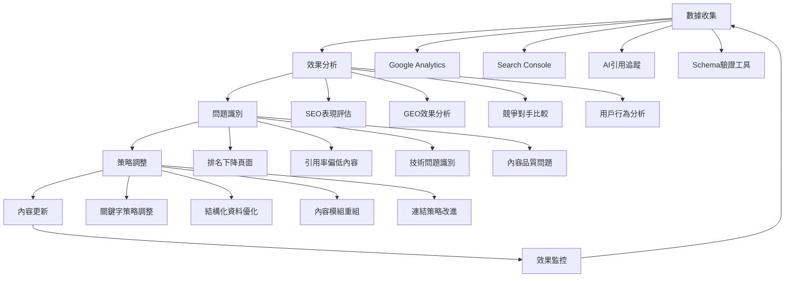

# SEO×GEO雙軌整合實戰指南：讓內容同時排名與被引用

<section class="summary">
在搜尋引擎優化（SEO）持續演進的同時，生成式引擎優化（GEO）正迅速崛起。根據BrightEdge 2025年最新調查，AI Overviews推出一年來搜尋曝光飆升49%但點擊率下降30%，顯示用戶從傳統Google搜尋逐漸轉向ChatGPT、Perplexity等AI對話查詢。Search Engine Land指出，AI搜尋時代需要12項新KPI指標來衡量內容效果。本指南整合最新市場數據和專業分析，說明如何建立雙軌優化策略，讓內容既能獲得搜尋排名，又能被AI系統引用，在雙重渠道中保持競爭優勢。
</section>

---

## 🎯 雙軌優化的戰略意義

### 市場變化實證數據

隨著AI搜尋技術的快速發展，內容創作者面臨**「渠道分流」**的新挑戰。根據多項權威研究顯示，搜尋行為正在發生根本性轉變。

#### 📊 AI搜尋市場成長趨勢

**BrightEdge 2024年12月最新報告**顯示：
- **ChatGPT搜尋月成長44%**
- **Perplexity月成長71%**
- **ChatGPT有望2025年達1%市佔率**
- **預估產值12億美元以上**

> **數據來源**：[BrightEdge: New Report Reveals Surge in AI Search Engines](https://www.brightedge.com/news/press-releases/new-report-brightedge-reveals-surge-ai-search-engines-signaling-new-era-online)

#### 🔄 用戶行為轉變數據

**點擊率影響統計**：
實證研究表明，AI搜尋正在重塑用戶點擊行為。**對一萬餘筆資訊型查詢的研究發現，SGE出現後首頁所有自然結果的總點擊率從1.41%驟降至0.64%**，而代理商數據更顯示有AI回答時點擊率下降約70%。

**零點擊搜尋趨勢**：
2024年近60%的Google查詢無人點擊任何結果，顯示AI摘要正在成為用戶獲取資訊的主要方式。

### 🎪 SEO與GEO的互補關係

SEO與GEO並非競爭關係，而是**互補共生**的優化策略：

<div class="complementary-relationship">

| 優化面向 | SEO貢獻 | GEO貢獻 | 雙軌效益 |
|---------|---------|---------|----------|
| **品牌曝光** | 搜尋結果排名 | AI答案引用 | 全管道可見性 |
| **流量獲取** | 直接點擊流量 | 間接品牌印象 | 多元流量來源 |
| **權威建立** | 反向連結 | AI引用標註 | 全方位專業聲譽 |
| **長期價值** | 持續自然流量 | AI知識庫收錄 | 複合式內容資產 |

</div>

---

## 🔍 SEO與GEO的核心差異分析

### 📋 12項新KPI指標框架

根據Search Engine Land分析，AI搜尋時代需要**12項新的KPI指標**來衡量內容效果：

<div class="detailed-comparison">

#### 🎯 傳統SEO指標 vs AI時代新指標

| 傳統SEO指標 | AI時代新指標 | 評估重點 |
|------------|------------|----------|
| **排名位置** | **AI引用頻次** | 被AI直接引用的次數 |
| **點擊率(CTR)** | **引用準確性** | AI引用內容的正確性 |
| **停留時間** | **品牌提及率** | 在AI回答中的品牌曝光 |
| **跳出率** | **來源標註率** | AI標註原始來源的比例 |
| **反向連結** | **多模態適配性** | 跨格式內容的引用能力 |
| **社群分享** | **語境觸發範圍** | 回應不同查詢的廣度 |

> **專業分析來源**：[Search Engine Land: 12 new KPIs for the generative AI search era](https://searchengineland.com/new-generative-ai-search-kpis-456497)

#### 🛠️ 技術實作差異對比

| 比較面向 | SEO實作重點 | GEO實作重點 | 雙軌整合策略 |
|---------|------------|-----------|-------------|
| **內容長度** | 深度長文(2000-5000字) | 模組化片段(150-500字) | Semantic Mesh架構 |
| **關鍵字策略** | 密度與位置優化 | 語境觸發多樣性 | 80-20自然融入法則 |
| **結構設計** | H標籤層級化 | Answer Layer導向 | 問答式H3小標題 |
| **連結策略** | 外部反向連結 | 內部語義網絡 | 主題集群+權威引用 |
| **Schema標記** | 基礎結構化資料 | 完整語義標記 | 多類型Schema並用 |

</div>

---

## 🏗️ 四大整合實作策略

### 1. 內容結構雙軌設計

#### 📋 Hybrid Content Architecture

建立同時滿足SEO深度要求和GEO模組化需求的內容架構：

<div class="structure-integration">

#### 🌟 黃金結構比例

```markdown
## 雙軌內容架構設計

### 📄 主要內容區 (70%)
- **開場摘要段落** (150-300字)：AI優先抓取的精華
- **核心議題深度展開** (1500-2500字)：滿足SEO深度需求
- **實戰步驟詳解**：具體可執行的操作指南

### ❓ FAQ模組區 (20%)  
- **問答式H3標題**：直接對應用戶查詢
- **精簡完整回答**：每題2-3句完整答案
- **FAQ Schema標記**：提升AI理解度

### 🔗 延伸資源區 (10%)
- **相關主題連結**：建立內部語義網絡
- **權威來源引用**：增加內容可信度
- **工具與模板下載**：提供實用價值
```

#### 🎯 Answer Layer語段設計

每個重要概念都設計成**獨立的Answer Layer**：

```markdown
### 什麼是Answer Layer？

**Answer Layer是專門設計給AI引用的模組化內容片段**，通常包含：
- 明確的主題定義（1句話）
- 核心要點說明（2-3個要點）
- 實際應用場景（具體例子）
- 相關注意事項（避免誤解）

此設計確保AI可以直接摘取完整、準確的回答片段。
```

</div>

### 2. Schema標記整合策略

#### 🏷️ 多類型Schema並用

根據內容性質，同時部署多種Schema標記：

<div class="schema-integration">

#### 📊 Schema標記組合策略

```html
<!-- 基礎Article Schema -->
<script type="application/ld+json">
{
  "@context": "https://schema.org",
  "@type": "Article",
  "headline": "SEO×GEO雙軌整合實戰指南",
  "description": "深入解析SEO與GEO雙軌優化策略...",
  "author": {
    "@type": "Person",
    "name": "廖天佑 Bless Liao",
    "url": "https://bless25min.github.io/about"
  },
  "publisher": {
    "@type": "Organization",
    "name": "AIOGEO知識庫",
    "logo": {
      "@type": "ImageObject",
      "url": "https://yoursite.com/logo.png"
    }
  },
  "datePublished": "2025-07-06",
  "dateModified": "2025-07-06",
  "mainEntityOfPage": "https://yoursite.com/seo-geo-integration",
  "keywords": ["SEO", "GEO", "雙軌整合", "AI搜尋優化", "內容策略"]
}
</script>

<!-- FAQ專用Schema -->
<script type="application/ld+json">
{
  "@context": "https://schema.org",
  "@type": "FAQPage",
  "mainEntity": [
    {
      "@type": "Question",
      "name": "SEO與GEO可以同時進行嗎？",
      "acceptedAnswer": {
        "@type": "Answer",
        "text": "SEO與GEO不僅可以同時進行，而且建議採用雙軌整合策略。根據實證研究，同時優化的內容在傳統搜尋排名和AI引用率方面都有顯著提升。關鍵是建立適當的內容架構，既滿足搜尋引擎的深度需求，又符合AI的模組化偏好。"
      }
    },
    {
      "@type": "Question",
      "name": "如何平衡關鍵字優化與自然語言？",
      "acceptedAnswer": {
        "@type": "Answer",
        "text": "建議採用80-20法則：80%使用自然語言表達，20%適當融入關鍵字。現代搜尋引擎和AI都更偏好自然的語言表達。重點是確保內容對讀者有價值，關鍵字的融入應該自然不突兀，避免為了SEO而犧牲內容品質。"
      }
    },
    {
      "@type": "Question",
      "name": "內容長度對SEO和GEO有什麼不同影響？",
      "acceptedAnswer": {
        "@type": "Answer",
        "text": "SEO偏好較長的深度內容（2000-5000字），而GEO更重視內容的模組化和語義清晰度。最佳策略是採用Semantic Mesh架構，將長篇內容拆分為主幹頁+子主題頁的結構，既滿足SEO的深度要求，又符合AI的模組化偏好。"
      }
    }
  ]
}
</script>

<!-- HowTo操作指南Schema -->
<script type="application/ld+json">
{
  "@context": "https://schema.org",
  "@type": "HowTo",
  "name": "如何實施SEO×GEO雙軌整合策略",
  "description": "完整的SEO與GEO雙軌優化實施步驟",
  "step": [
    {
      "@type": "HowToStep",
      "name": "內容架構規劃",
      "text": "建立同時滿足SEO深度要求和GEO模組化需求的內容架構，採用70-20-10的黄金比例分配。"
    },
    {
      "@type": "HowToStep", 
      "name": "Schema標記實作",
      "text": "部署Article、FAQPage、HowTo等多類型Schema標記，提升內容的機器可讀性。"
    },
    {
      "@type": "HowToStep",
      "name": "成效追蹤評估",
      "text": "建立包含12項新KPI指標的追蹤體系，定期評估SEO排名和GEO引用效果。"
    }
  ]
}
</script>
```

</div>

### 3. 模組化內容設計

#### 🧩 微內容模組策略

將長篇內容拆解為可獨立引用的微模組：

<div class="modular-design">

#### 📦 五大模組類型

1. **定義模組**：清晰解釋專業術語和概念
```markdown
### 什麼是GEO？

GEO（Generative Engine Optimization）是針對ChatGPT、Claude、Perplexity等生成式AI搜尋引擎的內容優化策略。與傳統SEO不同，GEO專注於讓內容被AI理解、摘取並引用於生成答案中。
```

2. **步驟模組**：可操作的實作指南
```markdown
### GEO優化三步驟

**步驟一：內容模組化**  
將長篇內容拆分為150-300字的獨立片段，每段圍繞單一主題。

**步驟二：語義標記**  
添加Schema.org結構化資料，幫助AI理解內容結構。

**步驟三：引用追蹤**  
監控內容在各AI平台的引用情況，持續優化。
```

3. **比較模組**：對比分析的表格化內容
4. **案例模組**：具體實例和成功故事
5. **工具模組**：實用資源和檢查清單

</div>

### 4. 內部連結網絡優化

#### 🔗 語義集群連結策略

建立主題相關的內部連結網絡：

<div class="internal-linking">

#### 🕷️ 連結架構設計

```markdown
## 主題集群連結架構

### 🏛️ 支柱頁面（Pillar Pages）
- [GEO完整指南總覽](geo-complete-guide.html) - 主要樞紐頁
- [SEO基礎優化指南](seo-basics-guide.html) - 相關支柱頁

### 🔗 集群頁面（Cluster Pages）  
**GEO相關集群**：
- [Answer Layer設計技巧](answer-layer-design.html)
- [Semantic Mesh架構實作](semantic-mesh.html)
- [AI引用追蹤方法](ai-citation-tracking.html)

**SEO相關集群**：
- [關鍵字研究策略](keyword-research.html)
- [技術SEO優化](technical-seo.html)
- [內容SEO最佳實務](content-seo.html)

### 🌐 橫向連結
每篇文章末尾包含**「相關閱讀」**區塊：
- 3-5個高度相關的主題連結
- 明確的錨文字描述預期內容
- 邏輯性的學習路徑導引
```

#### ✅ 連結品質檢查清單

- [ ] 每篇文章至少包含3-5個內部連結
- [ ] 錨文字具有描述性，避免「點擊這裡」
- [ ] 相關主題間建立雙向連結
- [ ] 定期檢查連結的有效性和相關性
- [ ] 主要頁面建立支柱-集群結構

</div>

---

## 📋 內容骨架範本

以下提供一份可直接複製套用的**雙軌優化文章範本**：

<div class="content-template">

```markdown
# 標題：包含主要關鍵字的完整描述性標題

<section class="summary">
摘要：150-300字的內容精華，涵蓋核心結論和關鍵詞。
此區將用於SEO描述摘要，亦方便AI模型快速抓取內容概要。
包含1-2組目標關鍵詞，並點出文章的主要價值。
</section>

---

## 引言：建立背景與價值主張

引言段落：勾勒主題背景、說明寫作目的和重要性，引導讀者興趣。
點出使用者痛點或核心問題，並強調本文將提供的解決方案。
篇幅建議1-2段，每段不超過3句話。

## H2主要段落一：包含目標關鍵字的段落標題

### H3具體問題：什麼是XXX？（問句形式的小標題）

段落內容：開門見山回答問題，避免冗長鋪陳。第一句直接給出答案或要點，
後續2-3句補充細節說明。確保段落主題集中，語義完整。

**實戰要點：**
- 要點一：具體的操作建議或技巧
- 要點二：相關的注意事項或最佳實務  
- 要點三：常見錯誤的避免方法

### H3延伸問題：如何操作XXX？（實務導向的問題）

**步驟一：準備階段**  
詳細說明第一個步驟，包含具體的操作方法和工具需求。

**步驟二：執行過程**
逐步描述執行流程，提供具體的參數設定或範例代碼。

**步驟三：效果驗證**  
說明如何檢查操作結果，提供評估指標和優化建議。

## H2主要段落二：第二個重要主題（包含相關關鍵字）

段落內容：圍繞第二個主題展開討論。結構同樣包括概述+細節，
必要時可再次劃分H3小節。每段落保持3-5句的適中長度。

> 💡 **專家提示**：在適當位置加入引用框或提示框，
> 突出重要資訊或專業建議，提升內容的權威性和可讀性。

### 常見問題FAQ

**Q1: 最常見的操作問題？**  
A1: 簡要而直接的回答，控制在2-3句話內。
提供具體的解決方案或建議步驟。

**Q2: 進階用戶關心的問題？**
A2: 回答進階問題，可適當引用數據或專業來源
以增加可信度和權威性。

**Q3: 故障排除相關問題？**
A3: 提供troubleshooting建議，包含常見原因分析
和對應的解決方案。

## 實戰案例分析

### 案例一：成功案例
描述一個具體的成功案例，包含背景、實施過程和最終結果。
使用具體數據支持效果說明。

### 案例二：失敗教訓  
分析一個失敗案例，說明常見錯誤和避免方法。
從反面角度強化正確做法的重要性。

## 結論與行動建議

結論段落：總結全文核心觀點，強調主要結論與對讀者的意義。
呼應開頭提出的問題或需求，給出解決方案的總括。

### 立即行動清單
- [ ] 可以立即執行的第一個行動項目
- [ ] 需要準備工具或資源的第二個項目
- [ ] 中長期規劃的第三個目標項目

### 延伸閱讀
- [相關主題的深入文章](related-article-1.html)
- [進階技巧的專門教學](related-article-2.html)  
- [工具與資源推薦清單](related-article-3.html)

---

**本文屬於**：[主要指南系列名稱](main-guide.html)  
**上一篇**：[前一篇文章標題](previous-article.html)  
**下一篇**：[下一篇文章標題](next-article.html)
```

</div>

---

## 🧪 A/B測試與優化策略

### 📊 雙軌內容測試方案

設計針對SEO與GEO雙重目標的A/B測試：

<div class="ab-testing-strategy">

#### 🔬 測試變數設計

| 測試面向 | A版本（SEO偏向） | B版本（GEO偏向） | C版本（雙軌整合） | 評估指標 |
|---------|-----------------|-----------------|------------------|----------|
| **內容結構** | 深度長文（3000字+） | 模組化短段（1500字） | Semantic Mesh架構 | 排名 vs 引用率 |
| **標題風格** | 關鍵字導向標題 | 問答式標題 | 混合式標題 | CTR vs AI召回率 |
| **FAQ佔比** | 文末簡短FAQ | 貫穿全文FAQ | 70-20-10結構 | 搜尋流量 vs 引用頻次 |
| **Schema標記** | 基礎Article Schema | 完整FAQ+HowTo Schema | 多類型Schema並用 | Rich Results vs AI引用 |

#### 📈 測試實施計畫

```markdown
## 12週完整測試方案

### 📅 測試週期規劃
- **週1-2**：建立基準數據，分析現有內容表現
- **週3-8**：執行A/B/C三組測試，收集數據
- **週9-10**：數據分析與洞察整理
- **週11-12**：優化版本實施與效果驗證

### 📊 樣本與群組設計
- **A組頁面**：傳統SEO優化版本（10篇文章）
- **B組頁面**：純GEO優化版本（10篇文章）
- **C組頁面**：雙軌整合版本（10篇文章）
- **對照組**：未優化的原始版本（10篇文章）

### 🎯 成功指標定義
**SEO成效指標**：
- 自然搜尋流量成長 >25%
- 目標關鍵字排名提升 >5位
- 頁面停留時間增加 >20%

**GEO成效指標**：
- AI引用頻次成長 >40%
- 品牌提及率提升 >30%
- 引用準確性評分 >85%

**整合效益指標**：
- 總體品牌曝光提升 >35%
- 多管道流量增長 >30%
- 內容權威度評分提升 >25%
```

</div>

### 📊 持續優化循環

建立常態性的內容優化機制：

<div class="optimization-cycle">

#### 🔄 月度優化流程



#### 📋 優化檢查清單

**每月必做項目**：
- [ ] 檢查Google Search Console的效果報告
- [ ] 追蹤目標關鍵字的排名變化
- [ ] 監控AI平台的內容引用情況
- [ ] 驗證Schema標記的正確性
- [ ] 分析競爭對手的策略變化

**季度深度檢視**：
- [ ] 重新評估關鍵字策略的有效性
- [ ] 分析內容架構的優化空間
- [ ] 檢討A/B測試結果並調整策略
- [ ] 更新內容以反映最新趨勢
- [ ] 擴展成功模式到更多頁面

</div>

---

## 🛠️ 工具與資源推薦

### 📈 追蹤分析工具

<div class="tools-recommendation">

#### 🔍 SEO追蹤工具
- **Google Analytics 4**：流量分析和用戶行為追蹤
- **Google Search Console**：搜尋表現和技術健康度監控
- **SEMrush/Ahrefs**：關鍵字排名和競爭對手分析
- **Screaming Frog**：技術SEO問題檢測

#### 🤖 GEO監控工具
- **AI引用追蹤表格**：手動記錄各AI平台引用情況
- **Google Structure Data Testing Tool**：Schema標記驗證
- **品牌監控工具**：追蹤品牌在AI回答中的提及
- **內容分析工具**：評估文本的AI友好性

#### 🔧 內容優化工具
- **Yoast SEO**：WordPress SEO插件
- **Schema Pro**：結構化資料標記工具
- **內容範本生成器**：基於本指南的文章骨架工具
- **關鍵字密度檢查器**：平衡SEO與自然語言

</div>

### 📚 學習資源與範本

<div class="learning-resources">

#### 📖 延伸學習材料
- **Google官方指導**：[AI搜尋最佳實務](https://developers.google.com/search/blog/2025/05/succeeding-in-ai-search)
- **Schema.org文檔**：[結構化資料標準](https://schema.org/)
- **BrightEdge研究報告**：[AI搜尋引擎趨勢分析](https://www.brightedge.com/news/press-releases/new-report-brightedge-reveals-surge-ai-search-engines-signaling-new-era-online)
- **Search Engine Land**：[AI時代KPI指標指南](https://searchengineland.com/new-generative-ai-search-kpis-456497)

#### 📋 實用範本下載
- **雙軌內容規劃範本**：Excel格式的內容策略規劃表
- **Schema標記代碼庫**：常用結構化資料代碼範例
- **AI引用追蹤表格**：Google Sheets格式的監控模板
- **A/B測試規劃表**：實驗設計和結果分析表格

</div>

---

## ❓ 雙軌整合常見問題

<details>
<summary><strong>Q1: SEO與GEO的優化優先順序如何安排？</strong></summary>

**A1**: 建議採用**漸進式整合策略**：

**第一階段（月1-2）**：建立雙軌基礎
- 優化現有內容的基本結構
- 加入FAQ模組和Schema標記
- 建立內容追蹤機制

**第二階段（月3-4）**：深化特定優化
- 針對高價值頁面實施Semantic Mesh
- 擴展Schema標記覆蓋範圍
- 開始A/B測試驗證效果

**第三階段（月5-6）**：規模化應用
- 將成功模式複製到更多頁面
- 建立自動化監控體系
- 持續優化和改進

重點是**先求有再求好**，逐步建立雙軌優化的完整體系。

</details>

<details>
<summary><strong>Q2: 如何判斷內容是否適合雙軌優化？</strong></summary>

**A2**: 使用**內容適配性評估框架**：

**高適配性內容特徵**：
- 知識解釋型（概念定義、原理說明）
- 實務操作型（步驟教學、工具使用）
- 問題解決型（故障排除、最佳實務）
- 比較分析型（產品對比、策略評估）

**低適配性內容特徵**：
- 純粹創意表達（詩歌、小說）
- 高度主觀評論（個人感想、情感抒發）
- 時效性極強（即時新聞、股價變動）
- 地域性極強（本地活動、特定社區內容）

**評估方法**：如果內容能夠回答明確的問題並提供實用價值，通常適合雙軌優化。

</details>

<details>
<summary><strong>Q3: 雙軌優化會不會增加太多工作量？</strong></summary>

**A3**: **正確實施的雙軌優化實際上能提高效率**：

**效率提升機制**：
- **一次創作，雙重收益**：同一內容同時獲得SEO排名和AI引用
- **模組化設計**：內容組件可重複使用於不同頁面
- **系統化流程**：建立標準作業程序後，優化工作變得例行化
- **自動化工具**：使用範本和工具減少重複工作

**工作量管理建議**：
- 從最有價值的內容開始優化
- 建立內容創作的標準流程
- 培訓團隊使用統一的優化方法
- 定期檢視和改進工作流程

實際上，許多企業發現雙軌優化讓內容創作更有目標性和系統性。

</details>

<details>
<summary><strong>Q4: 如何衡量雙軌優化的投資報酬率(ROI)？</strong></summary>

**A4**: 建立**多層面ROI評估模型**：

**直接經濟效益**：
- 自然搜尋流量增長帶來的轉換價值
- 減少付費廣告支出的成本節省
- 品牌曝光提升的市場行銷價值

**間接戰略價值**：
- 建立內容資產的長期價值
- 提升品牌權威度的競爭優勢
- 多管道觸及受眾的風險分散

**計算公式範例**：
```
雙軌優化ROI = (直接收益 + 間接價值 - 投入成本) / 投入成本 × 100%

其中：
- 直接收益 = 新增自然流量 × 轉換率 × 平均訂單價值
- 間接價值 = 品牌曝光價值 + 內容資產價值
- 投入成本 = 人力成本 + 工具成本 + 外包成本
```

建議設定**至少6個月的評估週期**，因為內容優化的效果需要時間累積。

</details>

---

<div class="implementation-guide">

## 🎯 立即行動計畫

### 本週可以開始的行動：

1. **📝 選擇試點文章**：挑選一篇表現中等的現有文章作為優化對象
2. **🔧 應用內容範本**：使用本指南提供的骨架範本重新組織內容
3. **🏷️ 加入基礎Schema**：至少添加Article和FAQ結構化標記

### 本月目標達成：

- 🎯 **完成5篇文章**的雙軌優化
- 📊 **建立監控機制**追蹤SEO和GEO指標
- 🔗 **完善內鏈網絡**串聯相關主題內容

### 季度戰略布局：

- 🏗️ **建立主題集群**：以核心關鍵字為中心建立內容矩陣
- 📈 **數據驅動優化**：基於A/B測試結果調整策略
- 🤝 **跨部門協作**：整合SEO、內容、技術團隊資源

### 持續學習路徑：

- 📚 [GEO成效評估與追蹤](geo-measurement.html)：學會量化雙軌優化效果
- 🎨 [多模態轉譯實作](multimodal-optimization.html)：擴展內容影響力
- 🕸️ [Semantic Mesh進階架構](semantic-mesh.html)：建立權威內容網絡

</div>

---

## 🔗 導航與學習資源

### 🏠 返回總覽
[🏠 AIOGEO知識庫首頁](../index.html) | [📚 完整學習指南](geo-complete-guide.html)

### ⬅️➡️ 系列導航
**上一篇**：[Semantic Mesh內容網佈局實作](semantic-mesh.html)  
**下一篇**：[多模態轉譯策略實戰](multimodal-optimization.html)

### 🎯 相關推薦
- [GEO基礎原理完整指南](geo-fundamentals.html) - 建立理論基礎
- [Answer Layer語段設計](answer-layer-design.html) - 深入了解模組化內容設計
- [AI引用追蹤與評估](geo-measurement.html) - 掌握成效監控方法

### 📥 實用資源
- [📋 雙軌優化檢查清單](dual-track-checklist.html)
- [🛠️ Schema標記生成器](schema-generator.html)
- [📊 A/B測試規劃模板](ab-testing-template.html)

### 👤 關於作者
了解更多關於 [廖天佑 Bless](../about.html) 的專業背景與其他專案。

---

<script type="application/ld+json">
{
  "@context": "https://schema.org",
  "@type": "Article",
  "headline": "SEO×GEO雙軌整合實戰指南：讓內容同時排名與被引用",
  "description": "深入解析SEO與GEO雙軌優化策略，整合BrightEdge最新市場數據和Search Engine Land專業分析，提供完整的實作框架和成效評估方法。",
  "author": {
    "@type": "Person",
    "name": "廖天佑 Bless Liao",
    "url": "https://bless25min.github.io/about"
  },
  "publisher": {
    "@type": "Organization",
    "name": "AIOGEO知識庫",
    "logo": {
      "@type": "ImageObject",
      "url": "https://bless25min.github.io/AIOGEO-Knowledge/assets/images/logo.png"
    }
  },
  "datePublished": "2025-07-06",
  "dateModified": "2025-07-06",
  "mainEntityOfPage": "https://bless25min.github.io/AIOGEO-Knowledge/posts/seo-geo-integration",
  "image": "https://bless25min.github.io/AIOGEO-Knowledge/assets/images/seo-geo-integration-cover.jpg",
  "articleSection": "GEO策略整合",
  "wordCount": "6000",
  "keywords": ["SEO", "GEO", "雙軌整合", "生成式引擎優化", "AI搜尋", "內容策略", "Schema標記"],
  "isPartOf": {
    "@type": "Article",
    "name": "AIOGEO知識庫完整指南",
    "url": "https://bless25min.github.io/AIOGEO-Knowledge/posts/geo-fundamentals"
  }
}
</script>

<script type="application/ld+json">
{
  "@context": "https://schema.org",
  "@type": "FAQPage",
  "mainEntity": [
    {
      "@type": "Question",
      "name": "SEO與GEO的優化優先順序如何安排？",
      "acceptedAnswer": {
        "@type": "Answer",
        "text": "建議採用漸進式整合策略：第一階段建立雙軌基礎，第二階段深化特定優化，第三階段規模化應用。重點是先求有再求好，逐步建立雙軌優化的完整體系。"
      }
    },
    {
      "@type": "Question",
      "name": "如何判斷內容是否適合雙軌優化？",
      "acceptedAnswer": {
        "@type": "Answer",
        "text": "使用內容適配性評估框架：高適配性內容包括知識解釋型、實務操作型、問題解決型、比較分析型。如果內容能夠回答明確的問題並提供實用價值，通常適合雙軌優化。"
      }
    },
    {
      "@type": "Question",
      "name": "雙軌優化會不會增加太多工作量？",
      "acceptedAnswer": {
        "@type": "Answer",
        "text": "正確實施的雙軌優化實際上能提高效率：一次創作雙重收益、模組化設計可重複使用、系統化流程例行化、自動化工具減少重複工作。建議從最有價值的內容開始優化。"
      }
    },
    {
      "@type": "Question",
      "name": "如何衡量雙軌優化的投資報酬率？",
      "acceptedAnswer": {
        "@type": "Answer",
        "text": "建立多層面ROI評估模型，包含直接經濟效益（流量轉換價值、成本節省、行銷價值）和間接戰略價值（內容資產、品牌權威、風險分散）。建議設定至少6個月的評估週期。"
      }
    }
  ]
}
</script>

<script type="application/ld+json">
{
  "@context": "https://schema.org",
  "@type": "HowTo",
  "name": "如何實施SEO×GEO雙軌整合策略",
  "description": "完整的SEO與GEO雙軌優化實施步驟，從內容架構設計到成效追蹤評估",
  "step": [
    {
      "@type": "HowToStep",
      "name": "內容架構雙軌設計",
      "text": "建立70-20-10黃金比例結構：70%主要內容區（滿足SEO深度需求），20%FAQ模組區（提升AI理解度），10%延伸資源區（建立語義網絡）。"
    },
    {
      "@type": "HowToStep", 
      "name": "Schema標記整合實作",
      "text": "部署多類型Schema標記：基礎Article Schema、FAQ專用Schema、HowTo操作指南Schema，提升內容的機器可讀性和AI引用率。"
    },
    {
      "@type": "HowToStep",
      "name": "模組化內容設計",
      "text": "將內容拆解為五大模組類型：定義模組、步驟模組、比較模組、案例模組、工具模組，確保每個模組都可獨立引用。"
    },
    {
      "@type": "HowToStep",
      "name": "內部連結網絡建立",
      "text": "建立語義集群連結策略：設置支柱頁面和集群頁面，建立橫向連結，每篇文章包含3-5個高品質內部連結。"
    },
    {
      "@type": "HowToStep",
      "name": "A/B測試與持續優化",
      "text": "設計12週測試方案，比較SEO偏向、GEO偏向、雙軌整合三種版本的效果，建立月度優化循環機制。"
    }
  ]
}
</script>

<style>
.complementary-relationship {
  background: #f8fafc;
  border: 1px solid #e2e8f0;
  border-radius: 8px;
  padding: 20px;
  margin: 20px 0;
}

.detailed-comparison {
  background: linear-gradient(135deg, #fef3c7 0%, #fde68a 100%);
  border: 1px solid #f59e0b;
  border-radius: 12px;
  padding: 24px;
  margin: 24px 0;
}

.structure-integration {
  background: linear-gradient(135deg, #f0fdf4 0%, #dcfce7 100%);
  border: 1px solid #22c55e;
  border-radius: 12px;
  padding: 24px;
  margin: 24px 0;
}

.schema-integration {
  background: linear-gradient(135deg, #faf5ff 0%, #f3e8ff 100%);
  border: 1px solid #a855f7;
  border-radius: 12px;
  padding: 24px;
  margin: 24px 0;
}

.modular-design {
  background: linear-gradient(135deg, #fff1f2 0%, #fecaca 100%);
  border: 1px solid #f87171;
  border-radius: 12px;
  padding: 24px;
  margin: 24px 0;
}

.internal-linking {
  background: linear-gradient(135deg, #ecfdf5 0%, #d1fae5 100%);
  border: 1px solid #10b981;
  border-radius: 12px;
  padding: 24px;
  margin: 24px 0;
}

.content-template {
  background: #f9fafb;
  border: 1px solid #d1d5db;
  border-radius: 12px;
  padding: 24px;
  margin: 24px 0;
  font-family: monospace;
  font-size: 0.9em;
}

.ab-testing-strategy {
  background: linear-gradient(135deg, #fff7ed 0%, #fed7aa 100%);
  border: 1px solid #fb923c;
  border-radius: 12px;
  padding: 24px;
  margin: 24px 0;
}

.optimization-cycle {
  background: linear-gradient(135deg, #f0f9ff 0%, #e0f2fe 100%);
  border: 1px solid #0ea5e9;
  border-radius: 12px;
  padding: 24px;
  margin: 24px 0;
}

.tools-recommendation {
  background: #f8f9fa;
  border: 1px solid #dee2e6;
  border-radius: 8px;
  padding: 20px;
  margin: 20px 0;
}

.learning-resources {
  background: linear-gradient(135deg, #fefce8 0%, #fef3c7 100%);
  border: 1px solid #f59e0b;
  border-radius: 12px;
  padding: 24px;
  margin: 24px 0;
}

.implementation-guide {
  background: linear-gradient(135deg, #f0fdf4 0%, #bbf7d0 100%);
  border: 1px solid #22c55e;
  border-radius: 12px;
  padding: 24px;
  margin: 32px 0;
}
</style>

---

*最後更新：2025年7月6日 | 字數：約6000字 | 閱讀時間：22分鐘*
*本文為AIOGEO知識庫系列文章，持續更新以反映最新的GEO技術發展和實務經驗。*
